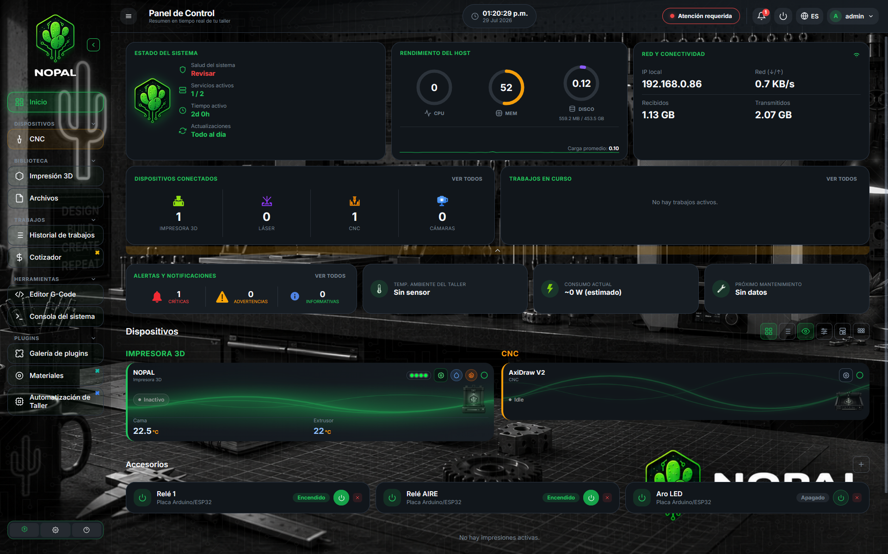
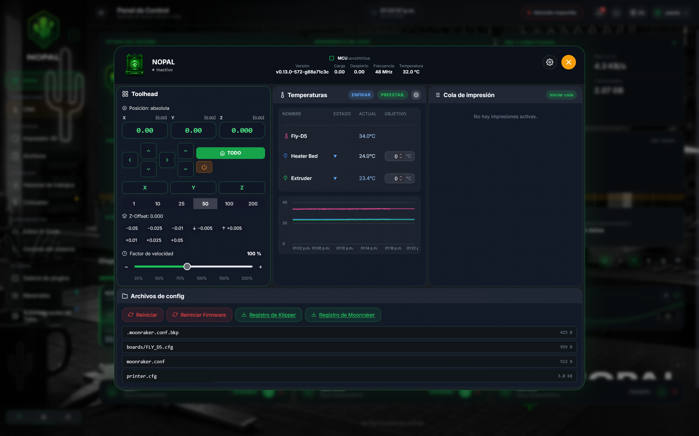
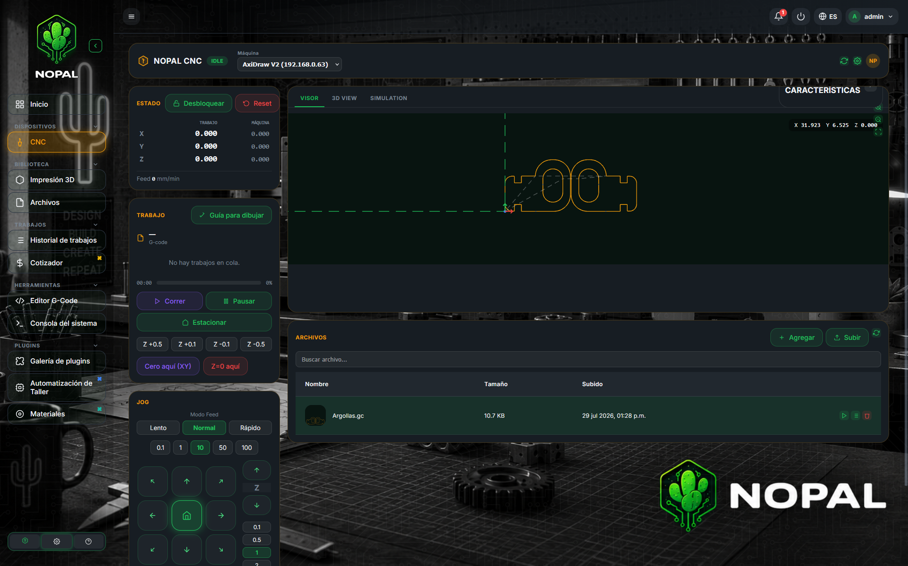
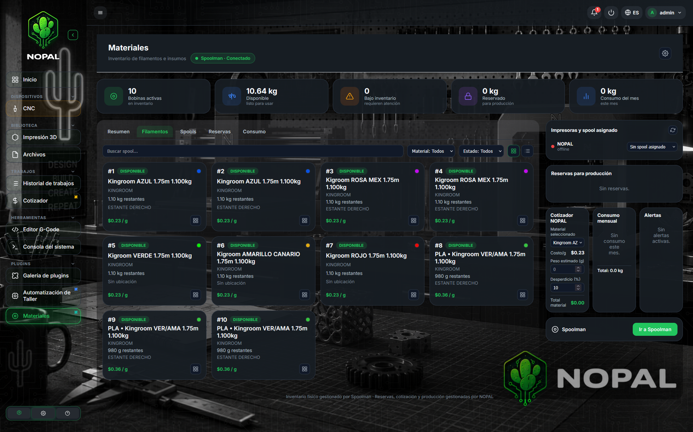
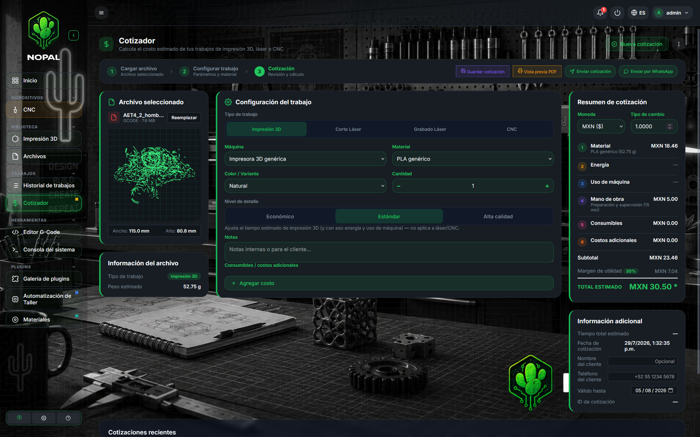
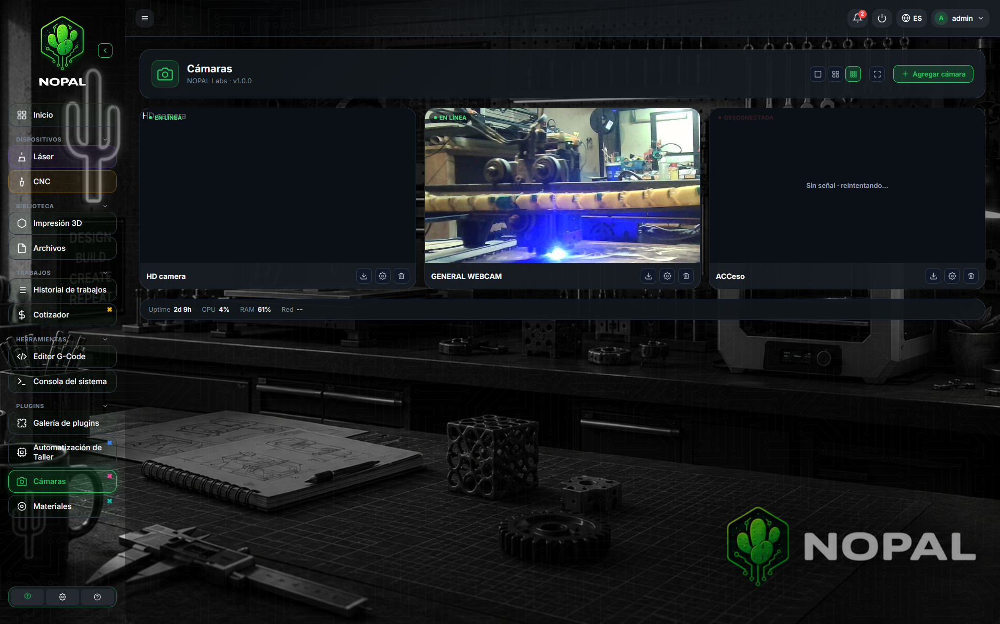
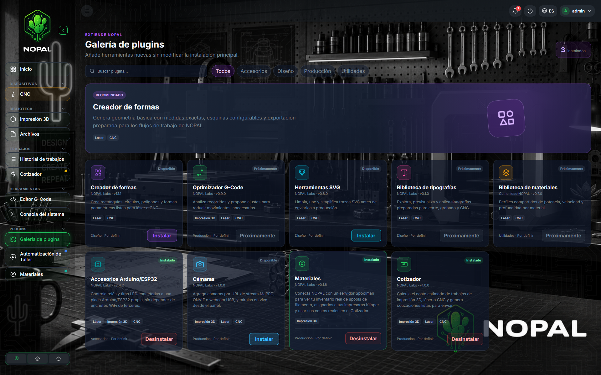
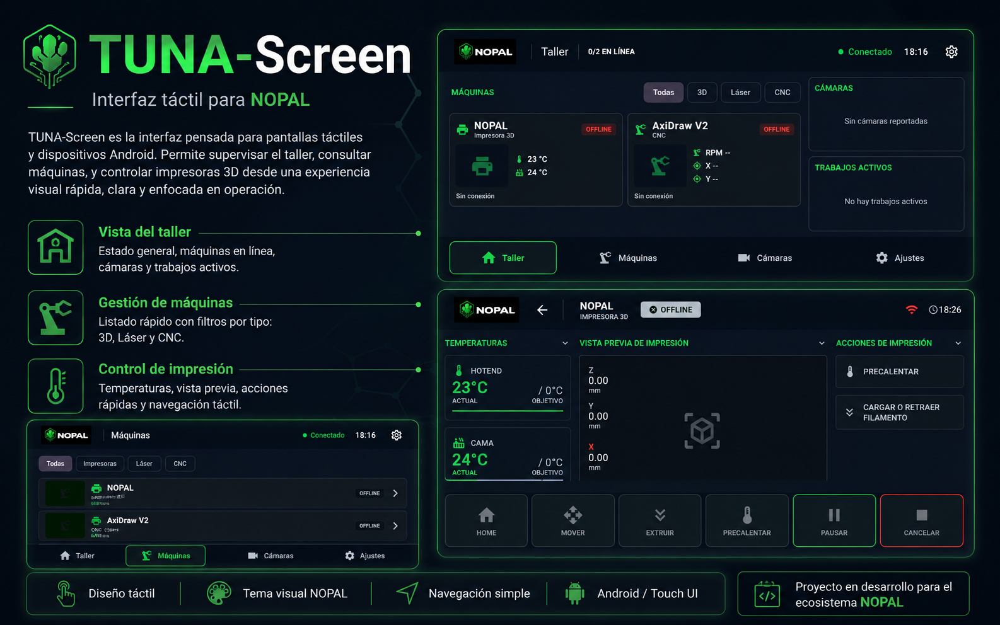
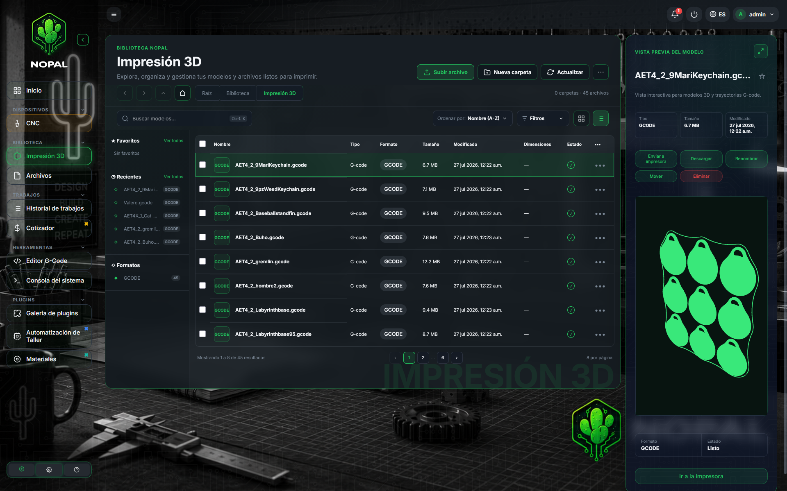

# NOPAL

[](./LICENSE)
[](https://github.com/charlymigenes-ux/nopal/commits/main)
[](./CHANGELOG.md)
[](requirements.txt)

<table>
  <tr>
    <td></td>
    <td></td>
    <td></td>
  </tr>
  <tr>
    <td></td>
    <td></td>
    <td></td>
  </tr>
  <tr>
    <td></td>
    <td></td>
    <td></td>
  </tr>
</table>

**Leer en otros idiomas:** [English](README.md)

**NOPAL** es un panel de control autoalojado (self-hosted), 100% desde el navegador, que unifica el **manejo de impresoras 3D** (Klipper/Moonraker, Marlin standalone, Bambu Lab, Elegoo, FlashForge), el **control de cortadoras/grabadoras láser y ruteadoras CNC GRBL**, y una **biblioteca completa de modelos 3D y G-code** en un solo dashboard — con un **sistema de plugins** para inventario de materiales, cotización de trabajos, cámaras y automatización de taller con Arduino, más **TUNA-Screen**, una app Android complementaria para controlar todo eso desde una tablet o un celular. Está pensado para makers, pequeñas granjas de impresión, y cualquiera que tenga un taller mixto y esté cansado de andar saltando entre pestañas de Mainsail/Fluidd, apps propias de cada marca, ventanas de LightBurn/LaserGRBL, y un explorador de archivos aparte.

---

## Índice

* [Resumen](#resumen)
* [Características](#características)
* [Arquitectura](#arquitectura)
* [Requisitos](#requisitos)
* [Instalación](#instalación)
* [Configuración](#configuración)
* [Uso](#uso)
* [Desarrollo](#desarrollo)
* [Actualizar](#actualizar)
* [Desinstalar](#desinstalar)
* [Roadmap](#roadmap)
* [Apoya a NOPAL](#apoya-a-nopal)
* [Licencia](#licencia)

---

## Resumen

NOPAL está pensado para resolver los problemas que suelen aparecer juntos en la mayoría de los talleres caseros o pequeños de fabricación:

1. **Manejar grandes colecciones de archivos** imprimibles y cortables (STL, 3MF, STEP, G-code) repartidos en carpetas y formatos distintos.
2. **Monitorear y controlar varias impresoras 3D a la vez** — de cinco marcas/protocolos distintos — sin andar cambiando entre apps separadas de cada fabricante.
3. **Controlar cortadoras/grabadoras láser GRBL y ruteadoras CNC** — por WiFi (placas estilo ESP3D) o directo por USB — desde el mismo lugar, incluyendo varias máquinas al mismo tiempo.
4. **Llevar el registro de material, costo e historial de trabajos** sin necesitar una hoja de cálculo aparte, a través de una capa opcional de plugins.
5. **Operar todo el taller desde un celular o una tablet montada en una máquina**, no solo desde un navegador de escritorio.

NOPAL junta todo esto en una sola aplicación web: una biblioteca de modelos/G-code, un dashboard en vivo con cada impresora/láser/CNC que detecta, paneles de control por máquina, una galería instalable de plugins, y un cliente móvil — todo desde un único servicio autoalojado, sin necesitar una base de datos externa.

---

## Características

### Biblioteca de modelos 3D y G-code

* Explora y organiza tus archivos imprimibles/cortables: **STL**, **3MF**, **STEP**, **G-code**.
* Organización por carpetas, renombrar/mover/eliminar, subida desde el navegador, acciones por lote.
* **Vista previa en 3D** dentro del navegador (Three.js) para modelos y trayectorias de G-code.
* Genera G-code desde un modelo o envía un archivo directo a una impresora o a la cola del láser/CNC.

### Dashboard unificado

* Detecta automáticamente las instancias locales de **Moonraker** y las impresoras **Marlin, Bambu Lab, Elegoo, FlashForge** registradas, además de los **láseres y CNC GRBL** (red + USB), y los muestra juntos, ordenados por conexión/estado.
* Colores por tipo de máquina y por estado, con un botón para ocultar rápido las que están sin conexión.
* Vista en mosaico o en lista, cuatro temas (claro, oscuro, NOPAL Style y un tema totalmente personalizado).

### Control de impresoras 3D — cinco marcas, una sola interfaz

* **Klipper/Moonraker**: temperaturas en vivo con escala de color tipo mapa de calor, precalentado/enfriado con presets de un clic, panel Toolhead completo (jog, home, motores apagados, ajuste fino de Z-offset, factor de velocidad), cola de impresión activa real con progreso en vivo sacado directo de Moonraker, historial de impresión con miniaturas, y macros directo desde `printer.cfg`.
* Impresoras **Marlin standalone** por USB serie o un puente WiFi MKS, compartiendo un spooler de comandos y un driver común.
* Impresoras **Bambu Lab** por MQTT (la impresora actúa como broker).
* Impresoras **Elegoo** por el protocolo SDCP sobre WebSocket.
* Impresoras **FlashForge** por su API HTTP REST.

Cada marca es un driver independiente propio — ajustado a cómo realmente se comunica ese hardware — no una abstracción de mínimo común denominador, así que las funciones específicas de cada marca no se recortan para encajar en un modelo genérico.

### Control de láser y CNC (GRBL, red + USB)

* Funciona con **placas de red** (controladoras WiFi estilo ESP3D) y con **placas USB/serie** (CH340, CP210x, ESP32 nativo) — detecta automáticamente las controladoras USB conectadas al servidor.
* El mismo hardware GRBL se puede registrar y controlar como **láser** (potencia/aire asistido) o como **ruteadora CNC** (spindle/refrigerante) — NOPAL muestra los controles correctos según el rol que le asignes.
* Maneja **varias máquinas al mismo tiempo**, cada una con su propio trabajo, conexión y configuración independientes.
* Controles de jog manual, home, editor de parámetros GRBL ($$), consola GRBL en vivo.
* Control de disparo con un patrón de seguridad deliberado de doble clic para armar.
* Streaming de G-code confiable con un protocolo real de buffer por conteo de caracteres (mantiene lleno el planificador de movimiento de GRBL en vez de cortarse entre líneas).
* Explorador de tarjeta SD para placas con almacenamiento propio, cola de trabajos con enmarcado (recorrer el contorno del trabajo antes de disparar) y envío de varias copias.

### Plugins

NOPAL trae un núcleo chico y una **galería de plugins** instalables (Configuración → Plugins) para todo lo demás. Cada plugin es un repositorio aparte, que se clona y se carga bajo demanda:

* **Materiales** (integración con Spoolman): se conecta a un servidor Spoolman para leer tu inventario real de filamento, asignar un carrete activo por impresora, reservar material para un trabajo, y alimentar costos reales por gramo a la herramienta de cotización.
* **Cotizador**: estima el costo de un trabajo de impresión 3D, láser o CNC a partir de tus propios perfiles de costo de material/máquina, con configuración global (moneda, precio del kWh, margen, mano de obra) e historial de cotizaciones con salida imprimible/PDF y reenvío por WhatsApp.
* **Cámaras**: agrega cámaras por MJPEG/ONVIF/URL o una webcam USB conectada localmente, y míralas en vivo por máquina.
* **Automatización de Taller** (accesorios Arduino/ESP32): mapea los pines de una placa Arduino/ESP32 genérica y arma escenas de automatización por máquina (luces, relés, sensores) sin depender de enchufes WiFi de terceros.

Hay más plugins (generación de formas, optimización de G-code, limpieza de SVG, una biblioteca compartida de parámetros de material) listados en la galería como "próximamente".

### TUNA-Screen (app Android complementaria)

Una app Android aparte (Kotlin + Jetpack Compose) que funciona puramente como una **pantalla remota** para NOPAL — nunca habla directo con Klipper/Marlin/GRBL/Bambu/Elegoo/FlashForge, solo con la API propia de NOPAL. Vinculá un celular o una tablet con un código de 6 dígitos generado desde Configuración → TUNA-Screen, y después:

* Mirá el estado en vivo de cada máquina en una vista de "taller", actualizada por WebSocket.
* Abrí la pantalla de una sola máquina para temperaturas, progreso del trabajo, y Home/Pausar/Reanudar/Cancelar.
* Montá una tablet barata directo en una impresora como pantalla de estado dedicada para esa máquina (modo kiosco).

Mirá el [repositorio de TUNA-Screen](https://github.com/charlymigenes-ux/TUNA-Screen) y [docs/TUNASCREEN_API.md](docs/TUNASCREEN_API.md) para el contrato de API que ve el cliente.

### Cuentas y acceso

* Login basado en sesión con dos roles: **Admin** (administra usuarios, dispositivos y configuración) y **Operador** (opera las máquinas).
* Un cambio de rol o la baja de una cuenta se aplica de inmediato, no recién en el próximo login.

### Interfaz

* Cuatro temas: claro, oscuro, **NOPAL Style** (verde, con su propio fondo) y un **tema personalizado** completo (elegí tus propios colores de acento/superficie/texto y subí tu propia imagen de fondo).
* Tamaño de texto de la interfaz ajustable.
* Interfaz bilingüe (español/inglés), con traducciones automáticas aportadas por la comunidad para alemán, francés y portugués de Brasil.
* Sección de **Ayuda** dentro de la app con una guía rápida de cada parte.

### Despliegue autoalojado

* Pensado para los entornos Linux donde normalmente corre Klipper.
* Se instala y corre como **servicio systemd**.
* Compatible con **Raspberry Pi OS**, **Debian**, **Ubuntu** y distribuciones similares — incluyendo las placas Linux que traen integradas algunas impresoras 3D.

---

## Arquitectura

NOPAL es una aplicación web autoalojada y liviana, sin necesitar base de datos externa — el estado persistente son archivos JSON planos.

### Componentes principales

* **Backend**: Python (FastAPI) servido con **Uvicorn**.
* **Frontend**: HTML renderizado por el servidor + JS sin frameworks, sin paso de build; vista previa 3D/G-code con Three.js.
* **Drivers de impresora**: cinco integraciones independientes (Klipper/Moonraker por polling REST, Marlin por USB/MKS-WiFi, Bambu por MQTT, Elegoo por WebSocket SDCP, FlashForge por HTTP REST) — ajustadas al transporte real de cada marca, no unificadas detrás de una abstracción compartida.
* **Integración láser/CNC**: HTTP + WebSocket para placas de red (estilo ESP3D), serie directo (pyserial) para placas USB, con estado de conexión y trabajo por host, así varias máquinas corren de forma realmente independiente al mismo tiempo.
* **Sistema de plugins**: los plugins son repositorios git aparte, clonados en `plugins/<id>/` y cargados dinámicamente al arrancar; un plugin roto solo deja un aviso en el log, no bloquea a NOPAL.
* **API de TUNA-Screen**: una superficie REST versionada y unificada `/api/tunascreen/*` más un WebSocket `/ws/tunascreen` que normaliza cada máquina (sin importar la marca) a un conjunto común de capacidades/acciones para el cliente Android.

### Flujo general

1. NOPAL escanea e indexa los archivos de modelo/G-code soportados de la biblioteca local.
2. La interfaz web expone esos archivos para explorarlos, previsualizarlos y enviarlos a una máquina.
3. NOPAL descubre las instancias locales de Moonraker y las impresoras/láseres/CNC registrados, y abre una conexión con cada uno usando el protocolo propio de esa marca.
4. El dashboard junta el estado de modelos, impresoras, láser/CNC y plugins en una sola interfaz, actualizada casi en tiempo real — y ese mismo estado normalizado es lo que consume TUNA-Screen por su propia API.

---

## Requisitos

### Sistema operativo

* Linux
* Recomendado: Debian, Ubuntu o Raspberry Pi OS

### Entorno de ejecución

* **Python 3.9 o superior**

### Opcional pero recomendado

* Una instalación funcional de **Klipper + Moonraker** (o una impresora Bambu Lab/Elegoo/FlashForge/Marlin standalone) accesible en la red, para las funciones de impresora 3D.
* Una **controladora láser o CNC basada en GRBL** (de red/estilo ESP3D o USB/serie) para las funciones de láser/CNC.
* Un servidor **Spoolman** en la red, para el plugin de Materiales.

Nada de lo anterior es obligatorio para correr NOPAL — la biblioteca de modelos y la interfaz funcionan solas; cada integración y plugin solo activa lo que encuentra.

---

## Instalación

Clona el repositorio y corre el instalador:

```bash
git clone https://github.com/charlymigenes-ux/nopal.git ~/nopal
cd ~/nopal
./install.sh
```

### Qué hace el instalador

1. Instala las dependencias del sistema necesarias (`python3-venv`, `python3-pip`).
2. Crea un entorno virtual de Python.
3. Instala las dependencias de Python desde `requirements.txt`.
4. Registra y arranca un servicio `systemd` (`nopal.service`) para que NOPAL inicie solo con el sistema.

Al terminar, NOPAL queda disponible en:

```text
http://<ip-de-tu-maquina>:8420
```

La primera vez que la abras, te va a pedir crear la cuenta inicial de **Admin**.

---

## Configuración

NOPAL está pensado para funcionar de entrada en un entorno local y autoalojado — no hay un archivo de configuración que editar a mano para el uso básico:

* La biblioteca de modelos vive dentro de la carpeta `uploads/` de la app.
* Las instancias de Moonraker se descubren solas en el host local; las demás marcas de impresora, láseres y CNC se registran desde la interfaz.
* Los plugins se instalan y habilitan desde Configuración → Plugins.
* Los códigos de vinculación de TUNA-Screen se generan desde Configuración → TUNA-Screen (solo Admin).
* Las preferencias de interfaz (tema, idioma, tamaño) se guardan por navegador.

El acceso lo controla el login propio de NOPAL (Admin/Operador). Si pensás exponer NOPAL más allá de tu red local, igual ponelo detrás de un proxy inverso como **Nginx** o **Caddy** para TLS.

---

## Uso

Con el servicio corriendo, abrí la interfaz de NOPAL desde un navegador en tu red local.

### Flujo típico

1. Abrí el dashboard y revisá de un vistazo el estado de cada impresora, láser y CNC.
2. Explorá tu biblioteca de modelos, previsualizá uno en 3D y generá o elegí su G-code.
3. Enviá el trabajo a una impresora, o agregalo a la cola del láser/CNC y mandalo a la máquina que quieras.
4. Mirá en vivo las temperaturas, la posición del cabezal, o la posición/avance del láser/CNC mientras corre el trabajo.
5. Cotizá el costo del trabajo, llevá el registro del material que usó, y revisá la cámara — si tenés esos plugins instalados.
6. Revisá el mismo estado, o actuá sobre un trabajo, desde TUNA-Screen en un celular o una tablet montada en la máquina.

### Casos de uso típicos

* Manejar una biblioteca compartida de archivos imprimibles y listos para láser/CNC.
* Monitorear y controlar una flota mixta de impresoras Klipper, Bambu Lab, Elegoo, FlashForge y Marlin standalone desde un solo dashboard.
* Correr una cortadora láser y una ruteadora CNC junto con impresoras 3D sin necesitar una app aparte para cada una.
* Cotizar un trabajo y llevar el costo real de filamento vía Spoolman antes de comprometerte a imprimirlo.
* Montar una tablet chica en una impresora como su pantalla de estado dedicada vía TUNA-Screen.
* Armar un panel de control pequeño y autoalojado para un taller casero o una pequeña granja de impresión.

---

## Desarrollo

Para correr NOPAL localmente en modo desarrollo:

```bash
python3 -m venv .venv
source .venv/bin/activate
pip install -r requirements-dev.txt
uvicorn backend.main:app --reload --host 0.0.0.0 --port 8420
```

Luego abrí:

```text
http://localhost:8420
```

### Flujo de trabajo sugerido

* Usá un entorno virtual de Python para trabajar localmente.
* Mantené al menos una marca de impresora y/o una placa GRBL accesibles localmente si estás probando la integración de impresoras o láser/CNC.
* Corré con `--reload` durante el desarrollo para iterar más rápido.
* `pytest` corre la suite de tests del backend (`pytest.ini` la apunta a `backend/tests`); los tests de cada plugin viven dentro de su propio repositorio, en `plugins/<id>/tests`.

---

## Actualizar

Para actualizar una instalación existente:

```bash
cd ~/nopal
git pull
./install.sh
sudo systemctl restart nopal
```

---

## Desinstalar

Para quitar NOPAL del sistema:

```bash
sudo systemctl disable --now nopal
sudo rm /etc/systemd/system/nopal.service
sudo systemctl daemon-reload
rm -rf ~/nopal
```

---

## Roadmap

Posibles áreas futuras para NOPAL:

* metadatos más ricos para la biblioteca de modelos — tags, colecciones y filtros de búsqueda
* mejores analíticas e historial de trabajos de impresión/láser/CNC
* integración con almacenamiento externo
* difusión por mDNS para que TUNA-Screen pueda descubrir un servidor NOPAL solo, sin tener que tipear una IP
* el modo de Máquina Avanzada de TUNA-Screen (gráficas de temperatura, jog fino, consola, macros) y un modo kiosco/pantalla dedicada real
* identificar el comando correcto de ejecución desde SD para más variantes de firmware GRBL/estilo DLC32 (correr directo desde la SD, en vez de streaming)

---

## Apoya a NOPAL

NOPAL es libre y de código abierto, y así se queda. Si te ahorra tiempo en tu taller, puedes apoyar su desarrollo:

[](https://buymeacoffee.com/nopal)
[](https://www.paypal.com/donate/?hosted_button_id=WFK56JHFAR8TL)

Lo que se recaude va a hardware para pruebas de compatibilidad — las placas y máquinas que NOPAL todavía no puede soportar porque nadie tiene una para probar. También puedes ayudar sin gastar nada [registrando el equipo que ya tienes](https://charlymigenes-ux.github.io/nopal/colabora/).

---

## Licencia

Este proyecto está licenciado bajo la **GNU General Public License v3.0**. Mirá el archivo [LICENSE](./LICENSE) para más detalles.
