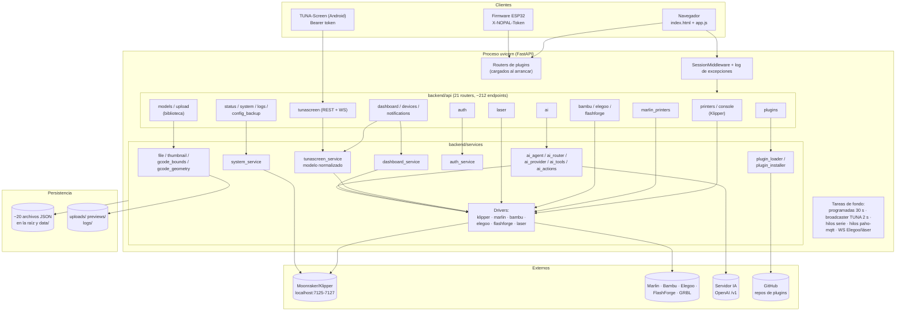
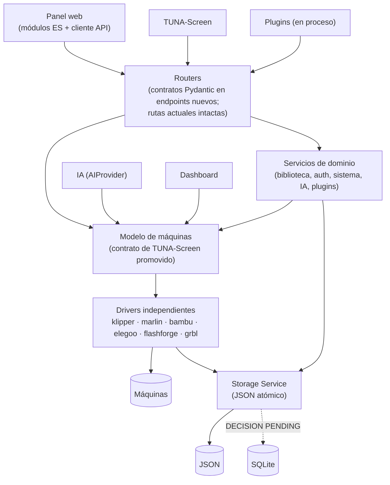

# NOPAL — Software Design Document

## 1. Información del documento

| Campo | Valor |
|---|---|
| Nombre | NOPAL |
| Nombre completo | Network Operating Platform for Automation & Libraries |
| Tipo | Software Design Document (SDD) |
| Estado | **Draft / Proposed Architecture** |
| Versión del SDD | 0.34 |
| Fecha | 2026-10-03 |
| Base analizada | rama `dev-main`: auditoría sobre `f47aa17`; estado actualizado a `09a5630` (incluye `6fc0aec` corrección de S-1, `247efab` pytest en CI, `09a5630` documentación). `main` todavía no contiene estos commits |
| Versión de NOPAL | `1.2.0-alpha.1` (archivo `VERSION`; sin tags de git) |

### Convenciones de estado

| Etiqueta | Significado |
|---|---|
| `CURRENT` | Existe hoy en el código y funciona. |
| `PROPOSED` | Propuesta de este documento; no implementada. |
| `OPEN` | Decisión no tomada. Requiere al dueño del proyecto. |
| `DECISION PENDING` | Hay una dirección propuesta, pero la decisión final depende de evidencia futura. |
| `LEGACY` | Existe y funciona, pero lo reemplazó otro mecanismo que convive con él. |
| `DEPRECATED` | Marcado para retirarse. |
| `UNKNOWN` | No hay evidencia suficiente en el repositorio para afirmarlo. |

### Fuentes, en orden de prioridad

1. Código del repositorio. 2. Tests (`backend/tests/`, 553 tests). 3. Configuración real
(`requirements*.txt`, `install.sh`, `.github/workflows/`, `.gitignore`).
4. Documentación (`README.md`, `CLAUDE.md`, `AGENTS.md`, `docs/*.md`).
5. Auditoría técnica del 2026-10-03 y auditoría de permisos D3 (misma fecha).
Cuando documentación y código discrepan, **manda el código**; las discrepancias
se listan en §5.6.

> Este documento reemplaza a la versión 0.1, que partía de un diseño anterior a
> la auditoría (asumía SQLite como decisión, una capa `machine_registry` nueva y
> versionado `/api/v1` como hecho). Nada de eso se conserva como decisión.

---

## 2. Propósito de NOPAL

### Actualmente (`CURRENT`)

NOPAL es un panel web auto-hospedado, de un solo proceso, que se ejecuta en un
host Linux del taller y concentra en una interfaz:

- **Monitoreo y control de impresoras 3D de cinco familias** con protocolos
  distintos: Klipper/Moonraker, Marlin standalone, Bambu Lab, Elegoo y FlashForge.
- **Control de láser y CNC GRBL** por red (placas estilo ESP3D) y por USB,
  con varias máquinas a la vez.
- **Biblioteca de archivos** (modelos y G-code) sobre el sistema de archivos,
  con navegación, subida, previsualización y envío a máquina.
- **Plugins** instalables desde un catálogo (cámaras, Spoolman, cotizador,
  automatización con Arduino, etc.).
- **TUNA-Screen**: API normalizada para una app Android que controla cualquier
  máquina sin conocer su marca.
- **NOPAL Intelligence**: capa de IA opcional, apagada por omisión, que
  consulta el estado del taller y, si se habilita, ejecuta acciones con
  confirmación.
- **Usuarios** con dos roles (`admin`, `operador`).

El problema que resuelve: un taller mixto que hoy tendría abiertas varias
pestañas de Mainsail/Fluidd, apps de cada fabricante, LightBurn/LaserGRBL y un
explorador de archivos, sin una vista común.

### Objetivo (`PROPOSED`)

Que NOPAL pueda crecer en número de marcas, máquinas, plugins y consumidores
sin reescribirse, apoyado en:

- un **contrato de dispositivo estable** (el modelo de TUNA-Screen, §7);
- **persistencia confiable** (escritura atómica, §16);
- **permisos explícitos** por acción (§18);
- **API con convenciones consistentes** (§11);
- **frontend modular** sin cambiar de tecnología (§12).

---

## 3. Alcance

### Dentro del alcance actual (`CURRENT`)

| Área | Detalle |
|---|---|
| Impresoras 3D | Klipper (solo Moonraker local), Marlin (USB y MKS WiFi), Bambu, Elegoo, FlashForge |
| Láser / CNC | GRBL por red y USB; streaming de G-code; trabajos desde SD; encuadre; cola |
| Biblioteca | Modelos y G-code en `uploads/`; carpetas; subida; mover/renombrar/borrar; miniaturas de G-code; vista 3D |
| G-code | Envío a máquina, análisis de límites (`gcode_bounds`), geometría (`gcode_geometry`), editor/visor 2D en el frontend |
| Plugins | Catálogo curado, instalación por `git clone`, carga dinámica de backend y frontend |
| IA | Proveedor OpenAI-compatible, herramientas de lectura, acciones con confirmación, conversaciones |
| Usuarios / auth | Sesiones, roles `admin`/`operador`, primer arranque con creación de admin |
| TUNA-Screen | Emparejamiento por código, token Bearer, REST + WebSocket |
| Sistema | Servicios systemd vía Moonraker, reinicio/apagado del host, actualización por git, respaldo cifrado de configuración, logs |

### Fuera del alcance actual

| Área | Evidencia |
|---|---|
| Base de datos (SQLite/PostgreSQL) | No hay código de BD; `backend/database.py` está vacío. |
| Moonraker en otro host | `MoonrakerClient` usa `http://localhost:{port}`. |
| Tags, categorías, metadatos y búsqueda en biblioteca | No implementado; aparece en el roadmap del README. |
| Historial unificado de trabajos | Solo existe `laser_history.json`; Klipper delega en Moonraker. |
| OctoPrint, Prusa Link, otras marcas | Sin driver. |
| API pública para terceros, API keys | No existe; solo sesión y token de TUNA-Screen. |
| Sandboxing de plugins | No existe (§13). |
| Docker / contenedores | No existe. |
| Multi-instancia / alta disponibilidad | Un proceso, estado en memoria y JSON locales. |
| Plugins de pago | El endpoint responde 501 ("falta el servidor de licencias"). |

---

## 4. Principios arquitectónicos

Todos están derivados de cómo está construido el código hoy.

| # | Principio | Evidencia en el código |
|---|---|---|
| P1 | **Separación router / servicio.** Los routers reciben y responden; la lógica y la E/S viven en servicios. | `backend/api/*.py` + `backend/services/*_service.py`. Hay excepciones (§21). |
| P2 | **Un driver por protocolo, independientes entre sí.** No se fuerza un transporte común. | Cinco servicios de impresora + `laser_service`, cada uno con su transporte; ninguno importa a otro (salvo `marlin_driver`, que es protocolo compartido a propósito). |
| P3 | **La normalización vive encima de los drivers, no dentro.** | `tunascreen_service` traduce lo que ya devuelve cada servicio; no reimplementa control. |
| P4 | **Capacidades y acciones declaradas, no inferidas.** Lo que una máquina no soporta no se anuncia. | `capabilities` / `actions` por driver; `dispatch_action` valida contra ambas. |
| P5 | **Datos observados, nunca inventados.** Valor desconocido = `null` / `"unknown"`. | Mapeos de estado de Elegoo/Bambu; comentarios explícitos en `tunascreen_service`. |
| P6 | **Extensibilidad por plugins, sin bloquear el core.** Un plugin roto no tumba NOPAL. | `plugin_loader_service._load_plugin_router` captura y registra. |
| P7 | **IA desacoplada del proveedor y opcional.** Apagada no contacta nada. | `AIProvider` (ABC), `ai_config_service`, import perezoso de httpx. |
| P8 | **La IA no escala privilegios.** Cada acción declara su acción canónica y la Authorization Policy decide con el usuario real (v0.27; antes copiaba a mano el rol del endpoint). | `ai_actions.execute` → `authorize`; `Action.role` derivado (deprecated); acciones `confirm` requieren confirmación humana. |
| P9 | **Testeable sin hardware.** | Transportes simulados; fixture `isolated_printer_registries`. |
| P10 | **Evolución incremental.** Ningún cambio rompe una ruta que use el frontend. | Patrón aplicado en `PrinterRegistrationError` (agrega `error_code` sin cambiar `detail`). |

---

## 5. Arquitectura actual (`CURRENT`)

### 5.1 Vista general

NOPAL es un **monolito modular**: un proceso `uvicorn` sirve la interfaz, la
API, los WebSockets y ejecuta tareas en segundo plano. No hay workers, colas ni
base de datos externa.



### 5.2 Capas

| Capa | Ubicación | Responsabilidad |
|---|---|---|
| Composición | `backend/main.py` (227 líneas) | Logging, middleware, montaje de estáticos, registro de routers, tareas de arranque. |
| Transversal ("core") | `backend/config.py`, `errors.py`, `auth_deps.py`, `utils.py` | Constantes de logging, error tipificado, dependencias de auth, validaciones y rutas seguras. No existe carpeta `core/`. |
| API | `backend/api/` | Routers delgados (mayoritariamente). Sin schemas Pydantic: `Form(...)` y dicts. |
| Servicios | `backend/services/` | Lógica, drivers, agregación, IA, plugins, persistencia JSON. |
| Presentación | `backend/templates/`, `backend/static/` | SPA servida por Jinja + JS vanilla. |
| Plugins | `plugins/<id>/` (ignorado por git) | Repos externos con backend y/o frontend propios. |

### 5.3 Arranque (`backend/main.py`)

En orden de registro (`@app.on_event("startup")`, mecanismo deprecado en FastAPI 0.128):

1. Log de inicio.
2. Carga de routers de plugins instalados y habilitados.
3. Captura del event loop principal para los hilos serie de láser y Marlin.
4. Loop de impresiones programadas de Klipper (cada 30 s).
5. Broadcaster de TUNA-Screen (cada ~2 s).

### 5.4 Ciclo de una petición del navegador

```text
Navegador ──fetch()──▶ SessionMiddleware (cookie firmada)
                     ▶ log_unhandled_exceptions
                     ▶ router (Depends(require_auth | require_role("admin")))
                         └─ auth_deps relee el rol desde auth_users.json
                     ▶ servicio de la marca / biblioteca / sistema
                     ▶ transporte (HTTP, MQTT, WS, serie) o archivo
                     ◀ dict JSON (forma variable por router)
```

El frontend actualiza por **polling** (34 `setInterval`, mayoría entre 3 y 10 s).
El único WebSocket servidor→cliente es el de TUNA-Screen.

### 5.5 Autenticación (resumen; detalle en §17–18)

- `SessionMiddleware` de Starlette, `same_site="lax"`, secreto en `.session_secret` (0600).
- Contraseñas con PBKDF2-HMAC-SHA256 y sal, en `auth_users.json` (0600, escritura atómica).
- `require_auth` / `require_role("admin")`; el rol se relee en cada request.
- Límite de intentos de login: 5 fallos por IP en 300 s, en memoria (`CURRENT`).
- TUNA-Screen: `Authorization: Bearer <token>` por dispositivo; el token se guarda con hash; **el dispositivo no tiene rol** (§18).
- Firmware de accesorios (plugin): cabecera `X-NOPAL-Token` compartida.
- No existe un sistema de permisos por acción centralizado (§18.2). La política objetivo está decidida en ADR-006 (`ACCEPTED`) y aún no implementada (§18.6–18.10).

### 5.6 Contradicciones documentación vs código

| # | La documentación dice | El código hace | Fuente |
|---|---|---|---|
| C1 | README: requiere "Python 3.9+" | `backend/api/plugins.py:50` usa `str \| None` en una firma evaluada en ejecución → requiere **3.10+**. CI usa 3.11; desarrollo 3.13. | README, código |
| C2 | CLAUDE.md: el fixture de tests aísla "every brand's `REGISTRY_PATH`" | No aísla `laser_service.REGISTRY_PATH` / `HISTORY_PATH` (ni `auth_users.json`, `scheduled_prints.json`, `temperature_presets.json`). `test_tunascreen.py` aísla el láser localmente y lo comenta. | `conftest.py` |
| C3 | CLAUDE.md: plugins "`arduino-accessories`, `camera-viewer`, `cotizador`" | El catálogo tiene 10; esta instancia tiene 8 instalados. | `plugin_catalog.json`, `data/plugins/installed.json` |
| C4 | CLAUDE.md y README: las marcas "no se unifican detrás de una abstracción compartida" | Los **transportes** no se unifican (cierto), pero `tunascreen_service` **sí** normaliza todas las marcas a un modelo común con capacidades y acciones (el propio README lo describe en otra sección). | `tunascreen_service.py` |
| C5 | CLAUDE.md: la lógica va en servicios, el router es delgado | `api/status.py` ejecuta `git`/`pip` y escribe `temperature_presets.json`; `api/models.py` opera el sistema de archivos con `shutil`; `api/upload.py` escribe el archivo. | código |
| C6 | CLAUDE.md: `app.py`, `routes.py`, `database.py` están vacíos | Cierto; `models.py` también está vacío y no se menciona. | código |
| C7 | CLAUDE.md: el frontend de un plugin no toca `templates/`/`static/` del core | Cierto en esa dirección, pero el **core** sí depende de plugins: `app.js` llama `/api/accessories` (20 referencias), `/api/cameras`, `/api/spoolman`. | `app.js` |
| C8 | FastAPI `description`: "Biblioteca inteligente para modelos 3D y G-code"; unidad systemd: "Panel de control de impresión 3D" | El producto cubre impresoras, láser/CNC, plugins, IA y TUNA-Screen. | `main.py`, `install.sh` |
| C9 | README: Moonraker se "auto-descubre en el host local" | Cierto; no se documenta que **no hay forma** de agregar un Moonraker remoto. | README, `klipper_service.py` |
| C10 | `.gitignore` ignora `database/` | No existe código de base de datos. | `.gitignore` |
| C11 | `requirements.txt` incluye `aiofiles` | No se encontró ningún import en `backend/`. Uso en plugins: `UNKNOWN`. | código |
| C12 | CLAUDE.md decía: "CI … only boots the server and checks the homepage renders; it does not run pytest" | **Resuelta** en `dev-main` (`247efab`, `09a5630`): el workflow ejecuta `pytest` antes del smoke test (§19.1) y CLAUDE.md ya lo describe así. | `.github/workflows/smoke-test.yml`, `CLAUDE.md` |
| C13 | Versión 0.2 de este SDD: "sin límite de intentos de login" | Existe límite: 5 fallos / IP / 300 s, en memoria (`backend/api/auth.py:20-66`). Corregido en 0.3. | código |

---

## 6. Mapa de módulos

Estados: `CURRENT` = implementado y en uso; `PARTIAL` = implementado con
limitaciones relevantes; `LEGACY` = convive con su reemplazo.

| Módulo | Responsabilidad | Estado | Dependencias principales |
|---|---|---|---|
| `main.py` | Composición de la app y tareas de arranque | `CURRENT` (usa `on_event`, deprecado) | todos los routers, `plugin_loader_service` |
| `auth_service` + `auth_deps` + `api/auth` | Usuarios, hash, sesión, roles | `CURRENT` | `auth_users.json`, `.session_secret` |
| `klipper_service` + `api/printers`, `api/console` | Moonraker: estado, control, cola, config, macros, programadas | `PARTIAL` (solo localhost) | requests |
| `marlin_printer_service` + `marlin_driver` + `mks_wifi_transport` | Marlin por serie o TCP; protocolo ok/resend compartido | `CURRENT` | pyserial |
| `bambu_service` | MQTT-TLS, caché con lock desde hilo paho | `CURRENT` | paho-mqtt |
| `elegoo_service` | SDCP por WebSocket persistente | `CURRENT` | websockets |
| `flashforge_service` | HTTP REST | `CURRENT` | requests |
| `laser_service` + `api/laser` | GRBL red/USB, streaming, SD, cola, encuadre, historial | `CURRENT`; "host activo" `LEGACY` (§10) | requests, requests-toolbelt, websockets, pyserial |
| `printer_profiles` | Catálogo estático de modelos (volumen, placas) | `CURRENT` | — |
| `tunascreen_service` + `api/tunascreen` | Modelo normalizado de máquinas, dispatch, emparejamiento, WS | `CURRENT` | los seis drivers, plugins (cámaras, Spoolman, accesorios) |
| `api/devices` | Expone `list_machines()` con sesión | `CURRENT` | `tunascreen_service` |
| `dashboard_service` + `api/dashboard` | Resumen: conteos, trabajos activos, host, plugins | `CURRENT` (agregación propia, §21) | los seis drivers |
| `notification_service` | Alertas calculadas al vuelo (no persistidas) | `CURRENT` | drivers, plugin de cámaras |
| `maintenance_service` | Mantenimiento por máquina | `CURRENT` | — |
| `ai_*` + `api/ai` | NOPAL Intelligence | `CURRENT` (apagado por omisión) | httpx, drivers, `dashboard_service` |
| `file_service`, `thumbnail_service`, `api/models`, `api/upload` | Biblioteca | `PARTIAL` (sin metadatos; S-1 corregido en `6fc0aec`) | Pillow, sistema de archivos |
| `gcode_bounds`, `gcode_geometry` | Límites y análisis de G-code | `CURRENT` | `gcode_bounds_cache.json` |
| `system_service` + `api/system` | Servicios systemd vía Moonraker, reinicio/apagado | `CURRENT` | Moonraker `/machine/*` |
| `api/status` | Estado, almacenamiento, temperaturas, presets, versión, diagnóstico, actualización | `CURRENT` (lógica en router) | git, pip, `klipper_service` |
| `config_backup_service` | Exportar/importar configuración cifrada (Fernet) | `CURRENT` | cryptography |
| `plugin_installer_service`, `plugin_loader_service`, `api/plugins` | Catálogo, clonado, carga dinámica | `CURRENT` | git |
| `app.py`, `routes.py`, `database.py`, `models.py` | — | Vacíos | — |
| Frontend (`index.html`, `app.js`, `style.css`, `guided-printer-setup.js`, i18n) | SPA | `CURRENT` (monolítico) | Three.js incluido |

---

## 7. Modelo de dispositivos

### 7.1 Estado actual (`CURRENT`)

No existe una clase `Device`. Existe un **modelo de datos normalizado**,
producido por `backend/services/tunascreen_service.py`, que hoy es lo más
cercano a un contrato común de dispositivos en NOPAL.

**Forma de una máquina** (ejemplo real de Klipper):

```json
{
  "id": "klipper:7125",
  "name": "manchas 1",
  "type": "printer",
  "driver": "klipper",
  "online": true,
  "capabilities": ["temperature", "movement", "extrusion", "fan",
                   "speed_override", "flow_override", "z_offset",
                   "macros", "console"],
  "actions": ["pause", "resume", "cancel", "home", "move", "extrude",
              "set_temperature", "set_fan", "set_speed_factor",
              "set_flow_factor", "set_z_offset", "run_macro",
              "send_console_command"],
  "status": {
    "state": "printing",
    "hotend": {"current": 210.1, "target": 210},
    "bed": {"current": 60.0, "target": 60},
    "position": [...], "fan_percent": 100,
    "speed_factor": 1.0, "flow_factor": 1.0, "z_offset": 0.0,
    "job": {...}, "camera": null
  }
}
```

| Campo | Significado | Origen |
|---|---|---|
| `id` | `"<prefijo>:<id nativo>"` | Klipper: puerto. Marlin: dispositivo. Bambu/FlashForge: número de serie. Elegoo: mainboard id. Láser/CNC: host. |
| `type` | `printer` \| `laser` \| `cnc` | Láser vs CNC lo decide `kind` del registro láser. |
| `driver` | Marca/protocolo | `klipper`, `marlin`, `bambu`, `elegoo`, `flashforge`, `grbl`. |
| `capabilities` | Qué puede **mostrar** la UI | Declaradas por normalizador; algunas dependen de plugins (`camera`, `spool`). |
| `actions` | Qué se puede **ordenar** | Listas fijas por driver (ver tabla). |
| `status` | Estado normalizado | `state` (`printing`, `paused`, `offline`…), temperaturas, posición, trabajo, cámara. |

La separación `capabilities` / `actions` es deliberada (comentario en el
código): evita botones falsos en máquinas que reportan temperatura pero no
permiten cambiarla por su driver.

**Acciones por driver** (constantes en `tunascreen_service`):

| Driver | Acciones |
|---|---|
| Klipper | pause, resume, cancel, home, move, extrude, set_temperature, set_fan, set_speed_factor, set_flow_factor, set_z_offset, run_macro, send_console_command |
| Marlin | igual que Klipper sin set_z_offset ni run_macro |
| Bambu, Elegoo, FlashForge | pause, resume, cancel |
| GRBL láser | pause, resume, cancel, home, move, set_laser_power, set_air_assist |
| GRBL CNC | pause, resume, cancel, home, move, set_work_zero, set_spindle, set_coolant |

**Caché y estabilidad**

- `list_machines()` consulta las seis fuentes **en paralelo**
  (`asyncio.gather` + `run_in_executor` para los servicios síncronos).
- Caché de **2.5 s** (`MACHINE_CACHE_TTL_SECONDS`), invalidada si cambia la
  "firma de fuentes" (`_current_source_signature`).
- Si una fuente completa falla, se conserva su **último snapshot**.
- **Grace snapshots**: una máquina que pasa de online a offline se sigue
  mostrando online hasta **3** snapshots fallidos (`OFFLINE_GRACE_SNAPSHOTS`),
  para que un timeout aislado no haga parpadear la tarjeta.

**Dispatch de acciones** (`dispatch_action(machine_id, action, params)`):

```text
split "driver:raw_id"
 → get_machine() (usa la caché)
 → ¿existe? ¿online? ¿action ∈ actions? ¿capability requerida ∈ capabilities?
 → _dispatch_<driver>(raw_id, action, params)
     └─ llama funciones ya existentes del servicio de la marca
        (p. ej. Klipper home/move = G28/G1 vía send_console_command)
```

**Consumidores actuales del modelo**

| Consumidor | Cómo |
|---|---|
| TUNA-Screen | `/api/tunascreen/machines`, `/machine/{id}`, `/action`, `/ws/tunascreen` (broadcast cada 2 s) |
| Panel web, "Todos los dispositivos" | `/api/devices/registry` |

**No lo consumen** (tienen su propia agregación de las seis fuentes):

| Módulo | Agregación propia |
|---|---|
| `ai_tools._collect_machines` | ~95 líneas |
| `dashboard_service._device_counts` / `_active_jobs` | ~120 líneas |
| Rutas por marca del panel | Hablan directo con cada servicio (correcto: son pantallas específicas de marca) |

### 7.2 Por qué este modelo es importante

1. Es el **único lugar** donde existe un vocabulario común de capacidades y
   acciones, y está **probado** (38 tests en `test_tunascreen.py`).
2. Un **cliente externo real** (la app Android) ya depende de él: es un
   contrato de facto, con `API_VERSION = 1`.
3. Respeta P2/P3: no toca los transportes; traduce lo que cada servicio ya
   devuelve.
4. Resuelve los problemas transversales (paralelismo, caché, tolerancia a
   fallos, validación) que los otros dos agregadores resuelven a medias.

### 7.3 Arquitectura objetivo (`PROPOSED`)

**No se crea una abstracción nueva.** Se promueve el modelo existente a
contrato de arquitectura:

1. **Separar responsabilidades dentro de lo que ya existe**: la parte de
   "máquinas" de `tunascreen_service` (normalizadores, caché, grace, dispatch)
   y la parte de "dispositivo TUNA-Screen" (emparejamiento, tokens, WS)
   conviven hoy en un archivo de 1228 líneas. Propuesta: mover la primera a un
   módulo propio **sin cambiar comportamiento ni forma de salida**; nombre
   `OPEN`.
2. **Un solo agregador**: `dashboard_service` y `ai_tools` consumen
   `list_machines()` en lugar de su agregación propia.
3. **Documentar el contrato**: forma, vocabulario cerrado de capacidades y
   acciones, semántica de `state`, formato de `id` (en un `docs/DEVICES.md`
   cuando se ejecute la fase correspondiente).
4. **Test de contrato** por driver: cada normalizador produce la forma
   documentada y toda acción declarada tiene dispatch.
5. **Agregar una marca** = servicio con su transporte + normalizador +
   dispatcher registrados. TUNA-Screen, dashboard, IA y panel la ven.

Lo que **no** se propone: clases `Device → Printer/Laser/CNC` (ver ADR-001/002),
ni que las pantallas por marca pasen por el modelo normalizado.

Puntos del contrato a resolver (`OPEN`): unificar el prefijo `laser:` con
`driver: "grbl"`; formato de id para Klipper remoto (depende de ADR-004).

---

## 8. Drivers

Todos son módulos de funciones (no clases intercambiables). Ninguno conoce a
otro, salvo el protocolo Marlin compartido.

### 8.1 Klipper / Moonraker
Ver §9.

### 8.2 Marlin standalone

| Aspecto | Detalle |
|---|---|
| Propósito | Impresoras 3D con Marlin sin Klipper |
| Protocolo | Marlin: un comando por `ok`; `Resend`, `busy`; estado solo por consulta (M105/M114) |
| Transporte | USB serie (autobaud 115200/250000) o TCP a módulo MKS WiFi (puerto 8080, descubrimiento UDP 8989) |
| Servicios | `marlin_printer_service.py` (gestor de conexión, registro, trabajos, SD) + `marlin_driver.py` (protocolo puro, recibe un `MarlinTransport` inyectado) + `mks_wifi_transport.py` |
| Capacidades | Temperatura, movimiento, extrusión, ventilador, velocidad/flujo, consola, SD, cola de comandos |
| Limitaciones | Un trabajo streamed depende de que NOPAL siga corriendo; los hilos serie requieren el event loop capturado al arranque |
| TUNA-Screen | `_marlin_machine`; acciones de movimiento y temperatura |
| Registro | `marlin_printer_registry.json` (escritura no atómica, con lock) |

### 8.3 Bambu Lab

| Aspecto | Detalle |
|---|---|
| Protocolo / transporte | MQTT sobre TLS; la impresora es el broker; usuario fijo + access code |
| Servicio | `bambu_service.py`; paho-mqtt corre en su propio hilo y escribe en una caché protegida por lock (no se fuerza al event loop) |
| Capacidades | Estado, temperaturas, progreso; pause/resume/cancel; envío |
| Limitaciones | Sin home/jog/extrude por REST |
| TUNA-Screen | `_bambu_like_machine`; solo acciones de transporte |
| Registro | `bambu_printer_registry.json` (access code en texto plano) |

### 8.4 Elegoo

| Aspecto | Detalle |
|---|---|
| Protocolo / transporte | SDCP por WebSocket persistente; la impresora empuja estado (sin polling una vez conectada) |
| Servicio | `elegoo_service.py`; códigos `PrintInfo.Status` observados en hardware real, documentados en el docstring; no mapeados → `"unknown"` |
| Capacidades / limitaciones | Igual que Bambu |
| Registro | `elegoo_printer_registry.json` (no atómico, sin lock) |

### 8.5 FlashForge

| Aspecto | Detalle |
|---|---|
| Protocolo / transporte | HTTP REST petición/respuesta; sin conexión persistente |
| Servicio | `flashforge_service.py` |
| Capacidades / limitaciones | Igual que Bambu |
| Registro | `flashforge_printer_registry.json` (no atómico, sin lock) |

### 8.6 GRBL (láser / CNC)
Ver §10.

---

## 9. Klipper / Moonraker

### 9.1 Estado actual (`CURRENT`)

| Aspecto | Implementación |
|---|---|
| Descubrimiento | `find_moonraker_instances()` sondea `localhost` en `MOONRAKER_DEFAULT_PORTS = 7125..7127` más los puertos de la variable de entorno `NOPAL_KLIPPER_PORTS` (separados por coma). Caché de 5 s. Solo registra en log las transiciones (aparece / deja de responder). |
| Configuración | **No hay registro de impresoras Klipper.** Una impresora es lo que responda en esos puertos. |
| Cliente | `MoonrakerClient(port)` → `base_url = http://localhost:{port}` (hardcodeado), timeout 2 s, sin API key. |
| Estado | `GET /printer/objects/query?extruder&heater_bed&fan&print_stats&toolhead&virtual_sdcard&gcode_move` → `normalize_printer_payload`. |
| Temperaturas | Objetos `extruder`/`heater_bed`, `/server/temperature_store`. |
| Progreso | `virtual_sdcard.progress`, `print_stats`, `/server/files/metadata`. |
| Control | `/printer/print/{pause,resume,cancel}`, `/printer/restart`, `/printer/firmware_restart`, `/printer/gcode/script`, `/server/files/upload`, cola (`/server/job_queue`), archivos de config. |
| Errores | `_get` captura `ConnectionError` y `Exception`, registra y devuelve `{}`. |
| Varias instancias | Una por puerto. Identificadas como `klipper:{port}`. |
| Nombres | En orden: nombre de Mainsail (`/server/database/item?namespace=mainsail`), `server.name`/`hostname`, `printer_N_data` en la ruta de config → `"manchas N"`, y un mapa fijo `{7125: "manchas 1", 7126: "manchas 2", 7127: "manchas 3"}`. Los nombres `"manchas"` son de una instalación concreta y están en el código. |
| Impresiones programadas | Solo Klipper. `scheduled_prints.json`; loop cada 30 s en `main.py` → `run_due_scheduled_prints()`. Escritura no atómica. |
| Sistema | `system_service` usa la API `/machine/*` de Moonraker para servicios systemd, reinicio y apagado del host. |
| Rutas | `/api/printers/{port}/...` identifican por puerto; `/api/printers/{printer_name}/status` por nombre. |

### 9.2 Decisiones pendientes

| Pregunta | Estado |
|---|---|
| ¿NOPAL soportará Moonraker remoto (otro host de la LAN)? | `OPEN` (ADR-004) |
| Si sí: ¿registro explícito, descubrimiento, o ambos? | `OPEN` |
| Si sí: ¿cómo se preservan los ids `klipper:{port}` existentes (vinculados a cámaras, Spoolman, TUNA-Screen)? | `OPEN` |
| ¿Se retiran los nombres `"manchas"` del código? | `PROPOSED` (bajo riesgo; requiere un nombre por omisión alternativo) |
| ¿Soporte de API key de Moonraker? | `OPEN` |

---

## 10. Láser / CNC

### 10.1 Estado actual (`CURRENT`)

| Aspecto | Implementación |
|---|---|
| Protocolo | GRBL / grblHAL / FluidNC; también placas con Marlin (reutiliza `marlin_driver`) |
| Transporte de red | HTTP (comandos, SD) + WebSocket en puerto 81 (estilo ESP3D) |
| Transporte USB | pyserial, con identidad por ubicación física USB (`_resolve_usb_location`), no por `/dev/ttyUSBx` |
| Streaming | Protocolo de buffer por conteo de caracteres (`GRBL_RX_BUFFER_SIZE = 120`) para mantener el planificador lleno |
| Concurrencia | Estado de conexión y trabajo **por host**; varias máquinas a la vez |
| Funciones | Estado, consola, jog, home, settings `$`, trabajos (inicio/pausa/reanudar/cancelar), encuadre, cola, SD (listar, ejecutar, carpetas, borrar, formatear), historial |
| Láser vs CNC | `kind` en `laser_registry.json` → `type` y conjunto de capacidades/acciones distinto |
| Persistencia | `laser_registry.json`, `laser_history.json` (máx. 200), sin escritura atómica, con lock |
| TUNA-Screen | `_laser_machine` → `id = "laser:{host}"`, `driver = "grbl"` |
| IA | Por diseño **no existe** herramienta para arrancar láser o CNC; un test lo verifica |

### 10.2 Coexistencia: host activo `LEGACY` vs multi-host `CURRENT`

| Modelo | Evidencia |
|---|---|
| ~~**Host activo (legacy)**~~ | **Retirado (D4, v0.34).** Era una variable global `_active_host` (inicializada con la IP fija `192.168.0.61`), compartida por todas las sesiones; `GET/POST /api/laser/host` la leía y cambiaba y toda ruta sin `host` actuaba sobre ella. Ver §10.2 y D-11. |
| **Multi-host (actual)** | `laser_registry.json` con varias máquinas; endpoints como `/api/laser/registry/status` y `/api/laser/jobs/active` operan sobre todas; TUNA-Screen e IA usan el host explícito. |

**D4 cerrada (v0.34): solo queda el modelo multi-host.** Ya no existe el "host
activo" global ni `/api/laser/host`. Las 25 rutas de láser que caían a él
exigen `host` (query en GET, formulario en POST); sin él responden **400**
"Falta indicar el láser o la CNC (host)" antes de autorizar, leer archivos o
tocar ninguna máquina (fail-closed). El servicio ya no tiene host por
omisión (`DEFAULT_LASER_HOST` → `FALLBACK_SCAN_SUBNET`, solo para adivinar la
subred del escaneo). El panel guarda la máquina elegida **por sección**
(Láser, CNC) en el navegador, por id interno (`lastLaserMachineId`,
`lastCncMachineId`; las claves viejas por host se migran una vez) y la
resuelve al host actual con el registro; ninguna llamada sale sin `host`.
Lo que hace una sesión ya no puede mover a qué máquina van las órdenes de
otra.

---

## 11. API

### 11.1 Estado actual (`CURRENT`)

- **~212 endpoints en core** en 21 routers, más los de plugins.
- **Sin versionado**, salvo TUNA-Screen (`API_VERSION = 1`, informado en `/api/tunascreen/info`).
- **Sin schemas Pydantic**: entradas por `Form(...)` o query; salidas como dict.
- Documentación OpenAPI automática de FastAPI disponible (`/docs`), no curada.

| Router | Prefijo | Endpoints aprox. | Auth |
|---|---|---|---|
| laser | `/api/laser/*` | 41 | sesión; 3 admin |
| marlin_printers | `/api/marlin-printers/*` | 27 | sesión; 2 admin |
| ai | `/api/ai/*` | 26 | sesión; 13 admin |
| printers | `/api/printers/*` (solo Klipper) | 21 | sesión |
| tunascreen | `/api/tunascreen/*`, `/ws/tunascreen` | 19 | token Bearer; 3 admin por sesión (emparejar, listar, revocar) |
| status | `/api/status`, `/api/storage`, `/api/system/*` | 12 | sesión; 3 admin |
| models | `/api/models`, `/api/browse`, `/api/files`, `/api/folders`, `/api/*/thumbnail` | 11 | sesión |
| bambu / elegoo / flashforge | `/api/<marca>/printers/*` | 9 c/u | sesión; alta/baja admin |
| auth | `/api/auth/*` | 9 | login/setup públicos; usuarios admin |
| system | `/api/system/*` | 5 | admin |
| console | `/api/console/*`, `/api/macros*` | 4 | sesión |
| plugins | `/api/plugins/*` | 4 | listar sesión; instalar/actualizar/borrar admin |
| config_backup | `/api/config-backup/*` | 4 | admin |
| dashboard, devices, logs, notifications, upload | — | 1 c/u | sesión |
| fuera de routers | `/`, `/uploads/{path}`, `/view/{path}` | 3 | `/` pública; resto sesión |

**Convenciones observadas**: JSON; nombres de campo mayormente `snake_case`;
errores con `HTTPException` → `{"detail": "<mensaje es-MX>"}`; el frontend
depende de que `detail` sea texto (`new Error(data.detail)`).
`PrinterRegistrationError` agrega `error_code` como campo hermano.

### 11.2 Inconsistencias conocidas

| Inconsistencia | Ejemplo |
|---|---|
| Nombres de recurso | `/api/printers` = solo Klipper; `/api/marlin-printers`; `/api/bambu/printers` |
| Identificadores | puerto, ruta de dispositivo, número de serie, mainboard id, host, nombre |
| Verbos | `POST /api/auth/users/update` y `/remove` en vez de `PUT`/`DELETE`; `POST /api/laser/registry/remove` |
| Forma de respuesta | `{"success": true}`, `{"ok": true}`, listas desnudas, dicts con claves variables |
| Errores | Solo el registro de impresoras usa `error_code`; 502/504 no se usan de forma sistemática para fallas de dispositivo |
| Duplicación | `/api/devices/registry` ≡ `/api/tunascreen/machines` (distinta auth); `/api/dashboard/summary` recalcula |
| Espacio de nombres de plugins | `/api/plugins/matriz-led/*` vs `/api/accessories/*`, `/api/cameras/*`, `/api/pricing/*`, `/api/spoolman/*` |
| `/api/system/*` | Repartido entre `status.py` y `system.py` |
| Endpoints sin referencia aparente en el frontend (heurística, a verificar) | `GET/PUT /api/ai/config`, `GET /api/ai/tiers`, `GET /api/marlin-printers/discover`, `GET /api/status` |

### 11.3 API objetivo — principios (`PROPOSED`)

No se define todavía una API nueva. Principios propuestos:

1. **Compatibilidad**: ninguna ruta usada por `app.js` o TUNA-Screen se rompe.
   Una ruta solo se retira después de que ningún cliente la use, marcándola
   antes como `DEPRECATED`.
2. **Errores**: `detail` sigue siendo texto; `error_code` estable se generaliza
   (patrón de `PrinterRegistrationError`). Fallas de dispositivo diferenciadas
   (502 la máquina respondió con error; 504 no respondió; 409 ocupada).
3. **Contratos explícitos** con Pydantic en endpoints nuevos.
4. **Un recurso normalizado de máquinas** basado en el modelo de §7.
5. **Versionado** (`/api/v1/...`): `PROPOSED` solo para recursos pensados para
   clientes fuera del panel. Depende de la decisión D2.

**Decisión pendiente (D2)**: ¿NOPAL tendrá consumidores externos además del
frontend y TUNA-Screen? → `OPEN`.

---

## 12. Frontend

### 12.1 Estado actual (`CURRENT`)

| Aspecto | Implementación |
|---|---|
| Arquitectura | SPA server-rendered: un `index.html` (5.3 k líneas) con todas las secciones; se muestran/ocultan por JS |
| JavaScript | `app.js` (22.5 k líneas) vanilla, sin módulos, sin build step; `guided-printer-setup.js` (851) |
| CSS | `style.css` (20.3 k líneas) |
| 3D | Three.js incluido en el repo (`three.min.js`, `STLLoader.js`, `3MFLoader.js`) |
| Comunicación | 259 llamadas `fetch(` dispersas; **sin cliente de API común** |
| Actualización | Polling: 34 `setInterval` (100 ms – 20 s; mayoría 3–10 s). Sin WebSocket en el panel |
| i18n | `translations.js` (es/en) canónico; de/fr/pt-BR generados por `scripts/generate_i18n.py` |
| Temas | Clase en `<body>`: claro (sin clase), `dark`, `green`, `red`, `custom`; variables CSS; regla: sin colores fijos. Guía: `NOPAL_DESIGN_SYSTEM_v1.md` |
| Modo IA | Atributo `data-ai-active` en `<body>`, ortogonal al tema (`docs/MODO_IA_PLAN.md`) |
| Plugins | JS/CSS de cada plugin servido desde `/plugins-static/<id>/frontend/...` e inyectado aparte |
| Acoplamiento | `app.js` llama endpoints de plugins (`/api/accessories`, `/api/cameras`, `/api/spoolman`) |

### 12.2 Problema: frontend monolítico

El problema no es la tecnología (JS vanilla es suficiente para el caso de uso:
pocos usuarios en LAN, servido por el mismo proceso) sino el **tamaño y la
falta de fronteras**: tres archivos concentran ~48 k líneas; cualquier cambio
toca un archivo compartido; no hay una capa común para llamadas a la API.

### 12.3 Evolución (`PROPOSED`, incremental)

- **No** migrar a React/Vue/otro framework (ver §28).
- Extraer secciones de `app.js` a **módulos ES nativos** (`<script type="module">`),
  que los navegadores actuales soportan sin bundler, una sección a la vez.
- Introducir un **cliente de API** pequeño (manejo uniforme de `detail`/`error_code`, sesión expirada).
- Partir `style.css` por área manteniendo un archivo base de variables de tema.
- Que el core no llame endpoints de plugins directamente (mecanismo `OPEN`).
- Estrategia de largo plazo: decisión D8, `OPEN`.

---

## 13. Sistema de plugins

### 13.1 Estado actual (`CURRENT`)

| Aspecto | Implementación |
|---|---|
| Catálogo | `backend/plugin_catalog.json` (en el repo): id, categoría, `repo_url`, disponibilidad, precio. 10 plugins. |
| Instalación | Solo admin. `git clone <repo_url>` en `plugins/<id>/` (ignorado por git). Solo plugins `free`; `paid` → 501. |
| Estado instalado | `data/plugins/installed.json` (`version`, `enabled`, `installed_at`), escritura atómica. Lo lee el servicio (no el router) para que el loader lo use antes de que exista cualquier router. |
| Manifiesto | `nopal-plugin.json`: `schema_version`, `id`, `name`, `version`, `publisher`, `category`, `description`, `permissions`, `compatibility`, `frontend {script, style, section}`, `backend {entry}` (opcional). |
| Carga | Al arrancar, para cada plugin habilitado: valida que `backend.entry` esté dentro de su carpeta; lo importa con `importlib` como paquete `nopal_plugins.<id>` (los imports relativos funcionan); registra su variable `router` con `app.include_router`. Falla → warning y se omite. |
| Puntos de extensión | `router` (endpoints), `AI_TOOLS` (herramientas para la IA, `get_plugin_ai_tools`; desde v0.28 cada una declara `policy_action` y se autoriza con la política, §18.8), lectura opcional por el core vía `get_loaded_plugin_module` (cámaras, accesorios, Spoolman en dashboard/notificaciones/TUNA-Screen). |
| Estáticos | `/plugins-static` monta `plugins/` completo. |
| Configuración y datos | Cada plugin guarda sus JSON (en la raíz: `spoolman_*.json`, `pricing_config.json`, `quotes_registry.json`, `camera_registry.json`, `accessory_registry.json`…; o en `data/`). |
| Dependencias Python | Las de plugins están en el `requirements.txt` del core (p. ej. `xhtml2pdf`, `esptool`). |
| Tests | Viven en cada repo de plugin; se corren aparte. |

### 13.2 Aislamiento y permisos — situación real

- **No hay sandboxing.** El backend de un plugin es Python importado **dentro
  del mismo proceso**, con los mismos privilegios que NOPAL: acceso a todos los
  archivos JSON (incluidos `auth_users.json` y credenciales de máquinas), a la
  red, a los puertos serie y a cualquier módulo del core.
- **El campo `permissions` del manifiesto es descriptivo**: se muestra en la
  galería; ningún código lo verifica ni lo aplica.
- **La autenticación de las rutas de cada plugin la decide el plugin.** En los 5
  plugins con backend instalados, todas las rutas usan `Depends(...)` salvo
  `POST /api/accessories/cluster/event`, que se autentica con `X-NOPAL-Token`
  (llamada desde firmware, documentado así a propósito).
- **Confianza**: la seguridad depende de que los repos del catálogo sean
  confiables; actualizar un plugin trae y ejecuta el código nuevo de su remoto.

---

## 14. Inteligencia Artificial (NOPAL Intelligence)

### 14.1 Estado actual (`CURRENT`)

Documentación detallada existente: `docs/NOPAL_INTELLIGENCE.md`.

| Componente | Responsabilidad |
|---|---|
| `ai_config_service` | Configuración (`ai_config.json`): habilitado, proveedores, modelos por nivel, `actions_enabled`, endpoints públicos permitidos |
| `ai_provider` | `AIProvider` (ABC) y su única implementación `OpenAICompatibleProvider` (`/v1/chat/completions`): llama.cpp, Ollama `/v1`, LM Studio, vLLM o nube si se habilita. httpx con import perezoso; manejo de `Retry-After` |
| `ai_router` | Clasifica la pregunta y elige nivel/modelo |
| `ai_agent` | Orquesta: perfil, loop nativo de herramientas o modo contexto, conversación |
| `ai_tools` | Herramientas de **solo lectura** (estado del taller, máquinas, temperaturas, trabajos, eventos del log, biblioteca, materiales, plugins, accesorios, cámaras) + herramientas declaradas por plugins |
| `ai_actions` | Acciones físicas, **registro separado**: interruptor propio (apagado por omisión), acción canónica de la Authorization Policy por herramienta (v0.27; antes `role` copiado del endpoint equivalente), riesgo `low` (directo) o `confirm` (token pendiente, TTL 300 s, en memoria). No existe acción para arrancar láser/CNC |
| `ai_conversations_service` | Historial (`ai_conversations.json`, escritura atómica); privado por usuario (`owner_user_id`, D-9, v0.31) |

### 14.2 Flujo confirmado

```text
Usuario (panel) ─POST /api/ai/ask─▶ api/ai.py (sesión; rol del usuario)
  ▶ ai_agent.ask()
      ├─ ai_router.route()              → modelo
      ├─ ai_provider (AIProvider)       ⇄ servidor IA (OpenAI-compatible)
      ├─ ai_tools.<tool>()              → servicios de marca / dashboard_service
      │      └─ drivers → máquinas
      └─ ai_actions (si actions_enabled y rol suficiente)
             ├─ risk=low     → ejecuta vía servicios → drivers → máquina
             └─ risk=confirm → token → POST /api/ai/actions/{token}/confirm
```

El flujo `Usuario → AI Provider → AI Tools → Services → Drivers → Machine` se
confirma, con dos matices: (a) las herramientas las orquesta `ai_agent`, no
el proveedor; (b) `ai_tools` usa su propia agregación de máquinas, no el modelo
de §7.

### 14.3 Observaciones

- `ai_tools.py:759` importa constantes de `backend.api.models` (servicio → router: capa invertida).
- `get_recent_events` lee `logs/nopal.log` con expresiones regulares (no hay almacén de eventos).
- `ai_config.json` puede contener una API key y tiene permisos 644.

---

## 15. Biblioteca

### 15.1 Implementado (`CURRENT`)

| Función | Detalle |
|---|---|
| Formatos | Modelos: `.stl .3mf .obj .step .stp .svg .dxf`. G-code: `.gcode .gc .gco .nc .tap .cnc` (`api/models.py`) |
| Almacenamiento | `uploads/models/` y `uploads/gcode/`; el árbol de carpetas es la organización y la fuente de verdad |
| Navegar | `GET /api/browse`, `GET /api/models` |
| Carpetas | `POST/PATCH/DELETE /api/folders` |
| Archivos | `PATCH /api/files` (renombrar), `DELETE /api/files`, `POST /api/files/move` |
| Rutas seguras | `safe_section_path()` resuelve y verifica que la carpeta quede dentro de la sección |
| Subida | `POST /api/upload` (multipart). El nombre de archivo se valida y se verifica que la ruta final quede dentro de la carpeta destino (S-1 `FIXED`, §17.2) |
| Descarga | `GET /uploads/{path}` (sesión, protegido contra traversal); se entrega en línea con el tipo deducido de la extensión (ver S-10, §17.2); vista `/view/{path}` |
| Miniaturas | G-code: render 2D con Pillow (`thumbnail_service`), cacheado; `GET /api/gcode/thumbnail`, `/api/models/thumbnail` |
| Preview | 3D en el navegador con Three.js (STL/3MF); visor 2D de G-code en el Editor G-Code |
| Análisis | `gcode_bounds` (límites para encuadre, caché JSON), `gcode_geometry` |
| Envío a máquina | Por driver (Klipper sube a Moonraker; Marlin/láser streaming o SD) |

### 15.2 No implementado

| Función | Estado |
|---|---|
| Tags | No existe |
| Categorías | No existe (solo carpetas) |
| Metadatos persistidos (slicer, tiempo, material) | No existe |
| Búsqueda avanzada | No existe; hay filtrado en cliente y `ai_tools._scan_library` recorre el disco |
| Asociación archivo → máquina / historial de uso | No existe |
| Límite de tamaño y lista blanca de extensiones en subida | No existe |

Prioridad de estas funciones: decisión D5, `OPEN`.

---

## 16. Persistencia

### 16.1 Estado actual (`CURRENT`): JSON + sistema de archivos

No hay base de datos. Inventario principal:

| Archivo | Clase de dato | Atómico | Lock | Notas |
|---|---|---|---|---|
| `auth_users.json` | Permanente / secretos | Sí | — | 0600 |
| `.session_secret` | Secreto | — | — | 0600 |
| `marlin_printer_registry.json` | Configuración | **No** | Sí | |
| `bambu_printer_registry.json` | Configuración / secretos | **No** | Sí | access codes en texto plano |
| `elegoo_printer_registry.json` | Configuración | **No** | **No** | |
| `flashforge_printer_registry.json` | Configuración | **No** | **No** | |
| `laser_registry.json` | Configuración | **No** | Sí | |
| `laser_history.json` | Historial (máx. 200) | **No** | Sí | |
| `scheduled_prints.json` | Estado | **No** | **No** | |
| `temperature_presets.json` | Configuración | **No** | **No** | escrito desde un router |
| `ai_config.json` | Configuración / secretos | **No** | **No** | 0644; puede tener API key |
| `ai_conversations.json` | Permanente | Sí | — | Privado por usuario (`owner_user_id`); fuera de los respaldos generales (D-9) |
| `tunascreen_devices.json` | Credenciales (hash) | Sí (+ respaldo `.corrupt`) | Sí | 0600 |
| `gcode_bounds_cache.json` | Caché reconstruible | Sí | — | |
| `data/plugins/installed.json` | Configuración | Sí | lock en router | |
| JSON de plugins | Varios | Según plugin | — | `UNKNOWN` por plugin |
| `uploads/`, `previews/` | Archivos de usuario | — | — | |
| `logs/nopal.log` | Logs | Rotación 5 MB × 5 | — | |
| Memoria | Cachés de máquinas/Moonraker/MQTT, buffers de consola, códigos de emparejamiento, acciones IA pendientes, historial de CPU | — | — | se pierden al reiniciar (a propósito en emparejamiento y acciones IA) |

Todos estos archivos están en `.gitignore` (estado por instalación).

### 16.2 Análisis

| Tema | Situación |
|---|---|
| Atomicidad | 5 servicios escriben con archivo temporal + `os.replace`; el resto sobrescribe directo. Un corte durante la escritura deja JSON truncado. |
| Corrupción | Ya ocurrió: existe `tunascreen_devices.json.corrupt-20260728-0406.bak`. Solo `tunascreen_service` tiene recuperación. |
| Concurrencia | Locks por módulo en algunos servicios; ninguno en Elegoo, FlashForge, programadas, presets ni configuración de IA. Un solo proceso, así que basta con locks de hilo/async. |
| Respaldos | `config_backup_service`: exportación/importación cifrada (Fernet con clave derivada de frase). Manual. `ai_conversations.json` está excluido (D-9, v0.31): ni se exporta ni se importa, hasta diseñar un respaldo compatible con propietarios. |
| Permisos | Solo los archivos de credenciales de auth y TUNA-Screen se crean con 0600. |
| Secretos | Access codes de Bambu, API key de IA y token de clúster en texto plano. |
| Historia | No hay almacén de trabajos ni eventos; las notificaciones no se persisten. |

### 16.3 Estrategia propuesta (`PROPOSED`)

**Primera etapa** — servicio de almacenamiento sobre lo que ya existe:

```text
servicios de marca, IA, presets, programadas…
                ↓
        Storage Service (PROPOSED)
        read_json / write_json
        - escritura atómica (tmp + os.replace)
        - lock por ruta
        - respaldo .corrupt-<fecha> si no parsea
        - permisos 0600 para archivos con secretos
                ↓
        mismos archivos JSON, mismo formato
```

Sin cambio de formato ni de ubicación: compatibilidad total con
`config_backup_service` y con instalaciones existentes.

**Después — SQLite: `DECISION PENDING`** (ADR-003). Se evaluará solo si aparece
una necesidad concreta que JSON no cubre bien (p. ej. historial de trabajos o
eventos consultable por rango, metadatos de biblioteca con búsqueda). No se
decide en este documento.

---

## 17. Seguridad

### 17.1 Estado actual

| Área | Situación |
|---|---|
| Autenticación | Sesión con cookie firmada (`itsdangerous`), `SameSite=Lax`; primer arranque crea el admin (`/api/auth/setup`). |
| Contraseñas | PBKDF2-HMAC-SHA256 con sal. |
| Límite de login | `CURRENT`: 5 intentos fallidos por IP en una ventana de 300 s, en memoria (se reinicia con el proceso) — `backend/api/auth.py:20-66`. |
| Roles | `admin` / `operador`; releído en cada request (degradar o borrar un usuario tiene efecto inmediato). Principales y autorización en §18. |
| Tokens | TUNA-Screen: Bearer permanente por dispositivo, guardado con hash, revocable por admin; códigos de emparejamiento de 6 dígitos y 5 min en memoria. Clúster de accesorios: token compartido en cabecera. |
| API keys | No existen para la API de NOPAL. API key del proveedor IA en `ai_config.json` (0644). |
| CORS | No configurado (solo mismo origen). |
| CSRF | Sin token; mitigado por `SameSite=Lax`. |
| Plugins | Código en proceso con privilegios completos (§13.2). |
| Archivos | Carpetas validadas con `safe_section_path`; descargas protegidas; nombre de archivo de subida validado (S-1 `FIXED`). `/plugins-static` sirve `plugins/` completo sin autenticación (D-8). |
| Ejecución de comandos | `subprocess` con lista de argumentos (sin `shell=True`): `git`, `pip`, `systemctl list-units` (lectura). Control de servicios y del host vía API de Moonraker, con nombre de servicio validado por regex. |
| Moonraker | Sin autenticación en la LAN: cualquiera en la red puede hablarle sin pasar por NOPAL. |
| Despliegue | uvicorn en `0.0.0.0:8420`, sin TLS; README recomienda proxy inverso para exponer fuera de la LAN. |
| Autoactualización | Admin: `git pull --ff-only` + `pip install -r requirements.txt`, bloqueada con trabajos activos o cambios locales. Confía en `origin`. |

### 17.2 Registro de riesgos

| ID | Riesgo | Severidad | Estado |
|---|---|---|---|
> Nomenclatura: `S-n` = riesgos de la auditoría técnica; `D-7`…`D-11` =
> riesgos de la auditoría de permisos D3 (se conserva su numeración original).
> No confundir con las decisiones abiertas `D1`…`D12` de §25 ni con las
> inconsistencias `D3-1`…`D3-6` de §18.4.

| ID | Riesgo | Severidad | Estado |
|---|---|---|---|
| **S-1** | **Upload path traversal**: `POST /api/upload` unía el nombre de archivo enviado por el cliente sin validarlo; un usuario autenticado de cualquier rol podía escribir fuera de `uploads/`. **Corrección**: `_safe_upload_target()` en `backend/api/upload.py` rechaza (400, sin revelar rutas) nombres vacíos, `.`/`..`, con `/` o `\`, con byte nulo o absolutos, y verifica que la ruta resuelta quede directamente dentro de la carpeta destino; la respuesta de éxito devuelve una ruta relativa. 20 tests nuevos en `backend/tests/test_upload.py` (fallan contra el código anterior); la suite pasó de 513 a **533 tests, todos verdes**. | **CRITICAL** | **`FIXED`** — commit `6fc0aec` en `dev-main` (aún no en `main`); CI verde. Sigue sin haber límite de tamaño ni lista blanca de extensiones (decisión deliberada: no forman parte de S-1). |
| S-2 | Sin token CSRF; depende de `SameSite=Lax`. | MEDIUM | `OPEN` |
| S-3 | ~~Sin límite de intentos de login~~ — **afirmación incorrecta de la versión 0.2**. Existe límite (`CURRENT`): 5 fallos por IP en 300 s, en memoria. Limitaciones: se pierde al reiniciar y es por IP. | LOW (residual) | `CURRENT` — sin acción pendiente salvo decidir si basta |
| S-4 | Secretos en texto plano y permisos laxos (`ai_config.json` 0644; access codes de Bambu). | MEDIUM | `OPEN` |
| S-5 | Plugins sin aislamiento; `permissions` no aplicado; actualización ejecuta código remoto. | MEDIUM | `OPEN` (aceptado implícitamente hoy) |
| S-6 | Moonraker accesible sin autenticación en la LAN. | MEDIUM (despliegue) | `OPEN` |
| S-7 | NOPAL sin TLS en `0.0.0.0`. | LOW en LAN / HIGH si se expone | `OPEN` (mitigación documentada en README) |
| S-8 | Autorización inconsistente entre canales y rutas equivalentes; la consola permite saltarse restricciones específicas (D3-1…D3-6, §18.4). | HIGH | `OPEN` — política decidida (ADR-006); pendiente de implementar (§18.10) |
| S-9 | Un dispositivo TUNA-Screen emparejado ejecutaba cualquier acción declarada sin rol ni alcance (incluidas temperatura, consola y potencia de láser/husillo). | HIGH | ✅ `FIXED` (v0.32): perfil operador (acciones de admin denegadas) + **scope persistente** por dispositivo, también en lecturas, cámaras y WebSocket (§18.8). Desde v0.33 Marlin y láser/CNC entran al scope por su id interno, solo con identidad estable (ver "Identidad estable de máquinas", §18.8) |
| **S-10** | **Stored XSS potencial en archivos servidos desde `/uploads/{path}`**: la biblioteca acepta cualquier extensión y `GET /uploads/{path}` (`backend/main.py`, `protected_upload`) entrega el archivo con `FileResponse`, **en línea** (sin `Content-Disposition: attachment`), con el tipo deducido de la extensión (p. ej. `text/html`, `image/svg+xml`) y sin cabeceras `Content-Security-Policy` ni `X-Content-Type-Options`, **desde el mismo origen que el panel**. Un archivo con contenido activo —un HTML, o un SVG que incluya script— podría ejecutarse en la sesión de quien lo abra directamente en el navegador. No todo SVG es un riesgo: depende de su contenido y de cómo se abra (como documento, no como ``). **Independiente de S-1**: S-1 impide escribir fuera de `uploads/`, pero no controla qué contenido se sirve desde ahí. No se ha demostrado explotación. Requiere analizar la política de entrega de archivos (tipos permitidos, descarga forzada, cabeceras, origen separado). Nota: `.svg` es un formato legítimo de la biblioteca (láser/CNC), por lo que una lista blanca de extensiones por sí sola no lo resuelve. | MEDIUM | `OPEN` |
| **D-7** | **Emparejamiento TUNA-Screen**: `POST /api/tunascreen/pair/confirm` es anónimo por diseño y acepta un código de **6 dígitos** con vigencia de **5 minutos**, **sin límite de intentos**; un código válido entrega un **token permanente** con el que el dispositivo controla máquinas (S-9). Además, `GET /api/tunascreen/info` (anónimo) indica si hay un emparejamiento abierto. | HIGH | **`FIXED`** (D3-Q6 implementado): `tunascreen_service`: vencimiento con `time.monotonic()` (300 s), canje atómico bajo lock (un solo uso, invalidado al canjear, no reutilizable), `PAIRING_MAX_FAILED_ATTEMPTS = 5` fallos por ventana invalidan todos los códigos vigentes, error genérico sin intentos restantes, token posterior aleatorio e independiente del código; `GET /api/tunascreen/info` ya no expone `pairing_open`. Tests: `backend/tests/test_tunascreen_pairing.py` |
| **D-8** | **`/plugins-static`**: monta el directorio `plugins/` completo sin autenticación. Se confirmó acceso anónimo al código fuente del backend de los plugins y a su carpeta `.git`. Hoy los repositorios de plugins son públicos, por lo que la exposición actual es baja; el riesgo es que cualquier archivo que un plugin o una persona coloque dentro de `plugins/` (datos, credenciales de firmware) quedaría publicado. | MEDIUM | `OPEN` — decidido: solo frontend público (D3-Q10); pendiente de implementar |
| **D-9** | **Conversaciones de IA sin propietario**: cualquier usuario autenticado podía listar, leer, continuar, renombrar o borrar conversaciones de otros usuarios. Solo borrar *todas* exigía admin. | MEDIUM | ✅ `FIXED` (v0.31): conversaciones privadas por usuario (D3-Q8), ver §18.8 "Conversaciones de IA" |
| **D-10** | **Último administrador**: `delete_user` impide borrar al último admin, pero `update_user` permite **degradar** su rol a `operador` (`backend/services/auth_service.py:111-128`), lo que dejaría la instalación sin administrador. La importación de un respaldo del grupo `users` podía además reemplazar `auth_users.json` por una lista sin ningún admin. | MEDIUM | **`FIXED`** por C-6 (`IMPLEMENTED`, `033b8f3`): `auth_service.has_admin()` usado por `delete_user`, `update_user` y la importación del grupo `users` de respaldos; la comprobación se hace antes de modificar o escribir el estado. Tests: `backend/tests/test_last_admin.py` |
| **D-11** | **Host láser activo global**: `POST /api/laser/host` (cualquier usuario autenticado) cambiaba el host por omisión compartido por todas las sesiones (§10.2). | MEDIUM | ✅ `FIXED` (v0.34, D4): mecanismo retirado; cada petición indica su host |

> **Nota de publicación**: el repositorio es público. Este documento ya está
> publicado en `dev-main` junto con la corrección de S-1 (`6fc0aec`), pero
> **`main` todavía no la contiene**. D-7, D-8, D-9 y S-10 siguen abiertos (estado de la nota original; D-7 y D-9 están corregidos en `dev-main`, ver §17.2). El
> documento describe los riesgos sin pasos de reproducción.

---

## 18. Roles, principales y autorización

> Fuente: auditoría de permisos D3 (2026-10-03), por inspección de código, y
> decisiones del propietario del mismo día.
> - 18.1–18.5: estado `CURRENT` (lo que hace el código hoy).
> - 18.6–18.9: política oficial **D3, `CERRADO`**, formalizada en **ADR-006 (`ACCEPTED`)**.
>   Está decidida pero **no implementada**: hasta completar la migración (18.10)
>   el comportamiento real sigue siendo el de 18.3.
> - NOPAL mantiene dos roles humanos (`ADMIN`, `OPERATOR`); los dispositivos
>   TUNA-Screen son un principal propio, no un tercer rol.

### 18.1 Principales (`CURRENT`)

NOPAL no solo autentica personas. Hoy existen cinco tipos de principal:

| Principal | Cómo se autentica | Rol / alcance | Evidencia |
|---|---|---|---|
| **ADMIN** | Cookie de sesión | `admin` | `auth_service.ROLES`, `auth_deps.require_role` |
| **OPERATOR** | Cookie de sesión | `operador` (nombre interno en español) | `auth_service.ROLES` |
| **ANONYMOUS** | Ninguna | Solo rutas públicas (login, setup inicial, info y canje de emparejamiento de TUNA-Screen, página `/`, estáticos) | §18.2 |
| **TUNA-SCREEN DEVICE** | `Authorization: Bearer <token>` permanente por dispositivo, guardado con hash | **Ninguno**: no tiene rol ni alcance equivalente a un usuario. Un dispositivo emparejado puede usar todas las rutas `/api/tunascreen/*` de dispositivo y todas las acciones de `dispatch_action` | `backend/api/tunascreen.py:18-29` |
| **FIRMWARE ACCESSORY** | Cabecera `X-NOPAL-Token` con un **token compartido** por el clúster (plugin `arduino-accessories`), rotable por admin | Solo `POST /api/accessories/cluster/event` | `plugins/arduino-accessories/backend/router.py:683` |

Los roles humanos no tienen jerarquía: `require_role("admin")` compara por
igualdad; el admin accede a las rutas de operador porque `require_auth` acepta
a cualquier usuario autenticado. No existe autoservicio de contraseña: un
operador no puede cambiar la suya (solo un admin vía `/api/auth/users/update`).

### 18.2 Mecanismos de autorización (`CURRENT`)

Coexisten **seis mecanismos paralelos**:

| Mecanismo | Dónde | Qué comprueba |
|---|---|---|
| `require_auth` | `backend/auth_deps.py:6` | Sesión válida; relee el usuario en cada request |
| `require_role("admin")` | `backend/auth_deps.py:25` | Rol exactamente `admin` (403 si no) |
| `require_device_token` | `backend/api/tunascreen.py:18` | Token de dispositivo válido; **sin rol** |
| Auth manual del WebSocket | `backend/api/tunascreen.py:232-241` | Token en la cabecera antes de `accept()`; cierra con 4401 |
| Rol por acción de IA | `backend/services/ai_actions.py` (`Action.role`, `risk`) | `admin` o `any`, copiado a mano del endpoint equivalente; `confirm` exige confirmación humana. **v0.27:** reemplazado por la Authorization Policy (§18.8); `Action.role` queda derivado y no autoriza |
| Autorización propia de cada plugin | `plugins/<id>/backend/router.py` | Cada plugin elige `require_auth` o `require_role("admin")` |

Complementos: límite de login (5 fallos/IP/300 s, en memoria), protección del
último admin en borrar, cambiar rol e importar respaldos (C-6, implementado; ver D-10), y ocultamiento de botones en `app.js`
(no es control de seguridad; replica lo que ya protege el backend).

**No existe un sistema de permisos por acción centralizado.** Cada ruta,
canal (panel, TUNA-Screen, IA) y plugin decide por su cuenta.

**Inventario de rutas** (core **+ plugins** instalados en la instancia auditada):

| Dependencia | Rutas |
|---|---|
| `require_role("admin")` | **95** (core + plugins) |
| `require_auth` | **233** |
| Token de dispositivo TUNA-Screen | **12** |
| Sin dependencia de auth | **8** — login, logout, setup, setup-required, `GET /api/tunascreen/info`, `POST /api/tunascreen/pair/confirm`, `/ws/tunascreen` (auth manual), `POST /api/accessories/cluster/event` (token en cabecera) |

Fuera de routers: `/` (pública), `/uploads/*` y `/view/*` (sesión), montajes
`/static` y `/plugins-static` (sin autenticación; ver D-8).

### 18.3 Matriz real de permisos (`CURRENT`, resumida)

> Situación real previa a ADR-006, documentada por la auditoría D3. Se conserva
> como línea base de la migración; la política objetivo es la matriz TARGET (18.6).

✅ permitido · ❌ denegado · ⚠️ depende del endpoint/driver · — no aplica.
"TUNA" = dispositivo emparejado.

| Área | Acción | Anón. | Operador | Admin | TUNA |
|---|---|:-:|:-:|:-:|:-:|
| Sistema | Ver estado, versión, diagnóstico, dashboard, notificaciones | ❌ | ✅ | ✅ | ✅ (registro de máquinas) |
| Sistema | Leer logs de NOPAL | ❌ | ✅ | ✅ | — |
| Sistema | Actualizar NOPAL, servicios systemd, reiniciar/apagar host, respaldo/importación | ❌ | ❌ | ✅ | — |
| Usuarios | Login / logout; primer admin (solo sin usuarios) | ✅ | ✅ | ✅ | — |
| Usuarios | Crear, listar, borrar usuarios; cambiar rol o contraseña | ❌ | ❌ | ✅ | — |
| Usuarios | Borrar, degradar o auto-degradar al último admin; importar un respaldo de usuarios sin admin | ❌ | ❌ | ❌ (C-6, implementado `033b8f3`) | — |
| Usuarios | Cambiar su propia contraseña | ❌ | ❌ (no existe) | vía update | — |
| Máquinas | Alta / baja (Bambu, Elegoo, FlashForge, Marlin, láser) | ❌ | ❌ | ✅ | — |
| Máquinas | Descubrir, probar conexión | ❌ | ✅ | ✅ | — |
| Máquinas | Ver estado y temperaturas | ❌ | ✅ | ✅ | ✅ |
| Máquinas | Pausar / reanudar / cancelar | ❌ | ✅ | ✅ | ✅ |
| Máquinas | Iniciar trabajo (impresión, SD, cola, programadas) | ❌ | ✅ | ✅ | — |
| Máquinas | Home / jog, ventilador, velocidad, flujo, macros | ❌ | ✅ | ✅ | ✅ |
| **Temperatura** | Klipper desde el panel (`/api/system/temperature-target`) | ❌ | ❌ | ✅ | — |
| **Temperatura** | Marlin desde el panel (`/api/marlin-printers/temperature-target`) | ❌ | ✅ | ✅ | — |
| **Temperatura** | TUNA-Screen `set_temperature` (Klipper, Marlin) | ❌ | — | — | ✅ |
| **Consola/G-code** | Klipper, Marlin, GRBL desde el panel | ❌ | ✅ | ✅ | — |
| **Consola/G-code** | TUNA-Screen `send_console_command` (Klipper, Marlin) | ❌ | — | — | ✅ |
| **Config. de máquina** | Editar `printer.cfg`; reiniciar Klipper; firmware restart | ❌ | ✅ | ✅ | — |
| **Config. de máquina** | Cambiar settings `$` de GRBL | ❌ | ✅ | ✅ | — |
| Láser/CNC | Ver estado, jog, home, iniciar/pausar/cancelar trabajo, encuadre, cola | ❌ | ✅ | ✅ | ⚠️ (pause/resume/cancel/home/move) |
| Láser/CNC | Potencia láser / husillo (M3/M4) | ❌ | ✅ (vía consola) | ✅ | ✅ (`set_laser_power`/`set_spindle`) |
| Láser/CNC | ~~Cambiar el host activo global~~ (retirado en v0.34, D4) | — | — | — | — |
| Láser/CNC | SD: subir, borrar, crear carpeta | ❌ | ✅ | ✅ | — |
| Láser/CNC | Formatear SD | ❌ | ❌ | ✅ | — |
| Biblioteca | Ver, descargar, miniaturas; subir, renombrar, mover, **borrar**, carpetas | ❌ | ✅ | ✅ | — |
| Plugins | Ver catálogo | ❌ | ✅ | ✅ | — |
| Plugins | Instalar, actualizar, desinstalar | ❌ | ❌ | ✅ | — |
| Plugins | Leer código y `.git` vía `/plugins-static` | ✅ | ✅ | ✅ | ✅ |
| Plugins | Configurar Spoolman, cámaras, matriz LED; flashear firmware; relés | ❌ | ❌ | ✅ | — |
| Plugins | Configurar el cotizador (materiales, máquinas, ajustes) | ❌ | ✅ | ✅ | — |
| Plugins | Encender accesorios, ejecutar escenas | ❌ | ✅ | ✅ | ✅ |
| Plugins | Asignar bobina activa (Spoolman) | ❌ | ❌ | ✅ | ✅ (`materials/active`) |
| IA | Preguntar; herramientas de lectura | ❌ | ✅ | ✅ | — |
| IA | Configurar proveedor, API key, activar IA/acciones | ❌ | ❌ | ✅ | — |
| IA | Leer, renombrar, borrar conversaciones **de otros** | ❌ | ✅ | ✅ | — |
| IA | Acciones físicas | ❌ | ⚠️ según `Action.role` (`preheat_machine` y `assign_spool`: admin; `control_print`, `queue_file`, accesorios: `any`) | ✅ | — |
| IA | Arrancar láser/CNC | ❌ | ❌ (no existe la acción) | ❌ | — |
| TUNA-Screen | Generar código de emparejamiento; listar/revocar dispositivos | ❌ | ❌ | ✅ | — |
| TUNA-Screen | Canjear código por token permanente | ✅ (con código vigente) | — | — | — |

### 18.4 Autorización inconsistente (`CURRENT`)

> Siguen presentes en el código. ADR-006 define cómo se resuelve cada una:
> D3-1 → `set_temperature` = Operator en todos los canales (D3-Q1);
> D3-2 → consola solo Admin (D3-Q2, 18.9); D3-3 → TUNA-Screen pasa por la
> política con Operator + scope (D3-Q5); D3-4 → potencia manual solo Admin en
> todos los canales (D3-Q3); D3-5 → configuración física solo Admin (D3-Q4);
> D3-6 → configurar plugin = Admin, usar = Operator (D3-Q9).

**D3-1 — Temperatura.** La misma acción tiene cuatro reglas:

```text
Klipper (panel)  → ADMIN      backend/api/status.py:194
Marlin  (panel)  → OPERATOR   backend/api/marlin_printers.py:231
TUNA-Screen      → sin rol    tunascreen_service._dispatch_klipper / _dispatch_marlin
IA               → ADMIN      ai_actions "preheat_machine" (copiado de status.py)
```

> **Estado (v0.27)** — Klipper (panel), TUNA-Screen e IA ya consultan la
> Authorization Policy: `set_temperature` es de operador en los tres canales.

**D3-2 — La consola salta restricciones específicas.**

```text
operador ─► /api/console/command ─► M104 / M140 ─► Klipper
```

La restricción admin de `/api/system/temperature-target` no impide fijar la
temperatura: solo bloquea esa ruta. Lo mismo vale para macros y para la
consola de Marlin y GRBL.

> **Estado (v0.20)** — D3-1 y D3-2 resueltos **en los paneles de Klipper y
> Marlin**: la temperatura es de operador en ambos y la consola (y las macros
> de Klipper) es de admin, así que el operador ya no puede fijar temperatura
> por una vía indirecta en esos paneles. Siguen abiertos: la consola de GRBL
> en el panel (operador), TUNA-Screen (sin rol) e IA (`preheat_machine` sigue
> en admin).

**D3-3 — TUNA-Screen no pasa por la política del panel.** `dispatch_action`
valida existencia, conexión, `actions` y `capabilities`, pero **no quién la
pide**. Acciones restringidas a admin en el panel (temperatura de Klipper,
bobina activa) son libres para cualquier dispositivo emparejado.

> **Estado (v0.23)** — `dispatch_action` ya consulta la Authorization Policy
> con el dispositivo como principal (operador): consola, macros y potencia
> láser/husillo quedan denegadas desde TUNA-Screen. **Parcial**: sin scope
> persistido, el dispositivo sigue pudiendo usar acciones de operador sobre
> cualquier máquina. La bobina activa (`/api/tunascreen/materials/active`) ya
> pasa por la política (`assign_active_spool`, v0.25), igual que accesorios y
> escenas (`use_plugin` sobre `plugin:arduino-accessories`, v0.26).

**D3-4 — Potencia de láser/husillo.** IA: prohibido por diseño (con test que lo
verifica). Panel: posible para operador vía consola. TUNA-Screen: `M3/M4 S…`
directo con cualquier token. En CNC arranca el husillo; en láser con `$32=0`
puede disparar el haz sin movimiento.

> **Estado (v0.22)** — En el panel GRBL, la consola, los settings `$` y la
> potencia/husillo son de admin en todas las rutas, incluida la genérica
> `POST /api/laser/command`, que ahora se clasifica por acción (§18.8). **El
> bypass de potencia/husillo del panel queda cerrado.** Siguen abiertos:
> TUNA-Screen (`set_laser_power`/`set_spindle` con cualquier token) e IA.

**D3-5 — Configuración de máquina más débil que lo administrativo.** Dar de
alta una impresora o formatear una SD exige admin, pero editar `printer.cfg`,
cambiar settings `$` de GRBL (límites, velocidades, modo láser) y hacer
firmware restart los puede hacer un operador.

**D3-6 — Plugins con criterios distintos.** La configuración de Spoolman,
cámaras y matriz LED es admin; la del cotizador es de operador; la bobina
activa es admin en el plugin pero libre por TUNA-Screen.

### 18.5 Impacto técnico de las acciones (`CURRENT`)

> **Impacto técnico ≠ permiso definitivo.** Esta clasificación describe el
> efecto potencial de la acción; no decide quién puede ejecutarla.

| Impacto | Acciones | Efecto |
|---|---|---|
| **CRITICAL** | Actualizar NOPAL (git + pip); instalar/actualizar plugins; importar respaldo; gestionar usuarios y roles; canjear emparejamiento; reiniciar/apagar host; controlar servicios systemd | Ejecución de código, credenciales, sistema operativo, integridad de NOPAL |
| **HIGH** | Consola / G-code arbitrario; editar `printer.cfg`; settings `$` de GRBL; firmware restart / reinicio de Klipper; potencia láser/husillo; fijar temperatura; iniciar trabajos; flashear firmware, relés, formatear SD; alta/baja de máquinas; configurar proveedor IA y credenciales de integraciones | Riesgo físico (fuego, calor, herramienta en movimiento), daño de hardware, credenciales y red |
| **MEDIUM** | Home, jog, ventilador, velocidad, flujo, z-offset, macros, air assist; borrar/mover/renombrar en biblioteca; borrar en SD; cambiar host láser global; accesorios y escenas; leer logs; leer conversaciones ajenas | Movimiento acotado, pérdida de datos, efecto sobre otros usuarios, exposición de información |
| **LOW** | Pausar, reanudar, cancelar; ver estado, dashboard, biblioteca, miniaturas; subir a la biblioteca; descubrir / probar conexión | Lectura, o escritura acotada |

### 18.6 Matriz TARGET — política oficial D3 (`ACCEPTED`, ADR-006)

> Decidida por el propietario de NOPAL el 2026-10-03 y formalizada en
> **ADR-006** (§24). **Es la política objetivo; todavía no está implementada.**
> Mientras no se migre (§18.10), el comportamiento real sigue siendo el de la
> matriz `CURRENT` de §18.3. Reemplaza a la matriz `PROPOSED` de la versión 0.3
> de este documento (ver historial, §30).

**Regla de lectura**: el permiso depende de la **acción**, no del driver ni del
canal. Una misma acción tiene el mismo requisito venga del panel, de
TUNA-Screen, de la IA o de un plugin.

"según scope" = el dispositivo TUNA-Screen tiene el nivel funcional de
`OPERATOR`, pero **solo** sobre las máquinas o recursos incluidos en su alcance.

| Capacidad | Anonymous | Operator | Admin | TUNA-Screen |
|---|:-:|:-:|:-:|:-:|
| Ver dashboard | ❌ | ✅ | ✅ | según scope |
| Ver máquinas | ❌ | ✅ | ✅ | según scope |
| Pausar / reanudar / cancelar | ❌ | ✅ | ✅ | según scope |
| Iniciar trabajo | ❌ | ✅ | ✅ | según scope |
| Fijar temperatura (`set_temperature`) | ❌ | ✅ | ✅ | según scope |
| Home / jog / operación normal | ❌ | ✅ | ✅ | según scope |
| Asignar / cambiar bobina activa (`assign_active_spool`) | ❌ | ✅ | ✅ | según scope |
| Consola / G-code arbitrario (`send_console_command`) | ❌ | ❌ | ✅ | ❌ |
| Macros capaces de ejecutar G-code arbitrario (`run_macro`) | ❌ | ❌ | ✅ | ❌ |
| Potencia manual láser / husillo (`set_laser_power`, `set_spindle`, M3/M4 manual) | ❌ | ❌ | ✅ | ❌ |
| Configuración física de máquina (`printer.cfg`, `$` de GRBL, límites, parámetros de seguridad, firmware restart) | ❌ | ❌ | ✅ | ❌ |
| Reiniciar Klipper (recarga configuración; `restart_klipper`) | ❌ | ❌ | ✅ | ❌ |
| Borrar en biblioteca (archivos y carpetas) | ❌ | ✅ | ✅ | según scope |
| Borrar en SD | ❌ | ❌ | ✅ | ❌ |
| Configuración de plugins | ❌ | ❌ | ✅ | ❌ |
| Usar plugins | ❌ | ✅ | ✅ | según scope |
| Leer logs / diagnóstico | ❌ | ✅ | ✅ | ❌ |
| Configuración IA | ❌ | ❌ | ✅ | ❌ |
| Conversaciones IA (leer, renombrar, borrar) | ❌ | ✅ solo las propias | ✅ solo las propias | ❌ |
| Borrado masivo del historial de conversaciones (operación de almacenamiento, sin lectura) | ❌ | ❌ | ✅ | ❌ |
| Usuarios (respetando la regla del último Admin) | ❌ | ❌ | ✅ | ❌ |
| Sistema / actualización | ❌ | ❌ | ✅ | ❌ |
| `/plugins-static` | solo recursos públicos del frontend de cada plugin | ídem | ídem | ídem |

**Diferencias respecto de `CURRENT` (§18.3)** — cambios de comportamiento que
la migración tendrá que aplicar:

| Capacidad | CURRENT | TARGET |
|---|---|---|
| Temperatura Klipper (panel) | Admin | Operator — ✅ **aplicado** (`POST /api/system/temperature-target`) |
| Temperatura vía IA (`preheat_machine`) | Admin | Operator — ✅ **aplicado** (`ai_actions`, v0.27) |
| Temperatura vía TUNA-Screen | cualquier dispositivo | Operator + scope |
| Consola Klipper / Marlin / GRBL (panel) | Operator | **Admin** — ✅ aplicado en Klipper (`POST /api/console/command`) y en Marlin (`POST /api/marlin-printers/console`); GRBL: ✅ `POST /api/laser/console` aplicado y ✅ `POST /api/laser/command` clasificada por acción (lo no reconocido es consola, admin) |
| Macros Klipper (panel) | Operator | **Admin** — ✅ aplicado (`POST /api/macros/run`) |
| Consola vía TUNA-Screen | cualquier dispositivo | **❌** |
| Potencia láser/husillo vía TUNA-Screen | cualquier dispositivo | **❌** |
| Potencia láser/husillo vía consola (panel) | Operator | **Admin** (consecuencia de D3-Q2) — ✅ cerrado en `POST /api/laser/console` y en `POST /api/laser/command` (M3/M4/M5 y palabra `S` clasificados como `set_laser_power`/`set_spindle`) |
| `printer.cfg`, `$` de GRBL, firmware restart | Operator | **Admin** — ✅ `printer.cfg` y firmware restart aplicados en Klipper (`POST /api/printers/{port}/config-files/content`, `POST /api/printers/{port}/firmware-restart`); `$` de GRBL ✅ aplicado (`POST /api/laser/settings`, y `$…=…` por `POST /api/laser/command`) |
| Borrar en SD | Operator | **Admin** |
| Configurar cotizador | Operator | **Admin** (D3-Q9) |
| Macros Klipper (panel) | Operator | **Admin** |
| Macros vía TUNA-Screen (`run_macro`) | cualquier dispositivo | **❌** |
| Reiniciar Klipper (`/printer/restart`) | Operator | **Admin** — ✅ aplicado (`POST /api/printers/{port}/restart`) |
| Bobina activa (panel, plugin Spoolman) | Admin | **Operator** |
| Bobina activa vía IA (`assign_spool`) | Admin | **Operator** — ✅ **aplicado** (`ai_actions`, v0.27) |
| Bobina activa vía TUNA-Screen (`materials/active`) | cualquier dispositivo | Operator + scope |
| Degradar al último Admin / importar respaldo de usuarios sin admin | permitido | **prohibido** — ✅ ya aplicado (C-6 `IMPLEMENTED`, `033b8f3`) |
| Conversaciones IA ajenas | cualquier usuario | **❌** (privadas) |
| `/plugins-static` | todo `plugins/`, anónimo | solo frontend público |
| Dispositivo TUNA-Screen | sin rol ni alcance | Operator + scope |

### 18.7 D3 — decisiones (`CERRADO`)

> D3 quedó **cerrado** el 2026-10-03. Numeración oficial del propietario.

| # | Decisión | Resultado | Notas |
|---|---|---|---|
| D3-Q1 | Temperatura | **Operator** puede fijar temperatura, en todos los canales (panel, TUNA-Screen, IA) y drivers (Klipper, Marlin) | `set_temperature → OPERATOR` |
| D3-Q2 | Consola / G-code arbitrario | **Solo Admin**, incluido todo mecanismo equivalente a una consola | `send_console_command → ADMIN`; incluye macros con G-code arbitrario (C-1) (§18.9) |
| D3-Q3 | Potencia manual láser / husillo | **Solo Admin** | Aplica a `set_laser_power`, `set_spindle`, M3/M4 usados para controlar potencia o arranque **fuera de un flujo de trabajo normal**. La potencia contenida en el G-code de un trabajo iniciado normalmente no se ve afectada |
| D3-Q4 | Configuración física de máquinas | **Solo Admin** | `machine_configuration`, `firmware_restart`, `grbl_settings`, `printer_config → ADMIN`; incluye `restart_klipper` (C-2) |
| D3-Q5 | TUNA-Screen | **Operator + scope** | Principal propio (§18.8). Almacenamiento y edición del scope: ✅ `IMPLEMENTED` (v0.32, §18.8) |
| D3-Q6 | Emparejamiento TUNA-Screen | **Se refuerza** (la necesidad está decidida) | Requisitos: código de un solo uso, expiración, límite de intentos, invalidación tras canje exitoso, no reutilización, token posterior independiente del código. **`IMPLEMENTED`**: `tunascreen_service`: vencimiento con `time.monotonic()` (300 s), canje atómico bajo lock (un solo uso, invalidado al canjear, no reutilizable), `PAIRING_MAX_FAILED_ATTEMPTS = 5` fallos por ventana invalidan todos los códigos vigentes, error genérico sin intentos restantes, token posterior aleatorio e independiente del código; `GET /api/tunascreen/info` ya no expone `pairing_open` |
| D3-Q7 | Borrado | **Biblioteca: Operator. SD: solo Admin** | Diferencia explícita |
| D3-Q8 | Conversaciones IA | **Privadas por usuario** | Nadie lee, renombra ni borra conversaciones ajenas; ser Admin no da acceso al contenido privado. La administración del sistema de IA sigue siendo una capacidad administrativa aparte. Requiere asociar cada conversación a su propietario. Borrado masivo por Admin: ver C-4 |
| D3-Q9 | Configuración de plugins | **Solo Admin** | Regla: configurar plugin → Admin; usar plugin → Operator. Los plugins existentes deben evolucionar hacia esta convención |
| D3-Q10 | `/plugins-static` | **Solo frontend público** | No deben exponerse: backend, código Python, `.git`, secretos, archivos internos, configuración privada, artefactos arbitrarios |
| D3-Q11 | Logs y diagnóstico | **Operator** puede consultarlos | Regla de diseño adicional: secretos, credenciales y API keys **nunca** deben exponerse por estar en logs o diagnóstico. TUNA-Screen: sin acceso (C-5) |
| D3-Q12 | Tercer rol | **No** | Solo `ADMIN` y `OPERATOR`. El principal de dispositivo TUNA-Screen **no** es un rol humano |

**Casos adicionales** (`ACCEPTED`, 2026-10-03) — casos que el código tenía y la
política inicial no nombraba; decididos por el propietario como parte de D3:

| # | Caso | Decisión | Justificación técnica |
|---|---|---|---|
| C-1 | Macros de Klipper (`run_macro`) | Una macro capaz de ejecutar G-code arbitrario → **Admin** (TUNA-Screen: ❌). Una macro puramente informativa podría ser una excepción **futura**; no se define ni implementa ahora | Una macro puede contener cualquier G-code (temperaturas, M3/M4, `SAVE_CONFIG`). Dejarla en Operator reabriría el bypass que D3-Q2 cierra (§18.9) |
| C-2 | Reinicio de Klipper (`/printer/restart`) | `restart_klipper` → **Admin** (TUNA-Screen: ❌) | Recarga la configuración y puede interrumpir un trabajo en curso: mismo nivel que firmware restart (D3-Q4) |
| C-3 | Bobina activa de Spoolman | `assign_active_spool` → **Operator** (TUNA-Screen: según scope), en todos los canales (panel, IA, TUNA-Screen) | Asignar o cambiar la bobina durante una operación es trabajo diario, no configuración del plugin; aplica la regla "usar plugin → Operator" (D3-Q9). Configurar la conexión con Spoolman sigue siendo Admin |
| C-4 | Borrado masivo del historial de conversaciones (`DELETE /api/ai/conversations`) | **Admin** puede ejecutarlo como operación administrativa de almacenamiento | Gestionar el almacenamiento no implica leerlo: `ADMIN ≠ acceso automático al contenido privado`. Las conversaciones siguen siendo de cada usuario (D3-Q8); el Admin no obtiene permiso para leer, renombrar ni borrar selectivamente conversaciones ajenas |
| C-5 | Logs para TUNA-Screen | **Sin acceso**; no se crea excepción | No hay un caso de uso del dispositivo que lo requiera y los logs exponen información interna; se reduce la superficie del principal de dispositivo |
| C-6 | Último administrador | **Regla de seguridad: NOPAL nunca debe quedar sin al menos un Admin.** Aplica a eliminar usuario, cambiar rol, degradar un administrador, auto-degradación y cualquier operación equivalente | Antes de C-6, `delete_user` protegía al último Admin pero `update_user` permitía degradarlo y la importación de respaldos podía dejar cero admins (D-10): una instalación sin Admin no puede gestionar usuarios, plugins, sistema ni recuperarse sin editar archivos a mano. **`IMPLEMENTED`** (`033b8f3`) |

Sigue fuera de D3 y `OPEN`: el **host láser global** (`POST /api/laser/host`),
que depende de D4 (retirar el mecanismo o asignarle una acción). **Resuelto (v0.34): retirado, sin acción nueva en la política.**

**Política vs. implementación** — todo lo anterior es política decidida; nada
está implementado todavía:

| Elemento | POLICY DECIDED | IMPLEMENTATION NOT YET DONE |
|---|---|---|
| D3-Q1…Q12 | ✅ `ACCEPTED` (ADR-006) | ⏳ migración §18.10 |
| C-1…C-5 | ✅ `ACCEPTED` (ADR-006) | ⏳ migración §18.10 |
| C-6 | ✅ `ACCEPTED` (ADR-006) | ✅ **`IMPLEMENTED`** (`033b8f3`) |
| Matriz TARGET (§18.6) | ✅ | ⏳ el comportamiento real sigue siendo la matriz CURRENT (§18.3) |
| Scope de TUNA-Screen | ✅ (Operator + scope) | ⏳ almacenamiento y edición `PROPOSED` |
| Emparejamiento reforzado (D3-Q6) | ✅ | ✅ **`IMPLEMENTED`**: `tunascreen_service`: vencimiento con `time.monotonic()` (300 s), canje atómico bajo lock (un solo uso, invalidado al canjear, no reutilizable), `PAIRING_MAX_FAILED_ATTEMPTS = 5` fallos por ventana invalidan todos los códigos vigentes, error genérico sin intentos restantes, token posterior aleatorio e independiente del código; `GET /api/tunascreen/info` ya no expone `pairing_open` |
| Regla del último Admin (C-6) | ✅ | ✅ **`IMPLEMENTED`** (`033b8f3`): `auth_service.has_admin()` usado por `delete_user`, `update_user` y la importación del grupo `users` de respaldos; la comprobación se hace antes de modificar o escribir el estado. Archivos: `backend/services/auth_service.py`, `backend/services/config_backup_service.py`, `backend/tests/test_last_admin.py` (20 tests) |
| Authorization Policy (infraestructura) | ✅ | ✅ **`IMPLEMENTED`** — `backend/services/authorization_policy.py` (matriz TARGET, 42 acciones, `authorize()`, fail-closed, scope validado por `kind:id`, `POLICY` inmutable); **enforcement: `STARTED`** — rutas migradas: 12 de Marlin (CURRENT = TARGET), la consola de Marlin (operador → admin), 6 de Klipper con la matriz TARGET ya aplicada (`set_temperature`, `send_console_command`, `run_macro`, `printer_config`, `restart_klipper`, `firmware_restart`) y 3 de GRBL (`/api/laser/console`, `grbl_settings`, `/api/laser/command` clasificada por acción); el resto sigue con los mecanismos CURRENT |

### 18.8 Arquitectura de autorización (`ACCEPTED` como principio; implementación `PROPOSED`)

**Estado actual** (`CURRENT`): cuatro caminos paralelos hacia los drivers, cada
uno con su criterio, más un bypass:

```text
Panel (sesión) ──► router por marca ──► servicio/driver   (rol por endpoint)
TUNA (token) ────► dispatch_action ───► servicio/driver   (sin rol)
IA (sesión) ─────► ai_actions ────────► servicio/driver   (rol copiado a mano)
Consola ─────────► G-code libre ──────► driver            (bypass de lo anterior)
```

El flujo `Principal → Autorización → Acción → Driver → Máquina` no está
soportado hoy (bypasses D3-2, D3-3, D-7).

**Principio oficial** (ADR-006, `ACCEPTED`):

```text
Principal (admin · operator · dispositivo TUNA-Screen [operator + scope])
   ↓
Authorization Policy     ← tabla única acción → requisito (§18.6)
   ↓
Action                   ← vocabulario existente: pause, set_temperature,
   ↓                       send_console_command, set_laser_power, …
Resource / Device        ← máquina o recurso; aquí se aplica el scope
   ↓
Driver
   ↓
Machine
```

La autorización es **independiente del driver y del canal**. Se abandona:

```text
Klipper → política propia
Marlin  → política propia
TUNA    → sin política
IA      → política distinta
```

y se evoluciona hacia:

```text
                 Authorization Policy
                    /      |      \
                 Panel    TUNA     IA      (+ plugins)
                    \      |      /
                         Action
                           ↓
                         Driver
```

**Estado de ADR-006**: POLICY `ACCEPTED` · INFRASTRUCTURE `IMPLEMENTED` (`backend/services/authorization_policy.py`) · ENFORCEMENT MIGRATION `STARTED` — 22 rutas migradas: 12 de Marlin con CURRENT = TARGET, 1 de Marlin con cambio de permisos (consola, operador → admin), 6 del panel de Klipper con **cambio deliberado de permisos** (`set_temperature` admin → operador; `send_console_command`, `run_macro`, `printer_config`, `restart_klipper` y `firmware_restart` operador → admin) y 3 del panel GRBL con cambio de permisos (`send_console_command` en `/api/laser/console`, `grbl_settings`, y la ruta genérica `/api/laser/command` clasificada por acción); y TUNA-Screen (`dispatch_action`): acciones de admin denegadas a dispositivos, acciones de operador, bobina activa (`materials/active`), accesorios y escenas (`use_plugin` sobre `plugin:arduino-accessories`) con scope persistente (v0.32); y el canal IA (`ai_actions`, 11 acciones con la política; `preheat_machine` y `assign_spool` admin → operador; `set_machine_alerts` cualquier usuario → admin) (§18.8).

Infraestructura implementada (`backend/services/authorization_policy.py`):
`Principal` (anónimo, usuario admin/operador, dispositivo TUNA-Screen con perfil
operador + scope recibido como dato, accesorio), `Action` (vocabulario único de
**42 acciones**; las de máquina usan los nombres existentes de
`tunascreen_service`), `Resource`, la tabla `POLICY` con la matriz **TARGET**
(incluidos C-1…C-6) y `authorize(principal, action, resource)` →
`AuthorizationResult` (ALLOW/DENY + motivo interno). Fail-closed: acción, rol o
principal desconocidos, dispositivo sin recurso o fuera de scope y conversación
sin propietario se deniegan. Solo depende de la biblioteca estándar.

Endurecimiento (revisión arquitectónica del 2026-10-03):
- **Scope validado y tipado**: cada entrada es la clave canónica `"<kind>:<id>"`
  de un recurso (`Resource.key`, p. ej. `printer:klipper:7125`); se normaliza a
  `frozenset[str]` en todo camino de construcción del `Principal`. Un `str`,
  `bytes`, `None`, una entrada vacía, no textual o con tipo de recurso
  desconocido se rechaza con error, sin "limpiarlo". Corrige el bypass por el
  que un scope en texto se comparaba por subcadena o por caracteres.
- **Scope por tipo + id**: la comparación es por igualdad exacta de `kind:id`;
  `printer:01` y `laser:01` son recursos distintos.
- **`POLICY` inmutable** (`MappingProxyType`) y reglas inmutables.
- **`set_work_zero` → Operator**: preparación del trabajo (cero de trabajo con
  `G10 L20`), no configuración persistente de la máquina.
- **`read_logs`** incluye el diagnóstico cuando es parte del mismo canal de
  información operacional; secretos y credenciales nunca. TUNA-Screen: DENY.

**Enforcement**: la integración pasa por `backend/auth_deps.py` — `principal_for_user()` convierte el usuario de `require_auth` en `Principal` y `ensure_authorized(user, action, resource)` consulta la política antes de la acción y responde 403 ("Permiso insuficiente", igual que `require_role`) si deniega; la sesión la sigue validando `require_auth` (401). El recurso de Marlin se construye en un único helper (`_marlin_resource(device)` → `Resource(PRINTER, "marlin:<device>")`). Todas las demás rutas siguen con los permisos de la matriz CURRENT (§18.3). El scope de TUNA-Screen no tiene almacenamiento.

Enforcement de Marlin por acción (en todas las rutas migradas CURRENT = TARGET: sin cambio visible):

| Acción | Rutas migradas | Estado |
|---|---|---|
| `set_temperature` | `POST /api/marlin-printers/temperature-target` | ✅ `IMPLEMENTED` |
| `pause` | `POST /api/marlin-printers/print/pause` | ✅ `IMPLEMENTED` |
| `resume` | `POST /api/marlin-printers/print/resume` | ✅ `IMPLEMENTED` |
| `cancel` | `POST /api/marlin-printers/print/cancel` | ✅ `IMPLEMENTED` |
| `start_job` — biblioteca | `POST /api/marlin-printers/print/start` (se autoriza antes de resolver o leer el archivo) | ✅ `IMPLEMENTED` |
| `start_job` — SD | `POST /api/marlin-printers/sd/print/start` (archivo ya en la SD); `POST /api/marlin-printers/sd/upload-and-print` (se autoriza antes de resolver o leer el archivo y antes de escribir en la SD; el precalentamiento opcional es parte del mismo inicio) | ✅ `IMPLEMENTED` |
| `start_job` — cola y programadas | — (no existen en el router de Marlin) | ⏳ `NOT STARTED` |
| `home` | `POST /api/marlin-printers/home` | ✅ `IMPLEMENTED` |
| `move` | `POST /api/marlin-printers/jog` | ✅ `IMPLEMENTED` |
| `view_status` | `GET /api/marlin-printers/status`, `GET /api/marlin-printers/temperatures`, `GET /api/marlin-printers/print/status` | ✅ `IMPLEMENTED` (solo esas rutas) |
| `extrude` | — (no hay ruta de Marlin en el panel; solo por TUNA-Screen) | ⏳ `NOT STARTED` |
| `set_fan` | — (ídem) | ⏳ `NOT STARTED` |
| `set_speed_factor` | — (ídem) | ⏳ `NOT STARTED` |
| `set_flow_factor` | — (ídem) | ⏳ `NOT STARTED` |
| `set_z_offset` | — (no existe para Marlin: TUNA-Screen no lo declara en `MARLIN_ACTIONS`) | ⏳ `NOT STARTED` |
| `assign_active_spool` | — (no aplica a Marlin: solo Klipper) | ⏳ `NOT STARTED` |
| `send_console_command` | `POST /api/marlin-printers/console` — **cambio de permisos** CURRENT operador → TARGET admin; cierra el bypass de consola del panel de Marlin (M104/M140, M3/M4) | ✅ `IMPLEMENTED` — TARGET ENFORCED |

Rutas de Marlin sin acción en la política (`NOT COVERED`): catálogo de perfiles, descubrimiento USB y MKS WiFi, pruebas de conexión, alta y baja del registro, listados del registro y de trabajos activos, lectura de consola (`GET /console`) y lectura de la SD (`sd/files`, `sd/available`). Otros canales (Klipper, TUNA-Screen, IA, plugins): ⏳ `NOT STARTED`.

Enforcement del panel de Klipper — **primer cambio real de permisos** (CURRENT → TARGET, intencional, respaldado por ADR-006):

| Acción | Ruta | CURRENT → TARGET | Estado |
|---|---|---|---|
| `set_temperature` | `POST /api/system/temperature-target` | admin → **operador** | ✅ `IMPLEMENTED` — TARGET ENFORCED |
| `send_console_command` | `POST /api/console/command` | operador → **admin** | ✅ `IMPLEMENTED` — TARGET ENFORCED |
| `run_macro` | `POST /api/macros/run` | operador → **admin** | ✅ `IMPLEMENTED` — TARGET ENFORCED |
| `printer_config` | `POST /api/printers/{port}/config-files/content` (se autoriza antes de validar la ruta y de escribir) | operador → **admin** | ✅ `IMPLEMENTED` — TARGET ENFORCED |
| `restart_klipper` | `POST /api/printers/{port}/restart` | operador → **admin** | ✅ `IMPLEMENTED` — TARGET ENFORCED |
| `firmware_restart` | `POST /api/printers/{port}/firmware-restart` | operador → **admin** | ✅ `IMPLEMENTED` — TARGET ENFORCED |
| Mismas acciones por TUNA-Screen | `dispatch_action`: `send_console_command` y `run_macro` denegadas a dispositivos; `set_temperature` permitida (operador) solo sobre máquinas del scope persistente | — | ✅ `IMPLEMENTED` (v0.32) |
| Mismas acciones por IA | `ai_actions`: `preheat_machine` → `set_temperature` (admin → **operador**); la IA no tiene herramientas de consola ni macros | — | ✅ `IMPLEMENTED` — TARGET ENFORCED (v0.27) |

El recurso es `Resource(PRINTER, "klipper:<port>")`, construido por un único helper (`klipper_resource`, en `backend/api/console.py`). La política se consulta antes de enviar cualquier G-code o macro. Fuera de lo migrado: lectura de consola, listado de macros y lectura de archivos de configuración (`GET /config-files`, `GET /config-files/content`; sin acción en la política) y el resto de rutas de Klipper. No hay otra ruta del panel que haga firmware restart; enviarlo como G-code por consola o macro ya es solo admin. El frontend no oculta al operador los controles de consola, macros, edición de `printer.cfg`, reinicio ni firmware restart: ahora le responden 403 "Permiso insuficiente".

Enforcement del panel GRBL / láser / CNC — cambio de permisos (CURRENT → TARGET, intencional, respaldado por ADR-006):

| Acción | Ruta | CURRENT → TARGET | Estado |
|---|---|---|---|
| `send_console_command` | `POST /api/laser/console` (el frontend no la usa; su consola envía por `/api/laser/command`) | operador → **admin** | ✅ `IMPLEMENTED` — TARGET ENFORCED |
| `grbl_settings` | `POST /api/laser/settings` | operador → **admin** | ✅ `IMPLEMENTED` — TARGET ENFORCED |
| `set_laser_power` / `set_spindle` | Sin ruta propia: el panel los envía por `POST /api/laser/command`, donde ahora se clasifican (`M3`/`M4`/`M5` o palabra `S`) | operador → **admin** | ✅ `IMPLEMENTED` — TARGET ENFORCED |
| Comando genérico (acciones mixtas) | `POST /api/laser/command`: el comando se descompone en acciones (`backend/services/laser_command_classifier.py`) y se autorizan **todas** antes de enviarlo | mixto (ver abajo) | ✅ `IMPLEMENTED` |
| Host láser activo | `POST /api/laser/host` | — | ✅ retirado (D4, v0.34) |

**Separación de `POST /api/laser/command`** (frontend sin cambios; la ruta sigue siendo el transporte):

| Parte del comando | Acción | TARGET |
|---|---|---|
| `G0`/`G1`/`G2`/`G3`, `G53`, modales (`G90`, `G91`, `G20`, `G21`…), palpado `G38.x`, jog `$J=` | `move` | operador |
| `$H`, `$HX…`, `G28`, `G30` | `home` | operador |
| `G10`, `G92`, `G92.1`, `G54`–`G59` | `set_work_zero` | operador |
| `M7`/`M8`/`M9` y toggles realtime `0xA0`/`0xA1` | `set_air_assist` (láser) / `set_coolant` (CNC) | operador |
| `?` · `!` · `~` · `0x18` (soft reset) · `0x84` · `0x85` | `view_status` · `pause` · `resume` · `cancel` · `pause` · `move` | operador |
| Overrides de avance y rápidos (`0x90`–`0x97`) | `set_speed_factor` | operador |
| `$$`, `$#`, `$G`, `$I`, `$N` (lectura) | `view_status` | operador |
| `M3`/`M4`/`M5`, cualquier palabra `S` | `set_laser_power` (láser) / `set_spindle` (CNC) | **admin** |
| `$…=…` (settings, `$RST=`, `$Nn=`) | `grbl_settings` | **admin** |
| Cualquier otra cosa (códigos no reconocidos, `T`, `M6`, `M106`, `G4`, `G28.1`, bytes realtime desconocidos…) | `send_console_command` | **admin** (fail-closed) |
| `$X` (desbloqueo) · overrides de husillo/potencia (`0x99`–`0x9E`) | NOT COVERED — sin acción en la política; solo sesión, sin cambio de permisos | — |

La normalización reproduce cómo lee GRBL: bytes realtime extraídos de cualquier posición, varias líneas por petición (`\n`/`\r`), comentarios `(...)` y `;` descartados, espacios ignorados, mayúsculas y varias palabras por bloque. Una petición mixta (p. ej. `G0 X10` + `M3 S1000`) exige todas sus acciones: el operador recibe 403 y no se envía nada. Esto **cierra el bypass de potencia/husillo y de settings `$`** por esta ruta. Compatibilidad: el frontend no cambió; los botones de husillo y de disparo de prueba del láser siguen visibles para el operador y ahora le responden 403.

El recurso es `Resource(LASER | CNC, "laser:<host>")` según el `kind` del registro (helper `_laser_resource` en `backend/api/laser.py`); si se omite `host` se usa el host activo, como antes. La autorización ocurre antes del chequeo de trabajo en curso (409). Fuera de este bloque: encuadre (`job/frame`), air assist / refrigerante, borrar y formatear SD, biblioteca y descubrimiento. El frontend no oculta el editor de settings `$` al operador: ahora le responde 403.

Enforcement de TUNA-Screen — perfil operador + **scope persistente** (v0.32; antes PARCIAL, con scope transitorio = recurso pedido):

| Acciones | Estado |
|---|---|
| Admin: `send_console_command`, `run_macro`, `set_laser_power`, `set_spindle` (y cualquier otra de admin que llegue a `dispatch_action`: `printer_config`, `grbl_settings`, `firmware_restart`, `restart_klipper`, `delete_sd_file`…) | ✅ `IMPLEMENTED` — TARGET ENFORCED: denegadas al dispositivo antes de llegar al driver, aunque el recurso esté en el scope |
| `assign_active_spool` (`POST /api/tunascreen/materials/active`) | ✅ `IMPLEMENTED` — exige la máquina **y** `plugin:spoolman` en el scope; la política es `assign_active_spool` sobre la máquina |
| Accesorios: `POST /api/tunascreen/accessories/{id}/power` (`use_plugin`) | ✅ `IMPLEMENTED` — TARGET ENFORCED (operador; recurso `plugin:arduino-accessories`, que tiene que estar explícito en el scope persistente) |
| Escenas: `POST /api/tunascreen/accessory-scenes/{id}/run` (`use_plugin`) | ✅ `IMPLEMENTED` — TARGET ENFORCED (operador; recurso `plugin:arduino-accessories`, explícito en el scope persistente). Ejecutar una escena es `use_plugin`; crearla o editarla sería `configure_plugin` (admin) y TUNA-Screen no lo expone |
| `ResourceKind.ACCESSORY` / `ResourceKind.SCENE` (scope por accesorio/escena) | ⏳ NOT IMPLEMENTED — FUTURE (el scope persistente autoriza el plugin completo) |
| Operador: `pause`, `resume`, `cancel`, `home`, `move`, `extrude`, `set_temperature`, `set_fan`, `set_speed_factor`, `set_flow_factor`, `set_z_offset`, `set_air_assist`, `set_coolant`, `set_work_zero` | ✅ `IMPLEMENTED` — solo sobre máquinas del scope persistente; fuera del scope la máquina es inexistente (400 "Máquina no encontrada") |
| Persistencia del scope | ✅ `IMPLEMENTED` (v0.32): `scope` en `tunascreen_devices.json`, ver "Scope persistente de TUNA-Screen" |
| Lecturas (máquinas, detalle, config, macros, consola), cámaras, inventarios de plugins y WebSocket | ✅ `IMPLEMENTED` (v0.32): filtrados por el scope |
| Emparejamiento reforzado (D3-Q6) | ✅ `IMPLEMENTED` (código temporal, de un solo uso, con vencimiento y límite de intentos; `/info` sin `pairing_open`) |

El principal sale solo de la identidad del token (`Principal.tuna_device`, perfil fijo operador); un `role` en la petición o en el registro se ignora. El recurso usa el tipo y el id normalizado de la máquina (mismas claves que el panel). Un DENY responde 403 "Permiso insuficiente"; una acción fuera del vocabulario o una máquina inexistente conservan su 400. **Bobina activa:** `POST /api/tunascreen/materials/active` autoriza `assign_active_spool` con `ensure_device_authorized` (mismo principal, mismo recurso y mismo scope que `dispatch_action`; desde v0.32 exige además `plugin:spoolman`) antes de llamar a `set_active_material`; si la máquina no está en el modelo normalizado el recurso es `machine:<id>`, y sin `machine_id` se deniega (403). Otros llamadores que asignan la bobina no son de TUNA-Screen: `ai_actions` (`assign_spool`, sigue en admin, canal IA sin migrar) y el router del plugin Spoolman (panel, admin). **Accesorios y escenas:** `POST /api/tunascreen/accessories/{id}/power` y `POST /api/tunascreen/accessory-scenes/{id}/run` autorizan `use_plugin` con `ensure_device_authorized_for` sobre `Resource(PLUGIN, "arduino-accessories")` (constante `ACCESSORIES_PLUGIN_RESOURCE`), con el mismo principal y su scope persistente (v0.32; la entrada `plugin:arduino-accessories` tiene que estar explícita), antes de `set_accessory_power` / `run_accessory_scene`, que no cambiaron. CURRENT = TARGET: un dispositivo emparejado sigue pudiendo usarlos. El recurso es el plugin completo: el scope por accesorio o escena (`accessory:<id>`, `scene:<id>`) queda para la persistencia del scope. La validación de `on` (400) ocurre antes de autorizar, como antes; accesorio o escena inexistente y plugin no disponible conservan su 400. Otros llamadores de estas operaciones no son de TUNA-Screen: `ai_actions` (`set_accessory_power`, `activate_scene`; canal IA sin migrar) y el router del plugin (panel, `require_auth`). El canal del clúster (`X-NOPAL-Token`, `/api/accessories/cluster/event`) no ejecuta estas operaciones. **Rutas de TUNA-Screen sin migrar:** ninguna con efecto físico. La consola (`GET …/machine/{id}/console`) y las cámaras son de lectura. El WebSocket solo empuja estado.

Lineamientos para la migración del enforcement (`PROPOSED`; hasta ahora aplicados solo en la ruta migrada):

1. La política se expresa sobre el **vocabulario de acciones que ya existe** en
   `tunascreen_service`, más acciones no ligadas a máquinas (configurar,
   borrar archivos, administrar usuarios…). No se crea una abstracción nueva.
2. Una sola función de autorización `(principal, acción, recurso)` consultada
   por todos los canales:
   - **panel**: dependencia FastAPI por acción en los routers existentes, sin cambiar rutas;
   - **TUNA-Screen**: dentro de `dispatch_action`, antes de despachar;
   - **IA**: `ai_actions.execute` consulta la política con el usuario y el recurso reales (✅ v0.27); `Action.role` ya no autoriza: se deriva de la tabla;
   - **plugins**: la misma función expuesta como punto de extensión.

**Scope persistente de TUNA-Screen (v0.32)** — `IMPLEMENTED`. La autenticación (token) identifica al dispositivo; el scope persistente de su registro decide qué ve y qué hace.

- **Formato:** cada registro de `tunascreen_devices.json` tiene `scope`: lista ordenada de claves canónicas `kind:id` (las mismas que valida la Authorization Policy), por ejemplo `["plugin:spoolman", "printer:klipper:7125"]`. Se conservan la escritura atómica, los permisos 0600 y el lock del registro.
- **Fail-closed:** `scope` ausente, que no sea lista, con duplicados o con cualquier entrada inválida o inestable se lee como vacío. Nunca hay un "todo" por omisión.
- **Recursos admitidos (identidad estable):** `printer:klipper:<puerto>`, `printer:bambu:<id>`, `printer:elegoo:<id>`, `printer:flashforge:<id>`, `plugin:<id>` y, desde v0.33, Marlin y láser/CNC por su **id interno** (`printer:marlin:mch_…`, `laser:laser:mch_…`, `cnc:laser:mch_…`) mientras su identidad sea `stable`. **Rechazadas siempre:** las direcciones (`printer:marlin:/dev/ttyUSBx`, `laser:laser:<ip>`, `cnc:laser:<ip>`, `…:laser:usb:/dev/ttyUSBx`) y sus formas no canónicas (`marlin:…`, `laser:<ip>`). Una máquina sin ancla o con el ancla en conflicto no se ofrece ni se acepta, y si su clave ya estaba en un scope deja de ser visible para el dispositivo.
- **Gestión (solo admin):** `POST /api/tunascreen/pair/start` acepta `{"scope": [...]}`; el scope viaja con el código (`_pending_codes[código] = {expires_at, scope}`) y se copia al registro en el canje. Omitido = vacío. `PUT /api/tunascreen/devices/{id}/scope` lo reemplaza; `GET /api/tunascreen/scope-options` lista lo asignable (máquinas estables y plugins instalados). En las rutas de gestión el scope se valida completo (forma, identidad estable, sin duplicados, recurso existente: máquina conocida por TUNA-Screen o plugin instalado) antes de escribir, sin escrituras parciales; inválido → 400. Un operador recibe 403 y un token de dispositivo 401. `pair/confirm` solo lee código y nombre: un `scope` enviado por el dispositivo se ignora. La interfaz de Configuración permite elegir el acceso al emparejar y editarlo después.
- **Decisión:** `principal_for_device` = `Principal.tuna_device(device_id, scope persistente)` (perfil operador fijo). Máquinas, detalle, configuración, macros y consola: `view_status` sobre la máquina. Acciones: la acción correspondiente sobre la máquina. Plugins: `use_plugin` sobre `plugin:<id>`. Sin acciones nuevas en la política.
- **Lecturas y enumeración:** `/machines` y `/config` devuelven solo las máquinas del scope. Fuera del scope, inexistente o inventada responden igual: detalle **404** "Máquina no encontrada"; macros, consola y `/action` **400** "Máquina no encontrada" (se conserva el contrato de Android); bobina activa **403** en ambos casos.
- **Cámaras:** una cámara solo es accesible si es la que TUNA-Screen expone (`status.camera.stream_url`) para una máquina del scope; es el mismo vínculo `bound_device` (`{"type", "id"}` con el id crudo de su marca; Klipper por nombre de impresora) que arma `_camera_fields`. Conocer el `camera_id` no basta: sin vínculo, vinculada a otra máquina o inexistente → el mismo 404.
- **Spoolman:** `GET /materials` exige `plugin:spoolman` (403 sin él) y sus `links` máquina→carrete se filtran a las máquinas del scope. `POST /materials/active` exige la máquina **y** `plugin:spoolman`.
- **Accesorios:** `GET /accessories`, potencia y escenas exigen `plugin:arduino-accessories` explícito (403 sin él). Tener una máquina no concede plugins, ni un plugin concede máquinas.
- **WebSocket:** cada conexión queda asociada al `device_id` del handshake. En cada ciclo (~2 s) se relee el registro: un dispositivo revocado se cierra con **4401** y no recibe más; se aplica el scope actual (un cambio vale en el ciclo siguiente, sin reconectar) y se le manda solo lo suyo, generado en el servidor. La deduplicación es por conexión y el snapshot inicial también sale filtrado.
- **Migración:** el dispositivo existente (`samsung SM-A035M`) quedó con `scope: []` (`migrate_registry_scopes`, idempotente) y no tiene acceso hasta que un admin se lo asigne. **El aislamiento aplica cuando el servidor corre esta versión;** un proceso iniciado antes ignora el campo.
- **Máquinas eliminadas:** sus claves pueden quedar en el scope. No dan acceso a nada (no hay fallback a otra máquina); como solo se admiten identidades estables, una clave no puede pasar a nombrar otra máquina física.
- **Limitaciones conocidas:** Marlin y láser/CNC solo entran con identidad `stable` (v0.33); una placa de red sin MAC en el ARP del servidor queda fuera. El vínculo de cámara de Klipper usa el nombre de la impresora. La app Android no distingue "revocado" de "sin conexión": ante el 4401 reintenta conectar cada ≤10 s. El scope autoriza plugins completos (no accesorios individuales).

**Identidad estable de máquinas (v0.33)** — `IMPLEMENTED` (estrategia A). Marlin y láser/CNC se identificaban por su dirección actual (`/dev/ttyUSBx`, IP, `usb:/dev/…`), que cambia al renumerar un USB o al reasignar el DHCP; cada cambio dejaba huérfano lo que había guardado el id viejo y una dirección reutilizada podía apuntar a otra máquina física.

- **Id interno:** cada entrada de `marlin_printer_registry.json` y `laser_registry.json` lleva `id` = `mch_<16 hex>` (mismo estilo que `u_…` y `tuna_…`), asignado por NOPAL al registrarla (o al leer por primera vez una entrada antigua) e **inmutable**: editar, renumerar o cambiar de IP no lo cambia. Ids canónicos: `marlin:<id>` y `laser:<id>` (láser y CNC comparten driver; el tipo va aparte). Los usan TUNA-Screen, la IA, los recursos de la política del panel (`_marlin_resource`, `_laser_resource`; un dispositivo sin registrar se rotula por su dirección, sin efecto para un usuario), notificaciones, trabajos activos del dashboard, historial de láser (`machine_id`), cámaras (`bound_device.id`; el plugin de cámaras toma `entry.id` de las listas del core) y reglas LED (el frontend usa `data-machine-uid`). El panel sigue direccionando sus rutas por `device`/`host`; solo la identidad cambió.
- **Anclas (nunca son el id):** `location` USB (Marlin y láser USB, ya existente); para red, `mac` del ARP del servidor (`/proc/net/arp`, solo lectura) y, como dato complementario, `chip_id` de `[ESP420]` (16 bits de la MAC; el sondeo de estado ya consultaba `[ESP420]` en cada ciclo). Se capturan al registrar una placa de red y en la migración; nunca automáticamente en caliente. Sin MAC (placa fuera del ARP o en otra subred) la máquina funciona en el panel como antes pero con identidad `missing`.
- **Reencuentro y regla de conflicto:** USB: la reconciliación existente corrige la ruta y **ya no cambia el id**. Red, en cada ciclo después del sondeo: MAC en la IP guardada (y mismo Chip ID si se conoce) → en línea; MAC en exactamente otra IP libre → mismo id, se actualiza la IP (reencuentro tras DHCP, si el servidor tiene esa IP en su ARP, p. ej. tras un escaneo); dos máquinas con la misma MAC, una MAC en varias IPs, otro equipo u otra placa en esa IP, o una IP nueva que ya es de otra máquina → **conflicto** (fuera de línea, `conflict` visible); MAC ausente del ARP → fuera de línea (ni conflicto ni alta nueva). Un Chip ID repetido sin MAC es ambiguo y nunca identifica. Nunca se reasigna sola una máquina a otro id.
- **Estado de identidad:** `stable` (id válido + ancla única sin conflicto), `missing` (sin ancla; incluye Marlin por MKS WiFi) o `conflict`. Se expone en `/api/laser/registry/status`, `/api/marlin-printers/registry/status` y en las máquinas de TUNA-Screen. Solo `stable` entra a un scope de TUNA-Screen; si deja de serlo, la máquina deja de verse para el dispositivo aunque su clave siga guardada.
- **Migración con respaldo:** `scripts/migrate_machine_identity.py` (por omisión simula; `--apply` escribe; `--esp420` consulta el Chip ID; detener NOPAL antes) asigna ids, captura anclas de red y reescribe por la dirección ACTUAL del registro las referencias guardadas en `tunascreen_devices.json` (scope), `camera_registry.json`, `laser_history.json`, `data/plugins/matriz-led/machine_alerts.json`, `data/plugins/matriz-led/announcements.json`, `data/accessories/machine_led_rules.json` y `data/accessories/activity_log.json`. Sin tabla de alias. Las referencias sin contraparte se **descartan**, nunca se reapuntan: en configuración (reglas LED, alertas, scope) se borra la entrada; en registros (bitácora, historial, anuncios, cámaras) solo el vínculo. Antes de escribir cada archivo lo copia a `backups/machine-identity-<fecha>/<ruta>` (ignorado por git). Idempotente. La ejecución real la hace el propietario.
- **Limitaciones:** el ancla de red depende del ARP local (misma subred); el reencuentro tras un cambio de IP es oportunista (requiere que el servidor tenga la IP nueva en su ARP). Dos placas idénticas sin número de serie intercambiadas de puerto USB no se distinguen por software. Una máquina dada de baja y registrada de nuevo recibe otro id (lo que apuntaba a la anterior queda sin efecto). Los plugins de cámaras y Matriz LED no se modificaron: el de LEDs de accesorios recibe el id desde el frontend del core.

**TUNA-Screen como principal** (D3-Q5, `ACCEPTED`):

```text
TUNA-Screen Device
    ├── identity        (token de dispositivo, ya existe)
    ├── role/profile = OPERATOR
    └── scope           (máquinas / recursos permitidos)

Ejemplo conceptual:
TUNA-01   role = operator   scope = printer_01, laser_01
```

El dispositivo **no** es un tercer rol humano. Formato de almacenamiento,
edición del scope y valor por omisión para los tokens ya emitidos:
✅ `IMPLEMENTED` (v0.32), ver "Scope persistente de TUNA-Screen".

**Enforcement del canal IA** (v0.27) — **AI Authorization: `IMPLEMENTED`** para las 11 acciones físicas/operativas de `ai_actions`. **Conversation ownership: `IMPLEMENTED`** (D-9, v0.31; control separado de las acciones físicas, ver "Conversaciones de IA" más abajo).

Cada `ai_actions.Action` declara `policy_actions` (acciones canónicas) y `resource`. `execute(name, arguments, role, user_id)` sigue este orden: acción conocida → datos obligatorios → recurso (resolver la máquina es solo lectura; el servicio la recibe ya resuelta) → `authorize(Principal.user(user_id, rol), acción, recurso)` → servicio. El principal sale del usuario que devuelve `require_auth` (rol releído en cada request; `admin`/`operador`); los argumentos de la herramienta se filtran por el esquema y no pueden elevar el rol. Un DENY responde con el mismo texto de siempre ("Tu cuenta no tiene permiso para esta acción"), sin rol requerido, acción interna ni recurso, y no ejecuta nada. El catálogo que ve el modelo (y `GET /api/ai/actions`) se filtra con la misma política.

| Acción IA | Acción de la política | Recurso | CURRENT | TARGET | Tipo |
|---|---|---|---|---|---|
| `preheat_machine` | `set_temperature` | máquina (`printer:klipper:<port>`) | admin | operador | **PERMISSION CHANGE** (D3-Q1) |
| `assign_spool` | `assign_active_spool` | máquina | admin | operador | **PERMISSION CHANGE** (C-3) |
| `control_print` | `pause` / `resume` / `cancel` según `action` (si no se puede elegir, se exigen las tres) | máquina | cualquier usuario | operador | ENFORCEMENT ONLY |
| `queue_file` | `start_job` (encolar no arranca el trabajo; la política no tiene acción "encolar" y es la más cercana, mismo requisito) | máquina (`printer:…`, `laser:laser:<host>`, `cnc:laser:<host>`) | cualquier usuario | operador | ENFORCEMENT ONLY |
| `set_accessory_power`, `activate_scene` | `use_plugin` | `plugin:arduino-accessories` | cualquier usuario | operador | ENFORCEMENT ONLY |
| `create_scene`, `update_scene` | `configure_plugin` | `plugin:arduino-accessories` | admin | admin | ENFORCEMENT ONLY |
| `send_matrix_announcement`, `run_matrix_rule` | `use_plugin` | `plugin:matriz-led` | cualquier usuario | operador | ENFORCEMENT ONLY |
| `set_machine_alerts` | `configure_plugin` (persiste la configuración de alertas por máquina de la Matriz LED: `save_machine_alerts` reescribe el archivo y cambia lo que la matriz hará sola en cada cambio de estado) | `plugin:matriz-led` | cualquier usuario | **admin** | **PERMISSION CHANGE** (D3-Q9, v0.29) |

"Cualquier usuario" = `role="any"`, es decir cualquier sesión válida; con los dos roles reales equivale a operador. Un rol desconocido o vacío ahora se deniega (antes `any` lo dejaba pasar). El panel del plugin Matriz LED todavía permite esa misma configuración a cualquier usuario (`require_auth`): el panel de plugins no se migró, así que ahí sigue la diferencia CURRENT ≠ TARGET.

**Riesgo ≠ permiso.** `risk` no cambió en ninguna acción. Flujo: política (¿puede?) → riesgo (¿confirmó?) → servicio. Antes de dejar una acción `confirm` pendiente se consulta la política (`ensure_can_request`, sin recurso: para un usuario el recurso no cambia la decisión); al confirmar, `execute` vuelve a autorizar con el rol de ese momento y con el recurso, así que una degradación entre pedir y confirmar se respeta.

**`Action.role`: DEPRECATED, conservado como propiedad derivada.** Ya no se declara ni autoriza; se calcula de `POLICY` ("admin" si alguna de sus acciones exige admin, si no "any") solo para no cambiar la forma de `GET /api/ai/actions`. No hay segunda fuente de verdad. Se puede eliminar cuando ningún consumidor lea ese campo (hoy `app.js` no lo usa). El docstring de `authorization_policy.py` todavía dice que `Action.role` manda: queda desactualizado porque este bloque no modifica la política.

**Sin cobertura (NOT COVERED):** las herramientas de lectura de `ai_tools` (estado, temperaturas, trabajos, biblioteca, materiales, cámaras, accesorios, Matriz LED, eventos y errores) siguen protegidas solo por `require_auth` en `/api/ai/ask`; la política no tiene acción de lectura equivalente (`view_status` es por máquina y `read_logs` no cubre todo) y no se inventa una en esta fase. Usar la IA (`use_ai`) tampoco se consulta todavía.

**Bypasses del canal IA:**

| Camino | Estado |
|---|---|
| Herramientas de `ai_actions` hacia servicios/hardware | **CLOSED** (todas pasan por la política) |
| Confirmación de una acción pendiente (`POST /api/ai/actions/{token}/confirm`) | **CLOSED** (reautoriza al ejecutar) |
| G-code libre, consola, macros, potencia láser/husillo, mover ejes por IA | **NOT FOUND** (no existen herramientas; test de registro) |
| `AI_TOOLS` declaradas por plugins (`plugin_loader_service.get_plugin_ai_tools` → `ai_tools.call_tool`) | **CLOSED** (v0.28): autorizadas con la política y el usuario autenticado, en el agente y en `POST /api/ai/tools/{name}`; ver abajo |
| Modo contexto del agente | **NOT FOUND** (no ejecuta herramientas) |

**Herramientas de plugins (`AI_TOOLS`)** (v0.28) — auditadas y cerradas. Ningún plugin instalado declara `AI_TOOLS` hoy, así que **no hay herramientas de plugin migradas ni permitidas en esta instalación**; lo que cambió es el contrato del punto de extensión:

- Cada `ai_tools.Tool` de un plugin declara `policy_action` (el `Enum` canónico, no su texto): `use_plugin` (operador) o `configure_plugin` (admin), y `read_only` (por omisión `True`). Sin `policy_action`, con cualquier otra acción (temperatura, movimiento, consola, potencia, configuración de máquina, reinicios, archivos, sistema, usuarios…) o con parámetros de identidad (`role`, `user_id`, `user`, `username`, `principal`, `scope`), la herramienta **no se registra** (DENY / NOT AUTHORIZED hasta que exista una definición explícita). Tampoco puede tomar el nombre de una herramienta del core ni de una acción de `ai_actions`.
- El recurso lo asigna el core: `Resource(PLUGIN, <plugin_id>)`, con el id deducido del paquete donde se cargó el módulo (`nopal_plugins.<id>`) contra los plugins instalados; `get_plugin_ai_tools()` devuelve pares `(plugin_id, herramienta)`. El plugin no elige su recurso.
- `call_tool(name, arguments, *, role, user_id, actions_enabled)`: para una herramienta de plugin construye `Principal.user(user_id, rol)` con el usuario autenticado que pasa quien llama (agente o ruta), nunca con argumentos del modelo ni atributos del `Tool`. Sin usuario, sin rol válido o con DENY → `not_authorized` y la herramienta no se ejecuta. Después de la política, una herramienta que cambia estado (`read_only=False` o `configure_plugin`) exige `actions_enabled`. `POST /api/ai/tools/{name}` traduce ambos errores a 403.
- El catálogo (`get_exposed_tools`, `GET /api/ai/tools`, esquema del agente) solo ofrece las herramientas de plugin que ese usuario podría ejecutar; sin usuario no ofrece ninguna. El modo contexto llama herramientas sin usuario y solo del core, así que no gana permisos por esta vía.
- Las herramientas de plugin no tienen flujo de confirmación (`risk`): eso sigue siendo exclusivo de `ai_actions`. El handler no recibe la identidad del usuario (ningún plugin la necesita hoy).
- Límite del modelo de confianza: el código de un plugin corre dentro del proceso de NOPAL, así que el control garantiza la identidad y la decisión de la política, no que el plugin clasifique honestamente su herramienta ni que no llame a servicios por su cuenta. Fuera de alcance.

**Conversaciones de IA (D-9, v0.31)** — **`IMPLEMENTED`**: privadas por usuario (D3-Q8), con la excepción de almacenamiento de C-4. Es un control de **datos**, distinto de las acciones físicas, pero lo decide la misma Authorization Policy con sus acciones de conversación ya existentes (`owner_only`), sin acciones nuevas.

- **Propietario:** cada conversación guarda `owner_user_id`, el `user_id` que devuelve `require_auth` (releído del registro en cada request). Se fija al crearla en `POST /api/ai/ask` y nunca lo elige el cliente, el modelo, una herramienta ni un payload (`owner_user_id`, `user_id`, `username` o `role` en el cuerpo se ignoran). Un usuario recreado con el mismo nombre tiene otro `user_id` y no hereda nada. Formato: el mismo objeto de siempre (`id`, `title`, `created_at`, `updated_at`, `messages`) más `owner_user_id`.
- **Decisión:** `authorize(Principal.user(user_id, rol), acción, Resource(CONVERSATION, id, owner_id=owner_user_id))`.

| Operación | Endpoint | Acción de la política | Propietario | Otro usuario | Admin no propietario |
|---|---|---|---|---|---|
| Listar | `GET /api/ai/conversations` | (filtro por `owner_user_id`) | solo las suyas | — | solo las suyas; no hay vista de "todas" |
| Leer | `GET /api/ai/conversations/{id}` | `read_conversation` | ✅ | 404 | 404 |
| Continuar | `POST /api/ai/ask` con `conversation_id` | `read_conversation` | ✅ con historial | conversación nueva propia | conversación nueva propia |
| Renombrar | `PUT /api/ai/conversations/{id}` | `rename_conversation` | ✅ | 404 | 404 |
| Borrar una | `DELETE /api/ai/conversations/{id}` | `delete_conversation` | ✅ | 404 | 404 |
| Borrar todo (C-4) | `DELETE /api/ai/conversations` | `clear_all_conversations` | admin ✅ · operador 403 | | |

- **Sin enumeración:** ajena, sin propietario, inexistente o inventada responden igual: 404 "Esa conversación ya no existe". En `ask`, una ajena se comporta como un id desconocido: empieza una conversación propia, sin mandar al modelo ni devolver historial o título ajenos y sin tocar la ajena (ni su `updated_at`). Los ids siguen siendo `uuid4` de 12 hex (no secuenciales) y ya no se exponen en ningún listado ajeno.
- **Sin usuario autenticado** `ask` no lee historial ni persiste nada (fail-closed): no se crean conversaciones sin propietario.
- **Conversaciones antiguas sin propietario** (24 en la instalación de referencia al implementarlo): no se asignan a nadie ni se reescriben. No aparecen en ningún listado; leer, renombrar y borrar responden 404 para todos, Admin incluido; continuarlas crea una conversación nueva propia. Se conservan físicamente y solo desaparecen con el borrado global (C-4) u otra limpieza explícita futura.
- **Recorte por propietario:** `MAX_CONVERSATIONS` (50) se aplica por `owner_user_id`; la escritura de un usuario no puede expulsar conversaciones de otro. Las antiguas no cuentan para nadie y el recorte no las toca.
- **C-4:** el borrado global es una operación de almacenamiento solo para Admin (incluye las antiguas) y no concede leer, renombrar ni borrar selectivamente conversaciones ajenas.
- **Respaldos:** `ai_conversations.json` quedó fuera del sistema general de respaldos: `POST /api/config-backup/export` no lo incluye y `POST /api/config-backup/import` no lo escribe (un respaldo anterior que traiga el grupo `ai_conversations` responde "Grupo desconocido" si se elige, y su archivo nunca se restaura). Hasta diseñar un respaldo compatible con propietarios, las conversaciones no tienen respaldo.
- **Confirmaciones pendientes:** además del `username`, el token guarda el `user_id` de quien la pidió; confirmar exige el mismo `user_id` (fail-closed si falta) y la reautorización con el rol actual sigue siendo obligatoria. Un usuario borrado y recreado con el mismo nombre no puede confirmar la acción pendiente del anterior. El `user_id` no sale en la respuesta.
- **TUNA-Screen** no tiene acceso: las rutas de conversaciones solo aceptan sesión.
- **Límite de la garantía:** la privacidad es de la aplicación, no criptográfica. `ai_conversations.json` está en claro en el servidor, y un Admin con control del sistema (por ejemplo, importando usuarios en un respaldo) puede suplantar a otro usuario. Lo que se garantiza es que ningún endpoint ni canal de NOPAL entrega una conversación a quien no es su propietario.

### 18.9 Principio: la consola es una acción privilegiada (`ACCEPTED`, D3-Q2)

> Si una acción específica está restringida, no debe existir una consola con
> privilegios menores que permita realizar la misma operación indirectamente.

En consecuencia, `send_console_command` y todo mecanismo equivalente (consola
de Klipper, Marlin, GRBL y TUNA-Screen) quedan en **Admin**, igual que las
macros capaces de ejecutar G-code arbitrario (C-1, §18.7). Una posible excepción
para macros puramente informativas queda para el futuro; no está definida.

### 18.10 Migración (`PROPOSED`)

ADR-006 **no se implementa de una sola vez**. Secuencia propuesta:

```text
CURRENT (matriz §18.3)
   ↓  infraestructura de política central (tabla + función) — ✅ IMPLEMENTADA:
   ↓  codifica la matriz TARGET y no está conectada; CURRENT se mantiene porque
   ↓  los mecanismos actuales siguen aplicándose: cero cambios visibles
   ↓  tests de la matriz (CURRENT y luego TARGET, por acción y por canal)
   ↓  migración del panel (routers por marca) — ⏳ EN CURSO: 12 rutas de Marlin
   ↓    (bloque CURRENT = TARGET completo; sin cambio visible) + consola de Marlin
   ↓    (operador → admin) y 6 de Klipper
   ↓    (cambios reales de permisos: temperatura, consola, macros, printer.cfg, reinicio, firmware restart)
   ↓  migración de TUNA-Screen — ✅ IMPLEMENTADA: dispatch_action con política;
   ↓    acciones de admin denegadas; emparejamiento reforzado ✅ (D3-Q6);
   ↓    bobina activa, accesorios y escenas con política ✅; scope persistente
   ↓    ✅ (v0.32) en acciones, lecturas, cámaras y WebSocket; identidad
   ↓    estable de máquinas ✅ (v0.33: Marlin y láser/CNC por id interno).
   ↓    Pendiente: scope por accesorio/escena (FUTURE)
   ↓  migración de la IA — ✅ IMPLEMENTADA (acciones físicas): ai_actions consulta
   ↓    la política con usuario y recurso reales; Action.role derivado (deprecated);
   ↓    AI_TOOLS de plugins con política ✅ (v0.28); lecturas del core de
   ↓    ai_tools sin cubrir; ownership de conversaciones: NOT STARTED
   ↓  migración de plugins (convención configurar/usar)
   ↓  eliminación de bypasses (consola, macros con G-code arbitrario, /plugins-static)
TARGET (matriz §18.6)
```

Reglas:

- Cada celda que cambie de requisito (tabla "Diferencias" de §18.6) es un cambio
  de comportamiento: se hace en un cambio propio, con test, y se comunica.
- Durante la migración convivirán rutas ya migradas y no migradas; la tabla de
  política debe poder reflejar ambos estados.
- Los tokens TUNA-Screen existentes necesitan un scope por omisión definido
  antes de activar la restricción. **Decidido e implementado (v0.32):** scope
  vacío (sin acceso) hasta que un admin lo asigne.
- Las conversaciones existentes no tienen propietario: la migración debe decidir
  cómo tratarlas (asignación o archivo), sin exponer su contenido. El borrado
  masivo por Admin (C-4) se conserva como operación de almacenamiento.
- La regla del último Admin (C-6) no dependía de la infraestructura de política
  y se implementó antes, como cambio aislado con sus tests (**`IMPLEMENTED`**,
  `033b8f3`): `auth_service.has_admin()` usado por `delete_user`, `update_user` y la importación del grupo `users` de respaldos; la comprobación se hace antes de modificar o escribir el estado.

---

## 19. Testing

### 19.1 Existing coverage (`CURRENT`)

- **1507 tests, 0 fallos** (~65 s local), `pytest` + `pytest-asyncio` (`asyncio_mode=auto`), `testpaths=backend/tests`. (513 de la auditoría + 20 de regresión de S-1 + 20 de C-6 + 257 de la Authorization Policy + 8 del enforcement de Marlin `set_temperature` + 24 del enforcement de Marlin `pause`/`resume`/`cancel` + 9 del enforcement de Marlin `start_job` + 8 del enforcement de Marlin `home` + 30 del bloque seguro de Marlin (`move`, `view_status`) + 20 de las variantes SD de `start_job` + 3 de regresión del aislamiento de la caché de TUNA-Screen + 19 del cambio de permisos de Klipper (temperatura, consola, macros) + 15 del cambio de permisos de configuración de Klipper (`printer_config`, `restart_klipper`) + 6 de `firmware_restart` de Klipper + 15 de la consola de Marlin + 30 del bloque privilegiado de GRBL + 72 de la separación de `/api/laser/command` + 30 del enforcement de TUNA-Screen (29 de autorización y 1 de validación de nombres de macro) + 17 del emparejamiento reforzado + 9 de la bobina activa de TUNA-Screen + 17 de accesorios y escenas de TUNA-Screen + 65 de autorización del canal IA + 52 de las herramientas de IA de plugins + 2 netos de `set_machine_alerts` como `configure_plugin` + 24 de regresión del entorno aislado de tests + 68 de privacidad de conversaciones (D-9) + 63 del scope persistente de TUNA-Screen + 60 de la identidad estable de máquinas + 31 del retiro del host láser activo (D4), contando casos parametrizados. El CI #58 ejecutó 533: es anterior a C-6 y a la política.)
- La suite también pasa completa en un checkout limpio (sin `plugins/`, `data/`, `uploads/` ni JSON locales): no requiere hardware, servicios ni variables de entorno.
- 12 warnings: deprecación de `on_event`.
- Sin hardware: transportes simulados (MQTT, serie, MKS TCP, HTTP).
- **Entorno aislado de sesión** (`backend/tests/isolation.py`, activado al principio de `conftest.py`, antes de importar la app): el directorio de trabajo es un sandbox temporal con enlaces de solo código (`backend/`, `docs/`, `VERSION`) y un `plugins/` vacío, así que ninguna ruta relativa de NOPAL alcanza los JSON del taller, `data/`, `logs/` ni `uploads/`, y la app arranca sin plugins aunque `client` sea de sesión. Además: red bloqueada (`connect`/`sendto` a IPv4/IPv6 salvo loopback hacia puertos que el propio proceso escucha; `localhost:7125` incluido; DNS solo para IP literales y `localhost`), `serial.Serial` sin dispositivos reales y `open()` en escritura dentro del repo bloqueado. No depende del orden: la suite pasa igual barajada (5 semillas) y con los archivos de test en cualquier orden. `test_isolation.py` falla si el entorno real vuelve a estar al alcance.
- Cobertura numérica: `UNKNOWN` (no hay `pytest-cov` instalado).

| Área | Tests aprox. |
|---|---|
| IA (config, router, tools, actions, conversaciones, retry) | 156 |
| Marlin (driver, servicio, API, UI) | 68 |
| Bambu / Elegoo / FlashForge | 45 |
| TUNA-Screen | 38 |
| Plugins (catálogo, instalador, loader, caché frontend) | 36 |
| Utilidades | 29 |
| Klipper (descubrimiento, archivos de config) | 16 |
| G-code bounds | 14 |
| Mantenimiento, perfiles, backup | 36 |
| Láser (encuadre, SD) | 12 |
| Dashboard | 7 |
| Otros (diagnóstico, presets, integridad de registros, help center, devices) | ~56 |
| Subida de biblioteca (regresión S-1) | 20 |
| Último admin (C-6): servicio, API e importación de respaldos | 20 |
| Authorization Policy (matriz TARGET, scope de dispositivo y su validación por `kind:id`, conversaciones, fail-closed, inmutabilidad, integridad del vocabulario) | 257 |
| Enforcement Marlin `set_temperature` (compatibilidad, política antes del servicio, DENY sin ejecución) | 8 |
| Enforcement Marlin `pause` / `resume` / `cancel` (ídem, por operación) | 24 |
| Enforcement Marlin `start_job` (ídem; con DENY tampoco se resuelve ni se lee el archivo) | 9 |
| Enforcement Marlin `home` (ídem) | 8 |
| Enforcement Marlin, bloque seguro: `jog` (`move`) y lecturas `status`, `temperatures`, `print/status` (`view_status`) | 30 |
| Enforcement Marlin, variantes SD de `start_job` (con DENY no se resuelve el archivo ni se escribe en la SD) | 20 |
| Aislamiento de la caché de máquinas de TUNA-Screen entre tests (regresión del flaky) | 3 |
| Cambio de permisos de Klipper: temperatura (operador), consola y macros (admin), sin bypass de temperatura para el operador | 19 |
| Cambio de permisos de configuración de Klipper: `printer_config` y `restart_klipper` (admin; el operador no llega a escribir `printer.cfg` ni a reiniciar) | 15 |
| Cambio de permisos de Klipper: `firmware_restart` (admin; el operador nunca llega al servicio) | 6 |
| Cambio de permisos de la consola de Marlin (admin; sin bypass de M104/M140/M109/M190 ni M3/M4/M5 para el operador) | 15 |
| Cambio de permisos GRBL: `/api/laser/console` y `grbl_settings` (admin; recurso láser/CNC según el registro; autorización antes del 409 de trabajo en curso; sin M3/M4/M5 ni `$` para el operador por esas rutas) | 30 |
| Bobina activa de TUNA-Screen (`assign_active_spool`): dispositivo permitido, anónimo y token inválido 401, DENY forzado sin servicio, principal/acción/recurso y orden, máquina desconocida, `machine_id` ausente (403, antes daba 500), errores del servicio intactos | 9 |
| Emparejamiento reforzado de TUNA-Screen: código válido, vencido, incorrecto, reutilizado, límite de intentos (incluso el correcto queda bloqueado), vencimiento e intentos independientes, canje concurrente (8 hilos → 1 token), `/info` sin `pairing_open`, tokens existentes intactos, logs sin código ni token | 17 |
| Enforcement de TUNA-Screen en `dispatch_action`: acciones de admin denegadas sin llegar al driver, acciones de operador permitidas, rol no elevable desde la petición, recurso igual al del panel, orden token → política → servicio, semántica de scope | 30 |
| Separación de `/api/laser/command`: clasificador (comandos reales del panel, tipo de máquina, peticiones mixtas, comentarios, realtime) y ruta (operación normal del operador intacta; 26 intentos de bypass denegados; todas las acciones autorizadas antes de enviar) | 72 |

**Fixtures**: `isolated_printer_registries` (autouse) redirige a `tmp_path`
los registros de Bambu, Elegoo, FlashForge, Marlin, TUNA-Screen, plugins,
configuración/conversaciones de IA y caché de bounds.

**CI** (`.github/workflows/smoke-test.yml`, `CURRENT`, commit `247efab`):
**CI ejecuta pytest.** Un solo job (`smoke-test`), Python 3.11:

```text
checkout → setup-python 3.11 → pip install -r requirements-dev.txt
        → pytest (falla el job si falla un test)
        → arrancar uvicorn → verificar que la portada responda "NOPAL"
```

Disparadores:

| Evento | Ramas |
|---|---|
| `push` | `main`, `dev-main` |
| `pull_request` | `main` |

Verificado en GitHub Actions: ejecución #58 (`37126493980`, push a `dev-main`,
2026-10-03) — Python 3.11.16, `collected 533 items`, **533 passed**, smoke test
correcto, job en verde. (Localmente se usa Python 3.13.)

### 19.2 Problemas conocidos

- ~~El fixture no aísla `laser_service.REGISTRY_PATH`/`HISTORY_PATH`, `auth_users.json`, `scheduled_prints.json`, `temperature_presets.json` (C2)~~ — **mitigado** (v0.30): esas rutas relativas resuelven al sandbox de la sesión, nunca a los archivos reales. Siguen compartidas entre tests de una misma sesión (no hay aislamiento por test para ellas).
- Sin tests de: autenticación y matriz de roles; operaciones de biblioteca distintas de la subida (navegar, mover, renombrar, borrar); control de Klipper (pausa, cola, programadas); streaming GRBL; frontend (más allá de cadenas/i18n).
- `laser_service` (1956 líneas) tiene 12 tests.
- ~~Test intermitente de TUNA-Screen~~ — **`FIXED`** (aislamiento de tests; producción sin cambios). Tests afectados: `test_tunascreen.py::TestDispatchAction::test_action_rejected_when_machine_is_offline` y su vecino `test_klipper_advanced_controls_emit_validated_gcode[set_fan-…]`. **Causa** (`PREEXISTING`, existe desde `1dc8200`; las migraciones de Marlin no la introdujeron): la caché global de máquinas de `tunascreen_service` (`_machines_cache`, `_machines_cache_at`, `_machines_source_signature`, `_machine_offline_counts`) sobrevivía entre tests y su invalidación compara `id()` de funciones reemplazadas por `monkeypatch`; cuando CPython reutilizaba esos `id()`, un test recibía las máquinas cacheadas por el anterior. **Reproducido** (en la corrida completa 26 de un bucle con `pytest -rf --tb=long`: `DID NOT RAISE`, con una petición HTTP real a `localhost:7125`) y la colisión de firma **observada** con un sondeo. **Fix**: fixture `autouse` `isolated_tunascreen_machine_cache` en `conftest.py` que vacía esos cuatro globales antes y después de cada test, más 3 tests de regresión (`TestMachineCacheIsolation`) que fuerzan la colisión de firma sin depender de `id()`; sin el fixture fallan. El test offline además falla si llegara a llamar a `send_console_command`. **Arquitectura de producción**: la caché por `id()`, la gracia de offline y el `asyncio.Lock` de módulo usado desde varios event loops siguen igual (fuera del alcance de este fix).
- ~~Tests que dependen del entorno~~ — **resuelto** (v0.30): con la red bloqueada, `test_ai_conversations.py` y el resto ya no consultan máquinas reales de la LAN; ven el taller "sin conexión" de forma determinista. Un test (`test_ai_config.py`, consentimiento para un proveedor en la nube) dependía de DNS real y ahora simula la resolución.
- **Incidente del 2026-10-03** (`FIXED`, v0.30): el fixture `client` es de sesión y se crea antes que los fixtures de aislamiento por test; con el repo como directorio de trabajo, el arranque de la app leía el `installed.json` real y cargaba los plugins reales para toda la sesión. En un orden de ejecución distinto al alfabético, `test_asignar_carrete_sin_plugin_instalado` ejecutó `assign_spool` real: escribió `spoolman_printer_links.json` y mandó `POST /server/spoolman/spool_id` al Moonraker de la impresora 7125. También, cada sesión con `client` escribía en `logs/nopal.log` real y arrancaba el loop de impresiones programadas sobre `scheduled_prints.json` real. Corregido con el entorno aislado de sesión (§19.1).
- ~~Fixtures de `conftest.py` con `role: "operator"` y clave `id`~~ — **resuelto** (`614d320`): `ADMIN_USER` y `OPERATOR_USER` usan `user_id` y los roles reales (`admin`, `operador`); los tests de enforcement de `pause`/`resume`/`cancel` los usan.

### 19.3 Target coverage (`PROPOSED`)

| Objetivo | Motivo |
|---|---|
| ~~`pytest` en CI, también en la rama de desarrollo~~ | **Hecho** (`247efab`; CI #58 verde) |
| ~~Test de regresión de S-1 y de subida~~ | **Hecho**: 20 tests (`6fc0aec`) |
| Fixture de aislamiento completo | Evitar escribir estado real durante tests |
| Tests de auth y de la matriz de autorización: CURRENT (§18.3) como línea base y TARGET (§18.6) por acción y canal | Requisito de la migración de ADR-006 (§18.10) |
| Tests de emparejamiento TUNA-Screen y de scope de dispositivo | D-7, D3-Q5, D3-Q6 |
| Test de contrato del modelo de máquinas (§7.3) | Estabilidad del contrato |
| Moonraker simulado por HTTP | Probar Klipper sin mocks de `requests` |
| Tests del protocolo de streaming GRBL | Riesgo funcional alto, cobertura baja |

---

## 20. Deployment

### 20.1 Producción (`CURRENT`)

| Aspecto | Detalle |
|---|---|
| SO | Debian / Ubuntu / Raspberry Pi OS (instalador usa `apt-get`) |
| Instalación | `install.sh`: no corre como root; instala `python3-venv`/`python3-pip`; crea `.venv`; `pip install -r requirements.txt`; crea `uploads/`, `previews/` |
| Servicio | `/etc/systemd/system/nopal.service`: `User=<usuario>`, `WorkingDirectory=<repo>`, `ExecStart=.venv/bin/uvicorn backend.main:app --host 0.0.0.0 --port ${NOPAL_PORT:-8420}`, `After=network-online.target moonraker.service`, `Restart=on-failure` |
| Puerto | 8420 por omisión |
| Variables de entorno | `NOPAL_PORT` (instalador), `NOPAL_KLIPPER_PORTS` (puertos extra de Moonraker). No hay `.env` |
| Moonraker | Esperado en el mismo host; NOPAL usa además su API `/machine/*` para control del sistema |
| Datos | En el directorio del repo (JSON en la raíz, `uploads/`, `data/`, `logs/`) |
| Actualización | Desde la UI (admin) o `git pull` manual |
| Desinstalación | `uninstall.sh` (271 líneas) |
| Docker / nginx | No existen; README recomienda Nginx/Caddy solo para exponer fuera de la LAN |

### 20.2 Desarrollo (`CURRENT`)

```bash
python3 -m venv .venv && source .venv/bin/activate
pip install -r requirements-dev.txt
uvicorn backend.main:app --reload --host 0.0.0.0 --port 8420
pytest
```

Diferencias con producción: `--reload` (el secreto de sesión persistido evita
cerrar sesiones en cada recarga); sin systemd; mismo directorio de datos. No
hay separación de configuración dev/prod.

---

## 21. Problemas arquitectónicos actuales

Severidad por impacto técnico o de seguridad.

| Severidad | Problema | Evidencia |
|---|---|---|
| ~~CRITICAL~~ `FIXED` | S-1: path traversal en subida — corregido (`6fc0aec`) | `api/upload.py`, §17.2 |
| **HIGH** | Autorización sin política central: seis mecanismos paralelos, reglas distintas por canal y consola que salta restricciones (D3-1…D3-6). Política objetivo decidida (ADR-006); implementación pendiente | §18.2, §18.4, §18.10 |
| **HIGH** | Dispositivo TUNA-Screen sin rol ni alcance (S-9) y emparejamiento sin límite de intentos (D-7). Decidido: Operator + scope y emparejamiento reforzado; implementación pendiente | §17.2, §18.8 |
| **HIGH** | Persistencia JSON no atómica en registros de máquinas, programadas, presets y configuración de IA (pérdida de configuración ante corte) | §16 |
| **HIGH** | Agregación de máquinas triplicada (`tunascreen_service`, `ai_tools`, `dashboard_service`) | §7.1 |
| **HIGH** | Klipper limitado a `localhost`, sin registro | `MoonrakerClient.__init__` |
| ~~HIGH~~ `FIXED` | CI no ejecutaba tests — ahora ejecuta `pytest` (`247efab`; CI #58 verde) | `smoke-test.yml`, §19.1 |
| MEDIUM | `/plugins-static` expone `plugins/` completo sin autenticación (D-8) | `main.py`, §17.2 |
| MEDIUM | Archivos de la biblioteca servidos en línea desde el mismo origen, sin política de contenido: XSS almacenado potencial (S-10) | `main.py` (`/uploads`), §17.2 |
| ~~MEDIUM~~ | ~~Conversaciones de IA sin propietario (D-9)~~ — `FIXED` (v0.31) | `api/ai.py`, §17.2 |
| ~~MEDIUM~~ `FIXED` | Se podía degradar al último admin o importar un respaldo sin admins (D-10) — resuelto por C-6 (`IMPLEMENTED`, `033b8f3`) | `auth_service`, `config_backup_service` |
| MEDIUM | Host activo de láser global (legacy) coexistiendo con multi-host; cualquier usuario lo cambia (D-11) | §10.2 |
| MEDIUM | Frontend monolítico (~48 k líneas en 3 archivos), sin cliente de API | §12 |
| MEDIUM | Sin schemas Pydantic; contratos implícitos | §11 |
| MEDIUM | Inconsistencias de API (nombres, ids, verbos, respuestas, errores) | §11.2 |
| MEDIUM | Lógica de negocio en routers (`status.py`, `models.py`, `upload.py`) | C5 |
| MEDIUM | Acoplamiento core → plugins (frontend llama endpoints de plugins; servicios leen módulos de plugins) | C7, §13 |
| MEDIUM | Fixture de aislamiento incompleto | C2 |
| LOW | Dependencias de plugins en `requirements.txt` del core | §13 |
| LOW | `@app.on_event` deprecado (12 warnings) | `main.py` |
| LOW | Importación invertida servicio → router (`ai_tools` → `api.models`) | §14.3 |
| LOW | Nombres e IPs de una instalación en el código (`"manchas"`, `192.168.0.61`) | §9, §10 |
| LOW | Módulos vacíos, ~40 archivos `.bak` sin rastrear en el árbol | §6 |
| LOW | Documentación desactualizada (C1, C3, C6, C8) | §5.6 |

---

## 22. Arquitectura objetivo (`PROPOSED`)

No es una reescritura. Es la arquitectura actual con contratos explícitos y
sin duplicación:

```text
CURRENT NOPAL
     ↓  estabilización   (S-1 ✓, CI con tests ✓, escritura atómica)
     ↓  contratos        (modelo de máquinas, errores, política de autorización ADR-006)
     ↓  consolidación    (un agregador, un storage, menos lógica en routers)
TARGET NOPAL
```



| Se mantiene | Se mejora progresivamente |
|---|---|
| Drivers independientes por protocolo | Storage: escritura atómica común |
| Modelo normalizado de TUNA-Screen | Contratos de API: errores, Pydantic en endpoints nuevos |
| Sistema de plugins y su catálogo | Permisos: una política común por acción para panel, TUNA-Screen, IA y plugins (ADR-006, §18.8) |
| Abstracción `AIProvider`, `ai_tools`/`ai_actions` separados | Agregación de máquinas: un solo origen |
| Frontend vanilla sin build | Organización del frontend: módulos |
| JSON como formato | Testing: CI, contratos, auth, biblioteca |
| systemd + venv | Deployment: documentación, permisos de archivos |

---

## 23. Roadmap arquitectónico (`PROPOSED`, no definitivo)

| Fase | Objetivo | Entregable comprobable |
|---|---|---|
| **0 — Audit** | Auditoría técnica, auditoría de permisos D3 y este SDD | `docs/SDD.md` revisado y aceptado — en curso |
| **1 — Security stabilization** | ~~Corregir S-1~~ (**hecho**, `6fc0aec`); pendientes: emparejamiento TUNA-Screen (D-7), `/plugins-static` (D-8), ~~último admin (D-10)~~ (**hecho**, C-6, `033b8f3`), política de entrega de `/uploads` (S-10), permisos 0600 en archivos con secretos | Test de regresión por cada riesgo cerrado |
| **2 — Architecture contracts** | ~~Decidir D3~~ (**hecho**: ADR-006 `ACCEPTED`); pendientes: documentar contrato de máquinas y convención de errores; tests de la matriz CURRENT como línea base | `DEVICES.md`; tests de la matriz |
| **3 — Device/TUNA consolidation** | Separar el modelo de máquinas de lo específico de TUNA-Screen; `dashboard_service` y `ai_tools` consumen `list_machines()` | Tests de TUNA-Screen sin cambios + test de contrato |
| **4 — Persistence** | Storage Service con JSON atómico; adoptarlo servicio por servicio | Tests de corrupción y concurrencia |
| **5 — API consistency** | Error común (`detail` + `error_code`), Pydantic en endpoints nuevos, decidir D2 | Sin cambios visibles en el frontend |
| **6 — Testing / CI** | ~~pytest en CI~~ (**hecho**, `247efab`); pendientes: fixture completo; tests de auth, biblioteca, Klipper, streaming | CI rojo ante un test fallido |
| **7 — Frontend evolution** | Módulos ES por sección; cliente de API; retirar llamadas del core a plugins | Cada sección extraída funciona igual en todos los temas |
| **8 — Plugin evolution** | Dependencias de plugins separadas (D6); espacio de nombres de rutas; evaluar extensión de máquinas por plugin | Instalación de un plugin no altera `requirements.txt` del core |
| **9 — Library evolution** | Según D5: metadatos, tags, búsqueda, asociación con máquinas | `UNKNOWN` hasta decidir D5 |

Observación: la parte de CI de la fase 6 ya se adelantó (pytest en CI) porque
protege a todas las demás. La centralización de la autorización (ADR-006, §18.8) cabe
en la fase 3 junto con la consolidación del modelo de máquinas, porque usa el
mismo vocabulario de acciones; la secuencia de migración de ADR-006 está en §18.10.

---

## 24. Architecture Decision Records

### ADR-001 — Mantener drivers independientes por protocolo

- **Estado**: `ACCEPTED` (refleja la arquitectura actual y la regla explícita de `CLAUDE.md`).
- **Contexto**: cada familia de máquinas usa un transporte distinto: REST con polling (Moonraker), serie/TCP con protocolo ok/resend (Marlin), MQTT-TLS con hilos de paho (Bambu), WebSocket con push (Elegoo), HTTP (FlashForge), HTTP+WS y serie con buffer de caracteres (GRBL).
- **Decisión**: cada driver conserva su servicio, su registro y su modelo de concurrencia. La normalización ocurre encima (ADR-002).
- **Consecuencias**: agregar una marca no obliga a encajarla en una interfaz que no le corresponde; la normalización debe mantenerse aparte; cierta repetición de forma (registro, CRUD) es aceptada.
- **Alternativas consideradas**: clase base `Device` con subclases `Printer`/`Laser`/`CNC` — descartada: las fronteras no son limpias (GRBL es láser o CNC según configuración; capacidades varían dentro de un mismo tipo) y acoplaría modelos de concurrencia incompatibles.

### ADR-002 — Utilizar el modelo de TUNA-Screen como contrato normalizado de dispositivos

- **Estado**: `PROPOSED` — **todavía no aceptado formalmente**.
- **Contexto**: `tunascreen_service` ya produce un modelo común (`id`, `type`, `driver`, `capabilities`, `actions`, `status`) con caché, grace snapshots y dispatch validado; un cliente externo depende de él. Otros dos módulos duplican la agregación. La auditoría D3 mostró además que su vocabulario de acciones es el candidato natural para el vocabulario de permisos (adoptado por ADR-006, §18.8), y que hoy `dispatch_action` no aplica ninguna autorización por principal (D3-3).
- **Decisión propuesta**: promover ese modelo a contrato de arquitectura sin cambiar su forma; separarlo de la lógica específica de TUNA-Screen; hacer que dashboard e IA lo consuman; documentarlo y cubrirlo con un test de contrato; usar su vocabulario de acciones como base de la política de autorización.
- **Consecuencias**: una sola definición de "máquina en línea"; marcas nuevas visibles para todos los consumidores; el contrato queda congelado de facto por la app Android (cambios solo aditivos o versionados). La autorización se decidió aparte (ADR-006, `ACCEPTED`), que usa el vocabulario de acciones de este modelo; aceptar ADR-002 como contrato de dispositivos sigue pendiente.
- **Alternativas consideradas**: nueva capa `machine_registry` diseñada desde cero (versión 0.1 de este SDD) — descartada: duplicaría lo existente. Mantener tres agregadores — descartada: divergencia comprobada.

### ADR-003 — No migrar inmediatamente a SQLite

- **Estado**: `ACCEPTED` para "no migrar ahora"; uso futuro de SQLite `DECISION PENDING`.
- **Contexto**: la configuración son pocos registros, editables y respaldados por `config_backup_service`; el problema real comprobado es la escritura no atómica, no el modelo de datos.
- **Decisión**: primero un Storage Service con JSON atómico. SQLite se reevalúa cuando exista una necesidad concreta (historial consultable, eventos, metadatos de biblioteca).
- **Consecuencias**: sin migraciones de datos en el corto plazo; el historial de trabajos y eventos sigue sin almacén hasta decidir.
- **Alternativas consideradas**: SQLite para todo — descartada por ahora (costo de migración sin problema que lo justifique). PostgreSQL — sin justificación para un proceso por taller.

### ADR-004 — Estrategia futura de Klipper remoto

- **Estado**: `OPEN`.
- **Contexto**: hoy solo Moonraker local por puertos; ids `klipper:{port}` vinculados a cámaras, Spoolman y TUNA-Screen.
- **Decisión**: ninguna. Requiere saber si existe la necesidad (D1).
- **Consecuencias si se aprueba**: registro de Klipper, cliente con host configurable, esquema de id que preserve los existentes, nuevo registro en el fixture de tests.
- **Alternativas a evaluar**: solo `NOPAL_KLIPPER_PORTS` (estado actual); registro explícito; registro + descubrimiento como sugerencia.

### ADR-005 — Estrategia futura de API versionada

- **Estado**: `OPEN`.
- **Contexto**: el panel se despliega junto con el backend (versionar sus rutas no protege a nadie); TUNA-Screen ya tiene su versión propia.
- **Decisión**: ninguna. Depende de D2 (consumidores externos).
- **Alternativas a evaluar**: sin versionado (estado actual); `/api/v1` solo para recursos nuevos de uso externo; versionado general (descartable de antemano por costo: ~212 rutas).

### ADR-006 — Centralización de autorización por acción

- **Estado**: `ACCEPTED` (2026-10-03, decisión del propietario de NOPAL). POLICY `ACCEPTED` · INFRASTRUCTURE `IMPLEMENTED` (`backend/services/authorization_policy.py`) · ENFORCEMENT MIGRATION `STARTED` — 22 rutas migradas: 12 de Marlin con CURRENT = TARGET, 1 de Marlin con cambio de permisos (consola, operador → admin), 6 del panel de Klipper con **cambio deliberado de permisos** (`set_temperature` admin → operador; `send_console_command`, `run_macro`, `printer_config`, `restart_klipper` y `firmware_restart` operador → admin) y 3 del panel GRBL con cambio de permisos (`send_console_command` en `/api/laser/console`, `grbl_settings`, y la ruta genérica `/api/laser/command` clasificada por acción); y TUNA-Screen (`dispatch_action`): acciones de admin denegadas a dispositivos, acciones de operador, bobina activa (`materials/active`), accesorios y escenas (`use_plugin` sobre `plugin:arduino-accessories`) con scope persistente (v0.32); y el canal IA (`ai_actions`, 11 acciones con la política; `preheat_machine` y `assign_spool` admin → operador; `set_machine_alerts` cualquier usuario → admin) (§18.8). **C-6: `IMPLEMENTED`** (`033b8f3`); C-1…C-5 y D3-Q1…Q12: pendientes.

- **Contexto**: la auditoría D3 (§18.1–18.5) mostró que la autorización depende del endpoint, del driver y del canal, no de la acción:
  - **permisos distintos por driver**: fijar temperatura exige Admin en Klipper (`/api/system/temperature-target`) y Operator en Marlin (`/api/marlin-printers/temperature-target`);
  - **TUNA-Screen sin rol**: un dispositivo emparejado ejecuta cualquier acción declarada, incluidas temperatura, consola y potencia de láser/husillo, y el emparejamiento no limita intentos (D-7);
  - **IA con permisos duplicados**: `ai_actions` copia a mano el rol del endpoint equivalente, lo que hereda y puede desalinear las inconsistencias;
  - **consola capaz de saltar restricciones**: un operador con consola puede hacer por G-code (`M104`, `M140`, `M3`…) lo que una ruta específica le prohíbe;
  - **plugins con reglas distintas**: la configuración del cotizador es de Operator; la de Spoolman, cámaras y matriz LED es de Admin; la bobina activa es Admin en el panel y libre por TUNA-Screen.
  Además: conversaciones de IA sin propietario (D-9) y `/plugins-static` sirviendo `plugins/` completo sin autenticación (D-8).

- **Decisión**: la autorización se define **por acción**, en una política única, independiente del driver y del canal, aplicada por igual al panel, TUNA-Screen, IA y plugins:

  ```text
  Principal → Authorization Policy → Action → Resource/Device → Driver → Machine
  ```

  Contenido de la política (D3-Q1…Q12, detalle en §18.6–18.7):
  1. `set_temperature` → **Operator**, en todos los canales y drivers.
  2. `send_console_command` y todo mecanismo equivalente → **solo Admin**; ninguna consola con menos privilegio que la acción restringida que podría emular.
  3. Potencia manual de láser/husillo (`set_laser_power`, `set_spindle`, M3/M4 fuera de un trabajo normal) → **solo Admin**.
  4. Configuración física (`printer.cfg`, `$` de GRBL, límites, parámetros de seguridad, firmware restart) → **solo Admin**.
  5. TUNA-Screen → **principal propio con perfil Operator + scope** sobre máquinas/recursos; no es un rol humano.
  6. Emparejamiento TUNA-Screen **reforzado**: un solo uso, expiración, límite de intentos, invalidación tras canje, no reutilización, token independiente del código.
  7. Borrado: **biblioteca → Operator; SD → solo Admin**.
  8. Conversaciones de IA **privadas por usuario**; Admin no accede al contenido ajeno por ser Admin; la administración del sistema de IA es una capacidad aparte.
  9. Configurar plugin → **Admin**; usar plugin → **Operator**.
  10. `/plugins-static` → **solo recursos públicos del frontend** de cada plugin.
  11. Logs y diagnóstico → **Operator**, con la regla de que secretos, credenciales y API keys nunca se exponen por esa vía.
  12. **Sin tercer rol humano**: solo `ADMIN` y `OPERATOR`.

  Casos adicionales (C-1…C-6, §18.7):
  - C-1: macros capaces de ejecutar G-code arbitrario → **Admin** (equivalentes a consola).
  - C-2: `restart_klipper` → **Admin** (recarga configuración; puede interrumpir un trabajo).
  - C-3: `assign_active_spool` → **Operator** en todos los canales (operación de trabajo, no configuración del plugin).
  - C-4: borrado masivo del historial de conversaciones → **Admin**, como operación de almacenamiento; `ADMIN ≠ acceso automático al contenido privado`.
  - C-5: TUNA-Screen **sin acceso a logs**.
  - C-6: **NOPAL nunca debe quedar sin al menos un Admin** (borrar usuario, cambiar rol, degradar, auto-degradar u operación equivalente). **`IMPLEMENTED`** (`033b8f3`): `auth_service.has_admin()` usado por `delete_user`, `update_user` y la importación del grupo `users` de respaldos; la comprobación se hace antes de modificar o escribir el estado; tests en `backend/tests/test_last_admin.py`.

- **Consecuencias positivas**:
  - una sola fuente de verdad de permisos: la misma acción tiene el mismo requisito sin importar el canal o la marca;
  - se eliminan los bypasses: la consola deja de ser una puerta lateral y TUNA-Screen deja de operar sin política;
  - la IA deja de duplicar roles a mano: deriva sus requisitos de la política y no puede ser más permisiva que el panel;
  - agregar una marca o un canal no exige repensar permisos: hereda la política por acción;
  - la política es testeable como tabla (acción × principal), lo que permite verificarla en CI;
  - el scope de dispositivo permite asignar tablets a máquinas concretas del taller.

- **Consecuencias negativas / trade-offs**:
  - **migración de endpoints existentes**: los routers por marca, `dispatch_action`, `ai_actions` y los plugins deben adaptarse uno por uno;
  - **cambios de comportamiento** respecto del sistema actual (tabla "Diferencias" de §18.6): operadores pierden consola, configuración física y borrado en SD; ganan temperatura en Klipper e IA; los dispositivos TUNA-Screen pierden consola y potencia de láser;
  - **necesidad de tests** de la matriz por acción y por canal antes y después de cada cambio;
  - **necesidad de scope para TUNA-Screen**: almacenamiento, edición, y valor por omisión para los tokens ya emitidos;
  - **necesidad de propiedad para conversaciones**: las existentes no tienen dueño y hay que decidir cómo tratarlas;
  - **compatibilidad temporal**: durante la migración convivirán rutas migradas y no migradas;
  - más cambios de comportamiento por los casos adicionales: los operadores pierden macros con G-code arbitrario y el reinicio de Klipper; ganan la asignación de bobina activa; los dispositivos TUNA-Screen pierden `run_macro`;
  - la regla del último Admin exige validar cada operación de usuario contra el conjunto completo de administradores (ya implementado, C-6); como efecto visible, el mensaje de error al borrar al último admin cambió a "NOPAL debe conservar al menos un administrador".

- **Alternativas consideradas**:
  1. **Mantener autorización por endpoint** (estado actual): descartada; produce las inconsistencias D3-1…D3-6 y no cubre TUNA-Screen ni la consola.
  2. **Mantener permisos diferentes por driver**: descartada; la misma acción física tendría requisitos distintos según la marca, y cada driver nuevo reabriría la discusión.
  3. **Centralizar autorización por acción**: **adoptada**. Se apoya en el vocabulario de acciones ya existente de TUNA-Screen (ver ADR-002, que sigue `PROPOSED` como contrato de dispositivos; ADR-006 solo usa su vocabulario de acciones).

---

## 25. Decisiones abiertas

| ID | Decisión | Impacto | Estado |
|---|---|---|---|
| D1 | ¿Soportar Moonraker remoto? | Registro de Klipper, ids, ADR-004 | `OPEN` |
| D2 | ¿API para consumidores externos o solo panel + TUNA-Screen? | Versionado, API keys, ADR-005 | `OPEN` |
| D3 | Matriz de autorización: ¿qué puede hacer cada principal? (D3-Q1…D3-Q12) | Seguridad, IA, TUNA-Screen, plugins | **`CERRADO`** — ADR-006 `ACCEPTED`; política en §18.6–18.7; implementación pendiente (§18.10) |
| D4 | ¿Eliminar el host activo del láser? | Endpoints `/api/laser/host`, valores por omisión, frontend | ✅ `CERRADO` (v0.34): retirado; ruta sin `host` → 400; selección del panel por sección y por id interno (§10.2) |
| D5 | ¿Tags / categorías / metadatos de biblioteca? ¿Cuándo? | Fase 9, posible necesidad de SQLite | `OPEN` |
| D6 | ¿Dependencias de plugins separadas del core? | `requirements.txt`, instalador de plugins | `OPEN` |
| D7 | ¿Migración futura a SQLite? | Persistencia, ADR-003 | `DECISION PENDING` |
| D8 | ¿Estrategia de frontend a largo plazo? | Fase 7 | `OPEN` (corto plazo: módulos ES, `PROPOSED`) |
| D9 | ¿Modelo de permisos para dispositivos TUNA-Screen? | S-9, D-7 | **`CERRADO`** por D3-Q5/D3-Q6 (Operator + scope; emparejamiento reforzado). Almacenamiento del scope: ✅ `IMPLEMENTED` (v0.32) |
| D10 | ¿Cómo deja el core de llamar endpoints de plugins? | Acoplamiento, fase 7 | `OPEN` |
| D11 | ¿Nombre y ubicación del módulo de máquinas separado de TUNA-Screen? | Fase 3 | `OPEN` |
| D12 | ¿Qué hacer con los `.bak-visor*` y `.backup-ai-panel-*` del árbol de trabajo? | Higiene | `OPEN` (pueden contener trabajo no guardado) |

---

## 26. Deuda técnica

### Architectural Debt
- Agregación de máquinas en tres lugares.
- Modelo de máquinas mezclado con emparejamiento/WS de TUNA-Screen en un archivo de 1228 líneas.
- Klipper sin registro y atado a `localhost`.
- Host activo global de láser coexistiendo con multi-host.
- Acoplamiento core → plugins.
- Lógica en routers (`status.py`, `models.py`, `upload.py`).
- Importación invertida `ai_tools` → `api.models`.
- Autorización dispersa: seis mecanismos paralelos, sin política por acción (§18.2).
- Dispositivo TUNA-Screen como principal sin rol ni alcance.

### Code Debt
- Archivos grandes: `laser_service` 1956, `tunascreen_service` 1228, `ai_tools` 1154, `klipper_service` 1086, `marlin_printer_service` 1062 líneas.
- `app.js` 22.5 k, `style.css` 20.3 k, `index.html` 5.3 k líneas.
- 259 `fetch` sin cliente común.
- 90 `except Exception` (mayoría con log y valor por defecto; ocultan el tipo de falla al llamador).
- Sin schemas Pydantic.
- `@app.on_event` deprecado.
- Módulos vacíos (`app.py`, `routes.py`, `database.py`, `models.py`).
- Nombres e IPs de una instalación en el código.
- Ids inconsistentes (`laser:` vs `driver: grbl`).

### Security Debt
- S-2, S-4…S-10 y D-7…D-11 abiertos (§17.2). S-1 `FIXED` (`6fc0aec`); S-3 era una afirmación incorrecta (el límite de login existe).
- Inconsistencias de autorización D3-1…D3-6 (§18.4).

### Testing Debt
- ~~CI sin pytest y solo en `main`~~ — resuelto (`247efab`).
- Fixture de aislamiento incompleto.
- Sin tests de auth y de la matriz de autorización; biblioteca (salvo subida); control Klipper; streaming GRBL; emparejamiento TUNA-Screen.
- Cobertura numérica desconocida.

### Documentation Debt
- Contradicciones C1–C13 (§5.6).
- `CHANGELOG.md` sin entradas.
- Sin documento del contrato de máquinas; la política de autorización (ADR-006) solo existe en este SDD (§18, §24).
- Descripción de la app y de la unidad systemd desactualizadas.

### Deployment Debt
- Sin separación de configuración dev/prod.
- Datos dentro del directorio del repo.
- Permisos de archivos con secretos no uniformes.
- Sin guía para asegurar Moonraker.
- Dependencias de plugins instaladas con el core.

---

## 27. Compatibilidad y migración

| Cambio futuro | Impacto | Compatibilidad | Migración | Rollback |
|---|---|---|---|---|
| Corregir S-1 (**hecho**, `6fc0aec`) | Subida de archivos | Nombres válidos siguen funcionando; nombres con rutas se rechazan; el campo `path` de la respuesta pasa a ser relativo (ningún cliente lo lee) | Ninguna | Revertir el commit |
| ADR-006, paso 1: infraestructura de política central (§18.8, §18.10) — ✅ **`IMPLEMENTED`** (infraestructura, sin conectar) | Ninguno todavía | Sin cambio de comportamiento: codifica TARGET pero ningún endpoint la consulta | La migración de cada canal la conecta, con tests de su matriz CURRENT y TARGET | Revertir el commit |
| ADR-006: dispositivo TUNA-Screen con perfil Operator + scope (D3-Q5) | TUNA-Screen, tokens emitidos | **Rompe** acciones hoy permitidas a dispositivos (consola, potencia láser/husillo, máquinas fuera de scope) | Scope por omisión para tokens existentes (`PROPOSED`, a definir antes de activar); comunicar antes | Volver al comportamiento sin scope |
| ADR-006: emparejamiento TUNA-Screen reforzado (D3-Q6, D-7) | `POST /api/tunascreen/pair/confirm` | Un emparejamiento legítimo no se ve afectado | Ninguna | Revertir |
| Storage Service (JSON atómico) | Todos los servicios con JSON | Mismo formato y ubicación | Adopción servicio por servicio, un commit cada uno | Revertir el commit del servicio afectado |
| Separar el modelo de máquinas de TUNA-Screen | TUNA-Screen, `/api/devices/registry` | Salida idéntica (verificada por tests existentes) | Mover código sin reescribir | Revertir; no hay datos involucrados |
| Dashboard e IA consumen `list_machines()` | Dashboard, herramientas IA | Mismos campos hacia el frontend / el modelo | Un consumidor por commit; comparar salida antes/después | Revertir el consumidor |
| Error común (`error_code`) | Todas las respuestas de error | `detail` sigue siendo texto | Gradual por router | Revertir |
| ADR-006: aplicar la matriz TARGET (tabla "Diferencias", §18.6) | Endpoints y acciones que cambian de requisito | **Rompe** flujos de operador que pierden permisos (consola, configuración física, borrado en SD, configurar cotizador); amplía otros (temperatura en Klipper e IA) | Un cambio por celda, con test; comunicar antes | Revertir la celda |
| ADR-006: regla del último Admin (C-6) — **`IMPLEMENTED`** (`033b8f3`) | Gestión de usuarios e importación de respaldos | Solo bloquea operaciones que dejarían la instalación sin Admin; respaldos con admin se importan igual | Ninguna | Revertir el commit |
| ADR-006: conversaciones privadas (D3-Q8) | IA, `ai_conversations.json` | Las conversaciones existentes no tienen propietario | **Resuelto (v0.31):** no se asignan a nadie; quedan invisibles e intocables para todos (Admin incluido) y solo las borra el borrado global (C-4) | Se conservan físicamente, sin reescribir |
| ADR-006: `/plugins-static` solo frontend (D3-Q10) | Frontend de plugins | Los recursos de `frontend/` deben seguir servidos | Verificar que ningún plugin cargue archivos fuera de `frontend/` | Revertir el montaje |
| Retirar host activo del láser (D4) | `/api/laser/host`, frontend | **Rompe** llamadas sin `host` | Marcar `DEPRECATED`, migrar frontend, retirar después | Restaurar endpoint | **Hecho en v0.34 en un solo cambio**: no había consumidores externos (TUNA-Screen, IA y plugins mandan `host` explícito) y el frontend se sirve desde el mismo servidor.
| Klipper remoto (D1) | Registro, ids | Ids locales preservados (requisito) | Sin registro → comportamiento actual | Borrar registro → comportamiento actual |
| SQLite (D7) | Persistencia de la parte que se migre | JSON intacto para configuración | Importador único desde JSON | Conservar JSON hasta validar |
| Módulos ES en frontend | `app.js` | Sin cambio de rutas | Una sección por vez | Revertir la sección |
| Separar dependencias de plugins (D6) | Instalación de plugins y del core | Instalaciones existentes ya tienen las dependencias | Instalador de plugins instala las suyas | Volver a listarlas en el core |

Regla general: **ninguna API existente se rompe sin una fase `DEPRECATED`
previa** y sin migrar antes a sus consumidores (`app.js`, TUNA-Screen, plugins).

---

## 28. NO-GOALS

Se derivan del análisis; no son preferencias abstractas.

- **Reescribir NOPAL desde cero** — la arquitectura actual funciona y tiene 553 tests.
- **Reemplazar o unificar los drivers** — sus transportes son incompatibles (ADR-001).
- **Crear una jerarquía `Device → Printer/Laser/CNC`** — el modelo de capacidades existente lo resuelve mejor (ADR-002).
- **Migrar inmediatamente a SQLite** — el problema comprobado es atomicidad, no el modelo de datos (ADR-003).
- **Migrar el frontend a React/Vue/otro framework** — el problema es modularidad, resoluble sin build step.
- **Versionar todas las rutas actuales** — su único consumidor se despliega junto con el backend.
- **Sandboxing completo de plugins en el corto plazo** — costo alto; se documenta el riesgo (S-5).
- **Eliminar o reescribir plugins existentes.**
- **Contenerizar NOPAL ahora** — depende de USB, sysfs, broadcast UDP y control del host.

---

## 29. Glosario

| Término | Definición en NOPAL |
|---|---|
| **NOPAL** | Network Operating Platform for Automation & Libraries. Panel web auto-hospedado del taller. |
| **TUNA-Screen** | App Android complementaria. En el backend, también la API (`/api/tunascreen/*`, `/ws/tunascreen`) y el servicio que normaliza todas las máquinas. |
| **Driver** | Servicio que habla el protocolo de una familia de máquinas (`klipper_service`, `bambu_service`…). No es una clase intercambiable. |
| **Moonraker** | Servidor API de Klipper; NOPAL lo consume por REST. |
| **Klipper** | Firmware de impresora que corre en un host Linux; se controla vía Moonraker. |
| **Marlin** | Firmware de impresora que corre en la placa; se controla por serie (o TCP vía MKS WiFi). |
| **GRBL** | Firmware de control de movimiento para láser/CNC (incluye variantes grblHAL/FluidNC). |
| **Plugin** | Repositorio externo con `nopal-plugin.json`, clonado en `plugins/<id>/`, que aporta backend y/o frontend. |
| **Device / Machine** | Una máquina representada con el modelo normalizado de §7. |
| **Capability** | Lo que la UI puede mostrar de una máquina (`temperature`, `movement`, `camera`…). |
| **Action** | Lo que se le puede ordenar a una máquina (`pause`, `set_temperature`…), validado al despachar. |
| **Dispatch** | Traducción de una acción normalizada a la llamada del driver correspondiente. |
| **Grace snapshot** | Snapshot fallido tolerado antes de marcar una máquina como fuera de línea (hoy 3). |
| **Provider** | Implementación de `AIProvider`; hoy solo `OpenAICompatibleProvider`. |
| **AI Tool / AI Action** | Función de solo lectura / función con efecto físico (con rol y riesgo) disponible para la IA. |
| **Service** | Módulo de `backend/services/` con lógica de negocio, persistencia o E/S. |
| **Router** | `APIRouter` de FastAPI en `backend/api/` (o en un plugin). |
| **Registro (registry)** | Archivo JSON con las máquinas dadas de alta de una marca. |
| **Host activo** | Host láser global por omisión (`LEGACY`, §10.2). |
| **operador** | Rol de usuario no administrador (nombre interno en español). |
| **Principal** | Quien hace una petición autenticada (o no): admin, operador, anónimo, dispositivo TUNA-Screen o firmware de accesorios (§18.1). |
| **Authorization Policy** | Tabla única acción → requisito, consultada por todos los canales. Principio `ACCEPTED` (ADR-006, §18.8); implementación pendiente: hoy no existe en el código. |
| **Scope** | Conjunto de recursos sobre los que un dispositivo TUNA-Screen puede actuar con su perfil Operator (D3-Q5). Cada entrada es la clave canónica `<kind>:<id>` del recurso; se valida y se guarda como `frozenset[str]`. Almacenamiento: `PROPOSED`. |
| **Canal** | Vía por la que un principal llega a un driver: panel (routers por marca), TUNA-Screen (`dispatch_action`), IA (`ai_actions`) o consola. |

---

## 30. Historial de cambios del SDD

| Versión | Fecha | Descripción |
|---|---|---|
| 0.1 | 2026-10-03 | Borrador inicial basado en un diseño previo a la auditoría. **Obsoleto**: asumía SQLite, una capa `machine_registry` nueva y `/api/v1` como decisiones. |
| 0.2 | 2026-10-03 | Reescritura completa basada en la auditoría técnica del commit `f47aa17`: arquitectura actual documentada, modelo de TUNA-Screen como contrato propuesto, ADR-001…005, decisiones abiertas D1–D12. |
| 0.3 | 2026-10-03 | Actualización posterior a la auditoría D3: corrección del rate limiting documentado (existe: 5 fallos/IP/300 s); corrección del conteo de endpoints (95 admin = core + plugins; 233 `require_auth`; 12 token de dispositivo; 8 sin dependencia); nueva matriz de autorización real y propuesta (§18); inconsistencias D3-1…D3-6; nuevos riesgos D-7…D-11; modelo de principales y TUNA-Screen como principal (`PROPOSED`); decisiones D3 abiertas (D3-Q1…Q12). Además: S-1 marcado `FIXED` y CI con pytest (ambos pendientes de commit); contradicciones C12–C13. |
| 0.4 | 2026-10-03 | Cierre de documentación antes de D3: nuevo riesgo S-10 (XSS almacenado potencial en archivos servidos desde `/uploads`, independiente de S-1, `OPEN`); C12 resuelta al actualizar la descripción del CI en `CLAUDE.md`. |
| 0.5 | 2026-10-03 | **D3 cerrado.** Decisiones del propietario formalizadas en **ADR-006 — Centralización de autorización por acción (`ACCEPTED`)**. Nueva matriz TARGET (§18.6) junto a la matriz CURRENT conservada (§18.3), tabla de diferencias, decisiones D3-Q1…Q12 (§18.7; numeración oficial del propietario: Q10 = `/plugins-static`, Q11 = logs, Q12 = tercer rol, distinta de la usada en 0.3), principio de autorización y TUNA-Screen como principal Operator + scope (§18.8), consola como acción privilegiada (§18.9), plan de migración (§18.10). D9 cerrado por D3-Q5/Q6. Sin tercer rol humano. Estados de S-1 y CI actualizados a los commits `6fc0aec`/`247efab`/`09a5630` y a la ejecución de CI #58 (533 passed, Python 3.11.16). |
| 0.6 | 2026-10-03 | Cierre de los casos pendientes de D3, todos `ACCEPTED` (política decidida, implementación pendiente): C-1 macros con G-code arbitrario → Admin; C-2 `restart_klipper` → Admin; C-3 `assign_active_spool` → Operator en todos los canales; C-4 borrado masivo de conversaciones → Admin como operación de almacenamiento, sin acceso al contenido; C-5 TUNA-Screen sin acceso a logs; C-6 regla de seguridad "NOPAL nunca queda sin al menos un Admin". Actualizados matriz TARGET, diferencias CURRENT → TARGET, D3-Q2/Q4/Q8/Q11, ADR-006, riesgo D-10, migración y tabla "política vs. implementación". |
| 0.7 | 2026-10-03 | **C-6 implementado** (política decidida → `IMPLEMENTED`, sin commit): `auth_service.has_admin()` usado por `delete_user`, `update_user` y la importación del grupo `users` de respaldos, con la comprobación antes de modificar o escribir el estado. Archivos: `backend/services/auth_service.py`, `backend/services/config_backup_service.py`, `backend/tests/test_last_admin.py` (20 tests). Suite: 553 tests, 0 fallos. Riesgo D-10 → `FIXED`. Actualizados matriz CURRENT, diferencias CURRENT → TARGET, tabla política vs. implementación, §18.10, ADR-006, §21, §23, §27. C-1…C-5 siguen sin implementar. Corrección de formato en NO-GOALS (dos viñetas unidas). |
| 0.8 | 2026-10-03 | **Authorization Policy: infraestructura implementada, sin conectar.** `backend/services/authorization_policy.py` (`Principal`, `Action`, `Resource`, tabla `POLICY` con la matriz TARGET incluidos C-1…C-6, `authorize()` fail-closed) y `backend/tests/test_authorization_policy.py` (160 tests). Estado de ADR-006: POLICY `ACCEPTED` · INFRASTRUCTURE `IMPLEMENTED` · ENFORCEMENT MIGRATION `NOT STARTED`; comportamiento efectivo sin cambios (matriz CURRENT). Suite: 713 tests, 0 fallos. §18.10: el primer paso codifica TARGET en vez de reproducir CURRENT (CURRENT se mantiene porque la política no está conectada). Referencias "sin commit" de C-6 actualizadas a `033b8f3`. |
| 0.9 | 2026-10-03 | **Authorization Policy endurecida** tras la revisión arquitectónica (NOT READY → correcciones aplicadas): scope validado y tipado (`frozenset[str]` de claves `kind:id`; rechaza `str`, `bytes`, `None`, entradas vacías o no textuales) — corrige el bypass por subcadena o por caracteres; scope comparado por tipo + id; `POLICY` inmutable (`MappingProxyType`); `set_work_zero` → Operator documentado como preparación del trabajo; `read_logs` incluye diagnóstico operacional. Conteo correcto: **42 acciones**. Infraestructura `IMPLEMENTED`, enforcement `NOT STARTED`; ADR-006 sin cambios. Suite: 810 tests, 0 fallos (257 de la política). |
| 0.10 | 2026-10-03 | **Primer enforcement de ADR-006**: `POST /api/marlin-printers/temperature-target` consulta la Authorization Policy (`Action.SET_TEMPERATURE`, recurso `printer:marlin:<device>`) antes de ejecutar `set_heater_target`, mediante `principal_for_user()` y `ensure_authorized()` en `backend/auth_deps.py`. CURRENT = TARGET: sin cambio visible (anónimo 401, operador y admin permitidos). Estado: ENFORCEMENT MIGRATION `STARTED` (1 ruta). Suite: 818 tests, 0 fallos (8 nuevos). Registrado el problema de los fixtures `OPERATOR_USER`/`ADMIN_USER` de `conftest.py`. |
| 0.11 | 2026-10-03 | **Segundo enforcement de ADR-006**: Marlin `pause`, `resume` y `cancel` (`POST /api/marlin-printers/print/{pause,resume,cancel}`) consultan la Authorization Policy con la acción canónica antes de ejecutar el servicio. CURRENT = TARGET: sin cambio visible. Recurso de Marlin centralizado en `_marlin_resource()`. Rutas migradas: 4 (todas de Marlin); resto `NOT STARTED`. Suite: 842 tests, 0 fallos (24 nuevos). Problema de los fixtures de `conftest.py` marcado como resuelto (`614d320`). |
| 0.12 | 2026-10-03 | **Tercer enforcement de ADR-006**: Marlin `start_job` (`POST /api/marlin-printers/print/start`) consulta la Authorization Policy antes de resolver o leer el archivo y de llamar a `start_print`. CURRENT = TARGET: sin cambio visible. Variantes de SD, cola y programadas: `NOT STARTED`. Rutas migradas: 5 (todas de Marlin). Suite: 851 tests, 0 fallos (9 nuevos). |
| 0.13 | 2026-10-03 | **Cuarto enforcement de ADR-006**: Marlin `home` (`POST /api/marlin-printers/home`) consulta la Authorization Policy antes de llamar al servicio. CURRENT = TARGET: sin cambio visible. `move` (`/jog`): `NOT STARTED`. Rutas migradas: 6 (todas de Marlin). Suite: 859 tests (8 nuevos). Registrado un test intermitente observado una vez y no identificado. |
| 0.14 | 2026-10-03 | **Bloque seguro de Marlin (CURRENT = TARGET)**: además de las 6 rutas anteriores, `POST /jog` (`move`) y `GET /status`, `/temperatures`, `/print/status` (`view_status`) consultan la Authorization Policy antes del servicio. Total: 10 rutas de Marlin, 0 permisos cambiados. Sin migrar: `POST /console` (cambio de permiso), variantes de SD, cola y programadas, y rutas sin acción en la política. `extrude`, `set_fan`, `set_speed_factor`, `set_flow_factor`, `set_z_offset` y `assign_active_spool` no tienen ruta de Marlin en el panel. Tabla de migración reorganizada por acción. Suite: 889 tests, 0 fallos (30 nuevos). |
| 0.15 | 2026-10-03 | **Variantes SD de `start_job` en Marlin**: `POST /sd/print/start` y `POST /sd/upload-and-print` consultan la Authorization Policy (`Action.START_JOB`); en `upload-and-print` se autoriza antes de resolver o leer el archivo y antes de escribir en la SD. CURRENT = TARGET: 0 permisos cambiados. Rutas migradas: 12 (todas de Marlin). Suite: 909 tests, 0 fallos (20 nuevos). Test intermitente identificado (`test_tunascreen.py::…::test_klipper_advanced_controls_emit_validated_gcode[set_fan…]`), causa sin confirmar. |
| 0.16 | 2026-10-03 | **Flaky de TUNA-Screen corregido** (`FIXED`, solo infraestructura de tests): causa preexistente — caché global de máquinas compartida entre tests con invalidación por `id()` —, reproducida y observada; fix con el fixture `autouse` `isolated_tunascreen_machine_cache` y 3 tests de regresión. Producción sin cambios. Registrada como deuda la dependencia de servicios reales de la LAN en `test_ai_conversations.py`. Suite: 912 tests, 0 fallos (12 corridas completas consecutivas en verde). |
| 0.17 | 2026-10-03 | **Primer cambio real de permisos (CURRENT → TARGET), panel de Klipper**: `POST /api/system/temperature-target` (`set_temperature`) pasa de admin a **operador**; `POST /api/console/command` (`send_console_command`) y `POST /api/macros/run` (`run_macro`) pasan de operador a **admin**. Los tres consultan la Authorization Policy antes del servicio. D3-1 y D3-2 resueltos en el panel de Klipper; siguen abiertos en Marlin y GRBL (consola), TUNA-Screen e IA. Rutas migradas: 15. Suite: 931 tests, 0 fallos (19 nuevos). |
| 0.18 | 2026-10-03 | **Segundo cambio real de permisos (CURRENT → TARGET), configuración de Klipper**: `POST /api/printers/{port}/config-files/content` (`printer_config`) y `POST /api/printers/{port}/restart` (`restart_klipper`) pasan de operador a **admin**; consultan la Authorization Policy antes de validar o escribir `printer.cfg` y antes de reiniciar. `firmware_restart` y las lecturas de configuración: sin migrar. Rutas migradas: 17. Suite: 946 tests, 0 fallos (15 nuevos). |
| 0.19 | 2026-10-03 | **Tercer cambio real de permisos (CURRENT → TARGET), Klipper**: `POST /api/printers/{port}/firmware-restart` (`firmware_restart`) pasa de operador a **admin** y consulta la Authorization Policy antes de reiniciar. No existe otra ruta del panel con el mismo efecto. Rutas migradas: 18. Suite: 952 tests, 0 fallos (6 nuevos). |
| 0.20 | 2026-10-03 | **Cambio real de permisos, consola del panel de Marlin**: `POST /api/marlin-printers/console` (`send_console_command`) pasa de operador a **admin** y consulta la Authorization Policy antes de enviar nada. Cierra el bypass de consola del panel de Marlin (M104/M140 y M3/M4). D3-1 y D3-2 quedan resueltos en los paneles de Klipper y Marlin; siguen abiertos la consola de GRBL, TUNA-Screen e IA. Rutas migradas: 19. Suite: 967 tests, 0 fallos (15 nuevos). |
| 0.21 | 2026-10-03 | **Bloque privilegiado GRBL (cambio real de permisos)**: `POST /api/laser/console` (`send_console_command`) y `POST /api/laser/settings` (`grbl_settings`) pasan de operador a **admin**, con recurso láser/CNC según el registro y autorización antes del 409. `set_laser_power` y `set_spindle` no tienen ruta propia (NOT PRESENT). `POST /api/laser/command` queda **NOT COVERED**: ruta genérica usada para operación normal y para M3/M4, así que **el bypass de potencia/husillo sigue abierto** y requiere una decisión. `POST /api/laser/host` sin tocar (D4). Rutas migradas: 21. Suite: 997 tests, 0 fallos (30 nuevos). |
| 0.22 | 2026-10-03 | **Separación de `POST /api/laser/command` (ruta de acciones mixtas)**: un clasificador (`backend/services/laser_command_classifier.py`) descompone el comando como lo lee GRBL (realtime en cualquier posición, varias líneas, comentarios, espacios, mayúsculas, varias palabras por bloque) y la ruta autoriza todas sus acciones antes de enviarlo. Operación normal sigue siendo de operador; `M3`/`M4`/`M5` y palabra `S` → `set_laser_power`/`set_spindle` (admin); `$…=…` → `grbl_settings` (admin); lo no reconocido → consola (admin). `$X` y overrides de potencia: NOT COVERED, sin cambio. **Bypass de potencia/husillo y de settings del panel GRBL: cerrado.** Frontend sin cambios. D4 sigue `OPEN`. Rutas migradas: 22. Suite: 1069 tests, 0 fallos (72 nuevos). |
| 0.23 | 2026-10-03 | **Primer enforcement de TUNA-Screen (PARCIAL)**: `dispatch_action` consulta la Authorization Policy con el dispositivo como `Principal(TUNA_DEVICE, operador)` antes de cualquier servicio. Las acciones de admin (consola, macros, potencia láser/husillo y cualquier otra de admin) quedan denegadas: `IMPLEMENTED — TARGET ENFORCED`. Las de operador pasan por la política con un scope transitorio igual al recurso pedido (decisión del propietario: no hay persistencia de scope), así que no se limita por máquina: PARTIAL. Un DENY responde 403. Test existente actualizado: `run_macro` desde un dispositivo ahora se deniega antes de validar el nombre (la validación se prueba aparte). Bypasses reportados: `materials/active`, accesorios y escenas. Pairing y persistencia del scope: `NOT STARTED`. Suite: 1099 tests, 0 fallos (30 nuevos). |
| 0.24 | 2026-10-03 | **Emparejamiento de TUNA-Screen reforzado (D3-Q6 `IMPLEMENTED`)**: vencimiento con reloj monotónico, canje atómico bajo lock (un solo uso, no reutilizable), límite de 5 intentos fallidos por ventana que invalida todos los códigos vigentes, errores genéricos, logs sin código ni token, y `GET /api/tunascreen/info` sin `pairing_open` (la app Android solo lo deserializa con valor por omisión). D-7 → `FIXED`. Tokens ya emitidos sin cambios. Persistencia del scope: `NOT STARTED`. Suite: 1116 tests, 0 fallos (17 nuevos). |
| 0.25 | 2026-10-03 | **Bobina activa de TUNA-Screen con Authorization Policy**: `POST /api/tunascreen/materials/active` autoriza `assign_active_spool` (operador) con el mismo principal, recurso y scope transitorio que `dispatch_action` antes de `set_active_material`, que no cambió. Permiso funcional sin cambios; un DENY responde 403. Corregido un defecto de `device_scope`: un recurso sin id producía un scope `{None}` y un 500; ahora es un scope vacío y la política deniega (403). Otros llamadores que asignan bobina (IA, plugin Spoolman) no son de TUNA-Screen. Persistencia del scope: `NOT STARTED`. Suite: 1125 tests, 0 fallos (9 nuevos). |
| 0.26 | 2026-10-03 | **Accesorios y escenas de TUNA-Screen con Authorization Policy**: `POST /api/tunascreen/accessories/{id}/power` y `POST /api/tunascreen/accessory-scenes/{id}/run` autorizan `use_plugin` (operador) sobre `Resource(PLUGIN, "arduino-accessories")` con el principal TUNA (scope transitorio) antes del servicio: `IMPLEMENTED — TARGET ENFORCED`. CURRENT = TARGET, respuestas y errores sin cambios; un DENY responde 403. Cierra el bypass de política reportado en v0.23. Nuevo helper `ensure_device_authorized_for` (recurso ya resuelto); `ensure_device_authorized` lo reutiliza. `ResourceKind.ACCESSORY/SCENE`: NOT IMPLEMENTED (FUTURE). Persistencia del scope: `NOT STARTED`. IA y panel del plugin sin migrar. Suite: 1142 tests, 0 fallos (17 nuevos). |
| 0.27 | 2026-10-03 | **Canal IA con Authorization Policy**: las 11 acciones de `ai_actions` declaran su acción canónica y recurso; `execute` autoriza con `Principal.user(user_id, rol)` del usuario autenticado y el recurso real (máquina con las claves del panel, o el plugin) antes del servicio; el catálogo se filtra con la política. **Cambios de permiso** (ADR-006): `preheat_machine` (`set_temperature`, D3-Q1) y `assign_spool` (`assign_active_spool`, C-3) pasan de admin a operador. El resto es solo enforcement. `risk` sin cambios: la política se consulta antes de dejar una acción pendiente y otra vez al confirmar. `Action.role`: deprecated, derivado de la política. Un rol desconocido ahora se deniega. NOT COVERED: lecturas de `ai_tools`, `use_ai`. Bypass latente reportado: `AI_TOOLS` de plugins. 4 tests existentes actualizados para el nuevo permiso (no eliminados). Conversation ownership: `NOT STARTED`. Suite: 1207 tests, 0 fallos (65 nuevos). |
| 0.28 | 2026-10-03 | **`AI_TOOLS` de plugins con Authorization Policy**: cerrado el bypass latente `get_plugin_ai_tools()` → `ai_tools.call_tool()`. Cada herramienta de plugin declara `policy_action` (`use_plugin` o `configure_plugin`, solo el Enum canónico); sin declarar, con otra acción o con parámetros de identidad no se registra. Recurso `plugin:<id>` asignado por el core (id deducido del paquete cargado). Identidad del usuario autenticado en el agente y en `POST /api/ai/tools/{name}` (403 ante DENY); las que cambian estado exigen `actions_enabled`; el catálogo se filtra por usuario. Ningún plugin instalado declara `AI_TOOLS`. 3 tests existentes adaptados al nuevo contrato. Conversation ownership: `NOT STARTED`. Suite: 1259 tests, 0 fallos (52 nuevos). |
| 0.29 | 2026-10-03 | **Correcciones finales de la fase IA**: `set_machine_alerts` pasa de `use_plugin` a **`configure_plugin`** (admin), porque persiste la configuración de alertas por máquina de la Matriz LED (D3-Q9). Cambio de permiso en el canal IA: cualquier usuario → admin; el panel del plugin no se migró. `docs/NOPAL_INTELLIGENCE.md` describe el contrato actual de `AI_TOOLS`. Suite: 1261 tests, 0 fallos. |
| 0.30 | 2026-10-03 | **Entorno aislado de tests** (incidente: un test ejecutó `assign_spool` real contra Spoolman/Moonraker). `backend/tests/isolation.py`, activado antes de importar la app: directorio de trabajo temporal sin plugins ni archivos del taller, red y puertos serie bloqueados, escrituras dentro del repo bloqueadas. Corrige también: escritura del log real y loop de impresiones programadas sobre el archivo real en cada sesión; dependencia de la LAN de `test_ai_conversations.py`; DNS real en `test_ai_config.py`; `asyncio.get_event_loop()` en un test síncrono (fallaba según el orden). `test_isolation.py` (24). Suite: 1285 tests, 0 fallos, también barajada. |
| 0.31 | 2026-10-03 | **D-9: conversaciones de IA privadas por usuario** (D3-Q8, C-4). `owner_user_id` = `user_id` autenticado; leer, continuar, renombrar y borrar con la Authorization Policy (`read_/rename_/delete_conversation`, `owner_only`); listado solo propio; ajena = inexistente (404 idéntico; en `ask`, conversación nueva propia sin historial ajeno). Borrado global con `clear_all_conversations` (admin). 24 conversaciones antiguas sin propietario: invisibles e intocables, conservadas. Recorte de 50 por propietario. Conversaciones excluidas de los respaldos generales. Confirmaciones pendientes ligadas a `user_id`. `test_ai_conversations.py` adaptado (identidad explícita). Suite: 1353 tests, 0 fallos (68 nuevos). |
| 0.32 | 2026-10-04 | **Scope persistente de TUNA-Screen** (S-9 `FIXED`): `scope` en `tunascreen_devices.json` (claves `kind:id`, fail-closed); solo identidades estables (Klipper, Bambu, Elegoo, FlashForge, plugins); Marlin USB y láser/CNC quedan fuera de todo scope. Admin asigna el scope al emparejar y lo edita (`PUT /api/tunascreen/devices/{id}/scope`, `GET /api/tunascreen/scope-options`). Lecturas, detalle, macros, consola, cámaras (por `stream_url` de máquinas del scope), Spoolman (`plugin:spoolman`; `links` filtrados), accesorios y WebSocket (por dispositivo, revalidado cada ciclo, 4401 al revocar, cambio de scope sin reconectar) filtrados; fuera del scope = inexistente. Dispositivo existente migrado a `scope: []`. Tests existentes adaptados con scope explícito (láser/CNC ahora inalcanzables desde TUNA). Suite: 1416 tests, 0 fallos (63 nuevos). |
| 0.33 | 2026-10-04 | **Identidad estable de máquinas** (estrategia A): id interno inmutable `mch_<16 hex>` en los registros de Marlin y láser/CNC; ids canónicos `marlin:<id>`/`laser:<id>` en TUNA-Screen, IA, recursos del panel, notificaciones, dashboard, historial, cámaras y reglas LED. Anclas solo para reencontrar: `location` USB, MAC del ARP del servidor y Chip ID de `[ESP420]` como dato complementario. Regla de conflicto: ancla ambigua o que no coincide → conflicto/fuera de línea, nunca reasignación; MAC ausente → fuera de línea, no alta nueva. Corrige el bug de la autocorrección USB que reescribía el id. Scope de TUNA-Screen reabierto para Marlin y láser/CNC solo por id interno con identidad `stable`. Migración con respaldo (`scripts/migrate_machine_identity.py`, simulación por omisión; referencias sin contraparte descartadas). Suite: 1476 tests, 0 fallos (60 nuevos). |
| 0.34 | 2026-10-04 | **D4: retiro del host láser activo** (D-11 `FIXED`). Se eliminan `_active_host`, `GET/POST /api/laser/host` y los valores por omisión `DEFAULT_LASER_HOST`. Las 25 rutas de láser que caían al host global exigen `host`; sin él, 400 antes de autorizar, leer archivos o tocar una máquina. El panel guarda la máquina elegida por sección (Láser/CNC) en el navegador, por id interno, y manda `host` en todas las llamadas. 2 tests existentes adaptados (el que verificaba el respaldo al host global ahora verifica el 400). Suite: 1507 tests, 0 fallos (31 nuevos). |
